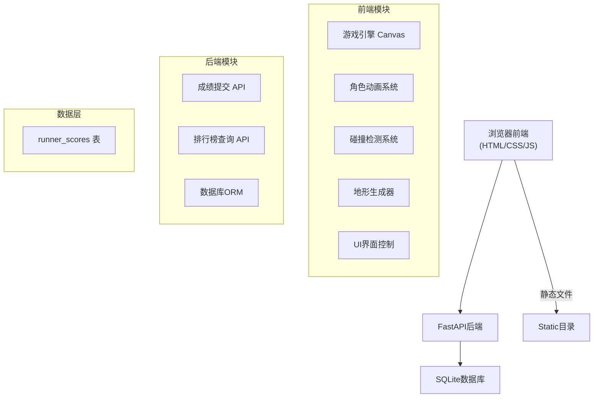
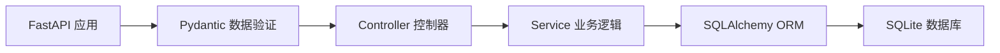
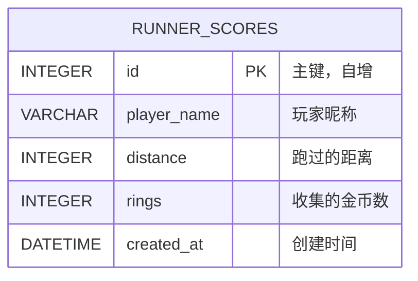

## 1. 架构设计



## 2. 技术描述

- **前端**：原生 HTML5 + CSS3 + JavaScript (ES6+)，使用 Canvas 2D 渲染游戏画面
- **后端**：FastAPI 0.100+ + Python 3.9+，使用 SQLAlchemy ORM
- **数据库**：SQLite 3，单表结构
- **静态文件**：由 FastAPI 挂载 `/static` 目录提供前端资源
- **部署**：单服务器部署，前后端共用同一 FastAPI 服务

## 3. 路由定义

| 路由 | 方法 | 用途 |
|------|------|------|
| `/` | GET | 游戏首页 |
| `/game` | GET | 游戏页面 |
| `/leaderboard` | GET | 排行榜页面 |
| `/api/scores` | POST | 提交游戏成绩 |
| `/api/scores` | GET | 获取排行榜数据 |
| `/static/*` | GET | 静态资源访问 |

## 4. API 定义

### 4.1 提交成绩

**请求**：
```typescript
interface ScoreSubmitRequest {
  player_name: string;    // 玩家昵称，最大20字符
  distance: number;       // 跑过的距离（米）
  rings: number;          // 收集的金币数
}
```

**响应**：
```typescript
interface ScoreSubmitResponse {
  success: boolean;
  message: string;
  data: {
    id: number;
    player_name: string;
    distance: number;
    rings: number;
    created_at: string;   // ISO 8601 格式
  };
}
```

### 4.2 获取排行榜

**请求**：`GET /api/scores?limit=10`

**响应**：
```typescript
interface LeaderboardResponse {
  success: boolean;
  data: Array<{
    rank: number;
    player_name: string;
    distance: number;
    rings: number;
    created_at: string;
  }>;
}
```

## 5. 服务器架构图



## 6. 数据模型

### 6.1 数据模型定义



### 6.2 数据定义语言

```sql
CREATE TABLE IF NOT EXISTS runner_scores (
    id INTEGER PRIMARY KEY AUTOINCREMENT,
    player_name VARCHAR(20) NOT NULL,
    distance INTEGER NOT NULL DEFAULT 0,
    rings INTEGER NOT NULL DEFAULT 0,
    created_at DATETIME DEFAULT CURRENT_TIMESTAMP
);

CREATE INDEX IF NOT EXISTS idx_distance ON runner_scores(distance DESC);
```

### 6.3 SQLAlchemy 模型

```python
from datetime import datetime
from sqlalchemy import Column, Integer, String, DateTime
from app.common.sqlite.db import Base

class RunnerScore(Base):
    __tablename__ = "runner_scores"
    
    id = Column(Integer, primary_key=True, autoincrement=True, index=True)
    player_name = Column(String(20), nullable=False)
    distance = Column(Integer, nullable=False, default=0)
    rings = Column(Integer, nullable=False, default=0)
    created_at = Column(DateTime, default=datetime.utcnow, index=True)
```

## 7. 前端游戏引擎架构

### 7.1 核心类结构

```javascript
// 游戏主类
class Game {
  constructor(canvas) {}
  init() {}          // 初始化游戏状态
  update() {}        // 游戏逻辑更新（每帧）
  render() {}        // 画面渲染（每帧）
  gameLoop() {}      // 主循环
}

// 玩家类
class Player {
  constructor() {}
  jump() {}          // 跳跃
  update() {}        // 物理更新（重力、速度）
  render() {}        // 渲染角色动画
}

// 障碍物基类
class Obstacle {
  constructor(type, x, y) {}
  update() {}
  render() {}
}

// 道具基类
class Item {
  constructor(type, x, y) {}
  update() {}
  render() {}
}

// 地形管理器
class TerrainManager {
  constructor() {}
  generateChunk() {}  // 生成地形块
  switchTerrain() {}  // 切换地形类型
}
```

### 7.2 游戏常量

```javascript
const CONFIG = {
  GRAVITY: 0.6,
  JUMP_FORCE: -12,
  JUMP_HOLD_BOOST: -0.3,
  MAX_JUMP_HOLD: 15,
  BASE_SPEED: 5,
  SPEED_INCREMENT: 0.001,
  MAX_SPEED: 12,
  GROUND_Y: 320,
  PLAYER_WIDTH: 32,
  PLAYER_HEIGHT: 32,
  TERRAIN_SWITCH_DISTANCE: 2000,
  INVINCIBLE_DURATION: 180,  // 3秒 @ 60fps
};
```
