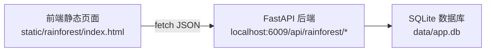
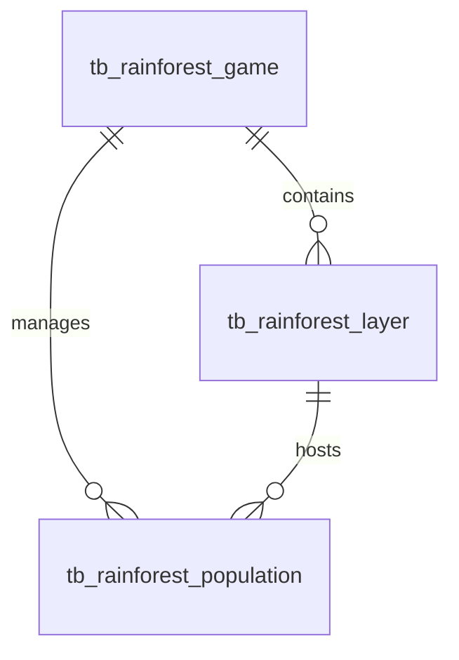

## 1. 架构设计

## 2. 技术说明

- **前端**：原生 HTML + CSS3 + Vanilla JS（单文件，零依赖，直接打开即用）
- **样式**：CSS 变量主题、Grid/Flex 布局、CSS 动画
- **后端**：已有 FastAPI + SQLite（端口6009），通过 fetch 调用 REST API
- **部署**：放入 `static/rainforest/` 目录，通过 StaticFiles 中间件直接访问

## 3. 路由定义

| 访问路径 | 用途 |
|-------|---------|
| `/static/rainforest/index.html` | 游戏主界面（单页面全部操作） |

## 4. API 接口清单

| 方法 | 路径 | 用途 |
|-----|------|-----|
| POST | `/api/rainforest/game/create` | 创建新游戏 |
| GET | `/api/rainforest/game/get?game_id=X` | 获取完整游戏状态 |
| GET | `/api/rainforest/game/summary/get?game_id=X` | 获取概要数据 |
| POST | `/api/rainforest/game/turn/advance?game_id=X` | 推进回合 |
| POST | `/api/rainforest/morph/transform` | 手动形态转换 |
| POST | `/api/rainforest/migrate` | 跨层迁移 |
| POST | `/api/rainforest/population/add` | 添加种群 |
| POST | `/api/rainforest/nematode/devour` | 线虫吞噬 |
| GET | `/api/rainforest/layer/config/get` | 获取配置与常量 |

## 5. 数据模型

### 5.1 ER 图

### 5.2 表结构

- **tb_rainforest_game**：id, turn, rainstorm_active, rainstorm_remaining_turns, leaching_remaining_turns
- **tb_rainforest_layer**：id, game_id, layer_type(0-3), organic_matter, base_difficulty, area, is_depleted
- **tb_rainforest_population**：id, game_id, layer_id, morph_type(0-2), count
