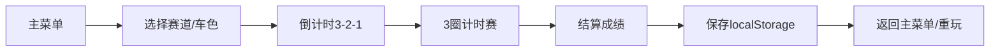

## 1. 产品概述
俯视角赛车计时赛游戏，主打漂移过弯手感，提供3条不同难度赛道和5个AI对手。
- 核心玩法：玩家操控赛车完成3圈计时，通过漂移机制获得加速优势，击败AI对手
- 目标用户：喜欢赛车游戏、追求操作手感的休闲玩家

## 2. 核心功能

### 2.1 功能模块
1. **主菜单**：赛道选择、赛车颜色选择、最佳成绩展示
2. **游戏画面**：俯视角赛道、赛车、HUD（计时/圈数/速度/小地图）
3. **赛车控制**：加速/刹车/转向/漂移
4. **AI系统**：5个不同难度的AI对手
5. **音效系统**：引擎/漂移/加速/碰撞/终点/推背音效
6. **视觉特效**：漂移痕迹/烟雾/火花/速度线/车身倾斜
7. **存档系统**：localStorage保存最佳成绩和解锁内容

### 2.2 页面详情
| 页面名称 | 模块名称 | 功能描述 |
|----------|----------|----------|
| 主菜单 | 赛道选择 | 3条赛道（新手环道/城市街道/山间险路），显示已解锁赛车颜色和最佳圈速 |
| 主菜单 | 赛车选择 | 显示解锁的车色（默认红），新手<30s解锁蓝，城市<45s解锁绿，山间<60s解锁金 |
| 游戏画面 | 赛道渲染 | 路面纹理、路边护栏、赛道宽度（100/80/60px） |
| 游戏画面 | 赛车物理 | 加速度0.15/帧²、刹车0.3/帧²、最大速度8px/帧、转角速度3°/帧 |
| 游戏画面 | 漂移机制 | 按住下+转向进入漂移，摩擦力0.05，漂移>30帧触发2秒1.5倍加速 |
| 游戏画面 | HUD | 计时精确到毫秒、圈数(1/3)、速度、漂移状态提示、小地图 |
| 游戏画面 | 特效层 | 漂移黑痕、后轮烟雾、碰撞火花、速度线、蓝色加速条纹 |
| 游戏画面 | 结算 | 3圈取最佳成绩，显示排名、是否解锁新颜色、是否破纪录 |

## 3. 核心流程

玩家从主菜单选择赛道和车色 → 进入游戏倒计时 → 3圈计时赛 → 结算显示成绩 → 保存至localStorage → 返回菜单或重玩

## 4. 用户界面设计

### 4.1 设计风格
- **主色调**：深色沥青灰(#2a2a2a) + 赛道黄(#f4c430) + 赛车红(#e74c3c)
- **辅助色**：加速蓝(#3498db)、漂移橙(#e67e22)、护栏白(#ecf0f1)
- **风格**：复古街机赛车风，霓虹光效，深色背景，像素感的UI文字
- **字体**：使用Orbitron（赛车风格数字字体）+ Montserrat
- **按钮**：圆角矩形，3D立体阴影，hover霓虹发光

### 4.2 页面设计概览
| 页面名称 | 模块名称 | UI元素 |
|----------|----------|--------|
| 主菜单 | 赛道卡片 | 三张卡片横向排列，显示赛道名/难度/最佳圈速/宽度 |
| 主菜单 | 车色选择 | 圆形色块可点击，未解锁显示锁图标 |
| 游戏画面 | HUD布局 | 左上：圈数计时；右上：小地图；左下：速度表；屏幕两侧：加速蓝条 |
| 游戏画面 | 漂移提示 | 漂移时屏幕上方显示"DRIFTING"橙色文字，进度条 |
| 结算页 | 成绩展示 | 大号数字显示最佳圈速，排名列表，解锁提示动画 |

### 4.3 响应性
- 桌面端优先，Canvas游戏区域固定1200x800px
- 全屏居中显示，左右留空可添加背景装饰
