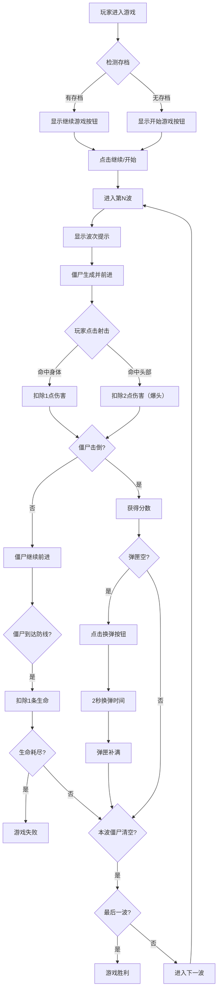

## 1. 产品概述

一款基于浏览器的第一人称视角僵尸射击游戏，玩家通过点击射击从远处逼近的僵尸，守住10波进攻即为胜利。游戏包含多种僵尸类型、爆头机制、弹匣换弹系统、生命系统与存档功能。

- 主要目的：提供紧张刺激的射击游戏体验，考验玩家的反应速度与策略规划
- 目标用户：休闲游戏玩家，喜欢僵尸题材的用户
- 核心价值：简单易上手的操作，渐进式的难度曲线，丰富的游戏机制

## 2. 核心功能

### 2.1 用户角色
无需登录注册，直接进入游戏。

### 2.2 功能模块
1. **游戏主界面**：瞄准镜视角、僵尸移动、射击效果、HUD信息
2. **波次系统**：10波进攻，难度递增，不同僵尸类型组合
3. **战斗系统**：点击射击、爆头伤害、弹匣管理、换弹机制
4. **生命系统**：3条生命，僵尸突破防线扣除生命
5. **存档系统**：localStorage 保存游戏进度与统计数据
6. **音效系统**：枪声、爆头、换弹、呻吟、警报等音效

### 2.3 页面详情
| 页面名称 | 模块名称 | 功能描述 |
|---------|---------|---------|
| 开始界面 | 标题与开始按钮 | 游戏标题、开始游戏按钮、继续游戏按钮（如有存档） |
| 游戏界面 | 游戏场景 | 3D透视效果的僵尸移动、瞄准镜准星、点击射击 |
| 游戏界面 | HUD信息栏 | 当前波次、剩余生命、分数、弹匣状态、换弹按钮 |
| 游戏界面 | 波次提示 | 每波开始时显示波次信息 |
| 暂停/结算界面 | 暂停菜单 | 暂停游戏、继续、重新开始 |
| 结算界面 | 胜利/失败 | 显示最终分数、爆头命中率、重新开始按钮 |

## 3. 核心流程



## 4. 用户界面设计

### 4.1 设计风格
- **主题风格**：恐怖末日风格，暗黑系配色，营造紧张氛围
- **主色调**：深灰 (#1a1a2e)、暗红 (#e63946)、军绿 (#4a5d23)
- **强调色**：血红色用于伤害提示、亮绿色用于爆头
- **字体**：使用像素风格或军事风格字体，增强游戏感
- **布局**：全屏游戏画面，HUD信息分布在屏幕四角
- **视觉效果**：瞄准镜十字准星、僵尸透视缩放效果、射击闪光、血液喷溅

### 4.2 页面设计概述
| 页面名称 | 模块名称 | UI元素 |
|---------|---------|-------|
| 开始界面 | 标题区 | 大字体游戏标题、僵尸剪影背景、渐变光效 |
| 开始界面 | 按钮区 | 开始游戏、继续游戏（条件显示）、操作说明 |
| 游戏界面 | 主场景 | 暗色背景、透视网格地面、远近层次 |
| 游戏界面 | 准星 | 十字瞄准线、中心红点、缩放动画 |
| 游戏界面 | 僵尸 | 三种体型、不同速度、受击闪烁 |
| 游戏界面 | HUD-左上 | 波次信息、剩余僵尸数 |
| 游戏界面 | HUD-右上 | 生命值（心形图标） |
| 游戏界面 | HUD-左下 | 当前分数 |
| 游戏界面 | HUD-右下 | 弹匣图标、子弹数、换弹按钮 |
| 游戏界面 | 波次提示 | 中央大字显示波次、渐入渐出动画 |
| 结算界面 | 结果面板 | 胜利/失败标题、最终分数、统计数据、重新开始按钮 |

### 4.3 响应式
- 桌面端优先，使用全屏游戏区域
- 适配不同屏幕尺寸，游戏场景按比例缩放
- 移动端支持触摸点击操作

### 4.4 游戏场景设计
- **透视效果**：僵尸从远处（小尺寸）向近处（大尺寸）移动，模拟3D效果
- **景深层次**：背景远景、中景地面网格、前景瞄准镜边框
- **射击反馈**：点击时屏幕轻微震动、枪口闪光效果、子弹轨迹
- **伤害反馈**：僵尸受击时红色闪烁、爆头时绿色特效 + 数字弹出
```
