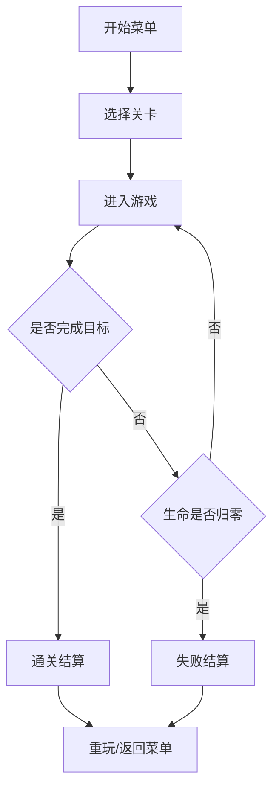

## 1. 产品概述
太空主题横版跑酷闯关游戏，玩家控制宇航员在不同星球表面奔跑，躲避外星生物和障碍物，收集能量晶体获取加速效果，完成指定距离或收集目标即可通关。

- 目标用户：休闲游戏爱好者、喜欢太空科幻主题的玩家
- 产品价值：提供轻松有趣的跑酷体验，通过多样化的关卡设计保持游戏新鲜感

## 2. 核心功能

### 2.1 用户角色
| 角色 | 注册方式 | 核心权限 |
|------|----------|----------|
| 玩家 | 无需注册 | 体验全部游戏关卡 |

### 2.2 功能模块
1. **开始菜单界面**：游戏标题、关卡选择、操作说明
2. **游戏主界面**：角色控制、障碍物与敌人生成、能量晶体收集、HUD 显示（距离、分数、生命值、加速状态）
3. **关卡结算界面**：通关/失败提示、成绩展示、重玩/返回按钮
4. **四个主题关卡**：沙漠星球、丛林星球、冰雪星球、机械星球

### 2.3 页面详情
| 页面名称 | 模块名称 | 功能描述 |
|----------|----------|----------|
| 开始菜单 | 标题区 | 游戏大标题、太空背景动效 |
| 开始菜单 | 关卡选择 | 四个星球卡片，点击进入对应关卡 |
| 开始菜单 | 操作说明 | 键盘/触屏控制方式说明 |
| 游戏主界面 | 游戏画布 | Canvas 渲染游戏场景、角色、障碍物、收集物 |
| 游戏主界面 | HUD 信息栏 | 显示当前距离、目标距离、晶体数量、生命值、加速条 |
| 游戏主界面 | 暂停控制 | 按 P 键或点击暂停按钮暂停/继续 |
| 结算界面 | 结果展示 | 通关/失败动画、最终成绩、收集统计 |
| 结算界面 | 操作按钮 | 重新开始、返回菜单 |

## 3. 核心流程
玩家在开始菜单选择关卡 → 进入游戏场景，宇航员自动向前奔跑 → 玩家通过跳跃/下滑躲避障碍物和敌人 → 收集能量晶体获得临时加速 → 完成目标距离通关，或生命值归零失败 → 进入结算界面，选择重玩或返回菜单。

## 4. 用户界面设计
### 4.1 设计风格
- 主色调：深邃太空蓝（#0a0e27）作为背景主色，配合各关卡主题色
- 沙漠星球：橙红渐变（#ff6b35, #f7c59f）
- 丛林星球：翠绿渐变（#2d6a4f, #95d5b2）
- 冰雪星球：冰蓝渐变（#48cae4, #ade8f4）
- 机械星球：暗灰金属渐变（#343a40, #6c757d）
- 强调色：能量晶体霓虹青（#00f5d4）、警告红（#ff006e）
- 按钮风格：圆角胶囊按钮，带发光 hover 效果
- 字体：使用 Orbitron（科幻风格标题字体）+ 系统无衬线字体
- 图标风格：像素风 / 扁平化 emoji 风格，符合游戏休闲属性
- 整体氛围：科幻复古风，带星空粒子背景和霓虹光效

### 4.2 页面设计概览
| 页面名称 | 模块名称 | UI 元素 |
|----------|----------|---------|
| 开始菜单 | 标题区 | 渐变发光大标题、星空动画背景、副标题 |
| 开始菜单 | 关卡选择 | 四张星球卡片（圆形缩略图+名称+难度星级），悬浮发光 |
| 开始菜单 | 操作说明 | 图标+文字说明（空格/↑跳跃，↓下滑，P暂停） |
| 游戏主界面 | 游戏画布 | 全屏 Canvas，视差滚动背景 |
| 游戏主界面 | HUD | 左上角生命条、右上角距离进度条、晶体计数、加速能量条 |
| 结算界面 | 结果展示 | 居中大标题（通关/失败）、成绩数字滚动动画、星星评价 |
| 结算界面 | 操作按钮 | 两个主按钮，悬浮缩放效果 |

### 4.3 响应式
- 桌面端优先，支持键盘操作（空格/方向键）
- 移动端适配：全屏 Canvas，底部虚拟按键（跳跃/下滑按钮）
- 最小支持宽度：360px

