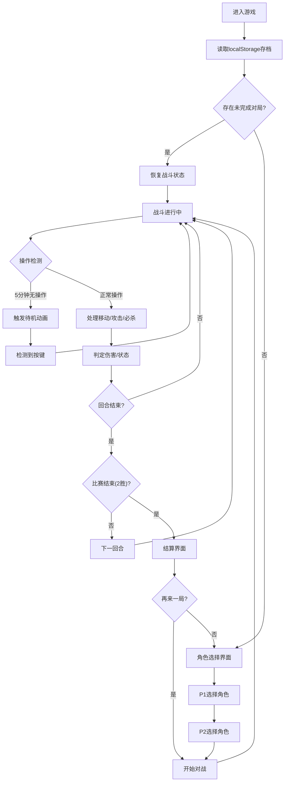

## 1. 产品概述
一款用Vue 3复刻的经典街机格斗游戏，还原双人对战的紧张刺激感。通过Canvas绘制火柴人风格角色，支持键盘双人对战，带有趣味性的角色技能系统和完整的比赛机制。
- 主要用途：双人本地对战的休闲格斗游戏，唤起街机时代怀旧情感
- 目标用户：怀旧街机玩家、喜欢休闲对战的游戏爱好者

## 2. 核心功能

### 2.1 用户角色
| 角色 | 操作方式 | 核心权限 |
|------|----------|----------|
| 玩家1（P1） | WASD移动 + J攻击 + K必杀 | 控制左侧角色对战 |
| 玩家2（P2） | 方向键移动 + 数字1攻击 + 2必杀 | 控制右侧角色对战 |

### 2.2 功能模块
1. **游戏主界面**：角色选择、战斗场景、结算界面
2. **角色系统**：4个差异化角色（龙拳、疾风、铁壁、幻影），各有独特属性和必杀技
3. **战斗系统**：普攻判定、必杀技释放、气槽积累、防御机制、击倒状态、蓄力机制
4. **比赛系统**：3局2胜制、60秒倒计时、超时血量判定
5. **存档系统**：localStorage自动存档，刷新/重开继续游戏
6. **音效系统**：Web Audio API合成拳击声、格挡金属声、必杀爆发音
7. **待机系统**：5分钟无操作触发待机动画（小幅度晃动+打哈欠）

### 2.3 页面详情
| 页面名称 | 模块名称 | 功能描述 |
|---------|---------|---------|
| 角色选择页 | 角色卡片 | 展示4个角色属性和必杀技说明，P1/P2分别选择 |
| 角色选择页 | 开始对战按钮 | 双方确认角色后进入战斗 |
| 战斗界面 | 顶部HUD | 双方血条、气槽、回合数、倒计时显示（CSS绘制） |
| 战斗界面 | Canvas场景 | 2D战斗场景绘制，火柴人角色渲染、动作动画 |
| 战斗界面 | 输入系统 | 监听键盘事件，处理角色移动、攻击、必杀输入 |
| 战斗界面 | 战斗逻辑 | 碰撞检测、伤害计算、状态管理、胜负判定 |
| 战斗界面 | 待机检测 | 5分钟无操作检测，触发待机动画 |
| 结算界面 | 胜负展示 | 显示获胜方、比分统计 |
| 结算界面 | 操作选项 | 再来一局 / 返回角色选择 |

## 3. 核心流程

## 4. 用户界面设计

### 4.1 设计风格
- **主色调**：深色系街机风格，深蓝色(#0a0e27)背景 + 霓虹红(#ff2d55)、霓虹蓝(#00d4ff)点缀
- **辅助色**：金色(#ffd700)用于高亮，灰色(#888)用于UI边框
- **按钮风格**：3D立体按钮，带霓虹发光效果和按压动画
- **字体**：使用 Press Start 2P（像素风街机字体）作为标题字体，数字字体使用 VT323，营造复古街机氛围
- **布局风格**：居中对称布局，战斗界面上下分层（顶部HUD + 中间Canvas + 底部操作提示）
- **动效**：角色攻击时屏幕轻微震动，必杀释放时全屏闪光+粒子特效

### 4.2 页面设计概述
| 页面名称 | 模块名称 | UI元素 |
|---------|---------|--------|
| 角色选择页 | 角色卡片 | 网格布局4列，卡片带角色颜色边框，悬停放大发光，选中状态金色高亮 |
| 角色选择页 | 属性面板 | HP/攻击/防御/速度 数值条展示，必杀技描述文字 |
| 战斗界面 | 顶部HUD | 左右对称血条（红色渐变）+ 气槽（蓝色能量条），中间回合数+倒计时 |
| 战斗界面 | Canvas场景 | 渐变色地面+网格线背景，角色颜色区分（龙拳红/疾风绿/铁壁蓝/幻影紫） |
| 战斗界面 | 操作提示 | 底部半透明条，显示P1/P2按键说明 |
| 结算界面 | 胜负展示 | 大字体胜者名称，彩色粒子背景动画，比分数字弹跳动画 |

### 4.3 响应式
- 采用桌面端优先设计，固定战斗区域尺寸 960×540
- Canvas使用固定分辨率，CSS居中显示
- 在小屏幕上整体缩放适配，保持画面比例
- 不支持移动端触控操作（专为键盘双人对战设计）
