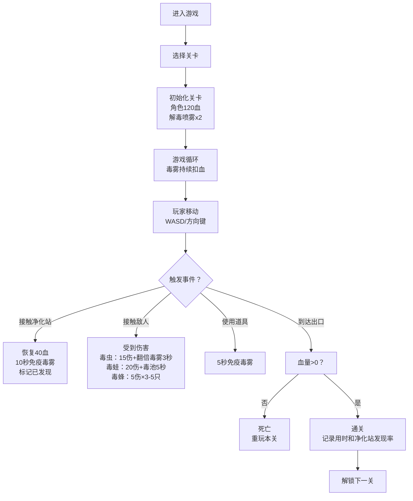

## 1. 产品概述

毒域闯关是一款12关卡的网页生存冒险游戏，玩家需在被毒雾覆盖的地图中寻找净化站并抵达出口。游戏结合了资源管理、敌人躲避和路径探索元素，考验玩家的策略规划和反应能力。

- **核心玩法**：在持续扣血的毒雾环境中探索，利用净化站和解毒喷雾道具生存并通关
- **目标用户**：休闲游戏玩家，喜欢挑战和策略类小游戏的用户
- **市场价值**：轻量化网页游戏，无需安装即可游玩，具备较强的成瘾性和重玩价值

## 2. 核心功能

### 2.1 用户角色

| 角色 | 注册方式 | 核心权限 |
|------|----------|----------|
| 玩家 | 自动生成匿名ID | 进行游戏、查看个人记录 |

### 2.2 功能模块

1. **游戏主界面**：地图渲染、角色控制、状态显示
2. **关卡系统**：12关递进难度，每关三段式设计
3. **战斗系统**：三种敌人类型（毒虫、毒蛙、毒蜂）
4. **道具系统**：解毒喷雾（每关2个）
5. **记录系统**：通关用时、净化站发现率统计
6. **视野系统**：5格半径视野限制，未探索区域显示黑雾

### 2.3 页面详情

| 页面名称 | 模块名称 | 功能描述 |
|----------|----------|----------|
| 开始页面 | 关卡选择 | 显示12关进度，选择已解锁关卡开始游戏 |
| 游戏页面 | 游戏画布 | 渲染地图、角色、敌人、毒雾效果 |
| 游戏页面 | HUD状态栏 | 显示血量条、关卡信息、道具数量、用时计时 |
| 游戏页面 | 控制按钮 | 方向控制、道具使用、暂停 |
| 结算页面 | 通关统计 | 显示通关用时、净化站发现率、死亡次数 |

## 3. 核心流程

## 4. 用户界面设计

### 4.1 设计风格

- **主色调**：深紫色（毒雾）、酸绿色（净化）、暗红色（危险）
- **辅助色**：深灰（地图）、亮黄（提示）
- **按钮风格**：圆角矩形，带发光边框，悬浮时有脉动动画
- **字体**：展示字体用Creepster（恐怖风格），正文字体用Roboto Mono
- **布局风格**：游戏画布居中，HUD环绕四周
- **视觉效果**：毒雾用径向渐变+CSS动画实现流动感，视野外区域用黑色遮罩

### 4.2 页面设计概览

| 页面名称 | 模块名称 | UI元素 |
|----------|----------|--------|
| 开始页面 | 关卡选择 | 12个关卡图标，已通关显示绿色边框，当前关卡高亮，未解锁显示灰色锁定 |
| 开始页面 | 游戏标题 | 发光文字"毒域闯关"，副标题"12关生存挑战" |
| 游戏页面 | 游戏画布 | 网格地图（每关30×20格），角色居中，5格半径视野 |
| 游戏页面 | 顶部HUD | 左侧血量条（红条+数值），中间关卡名，右侧计时 |
| 游戏页面 | 底部HUD | 左侧净化站发现进度，中间道具按钮，右侧提示信息 |
| 结算页面 | 统计面板 | 大字体"通关成功/失败"，用时、净化站发现率、重试次数，继续/重玩按钮 |

### 4.3 响应式设计

- 桌面端：游戏画布800×600像素，键盘WASD/方向键控制
- 移动端：自适应屏幕尺寸，添加虚拟方向键
- 触摸操作：支持滑动控制方向，点击使用道具

### 4.4 动画与特效

- **毒雾效果**：多层径向渐变，使用CSS animation实现缓慢漂浮流动
- **视野过渡**：进入未探索区域时，黑雾渐变消散
- **受伤反馈**：屏幕红色闪烁，角色震动
- **净化效果**：接触净化站时绿色光环扩散
- **敌人预警**：敌人靠近时，边缘出现红色脉冲提示
