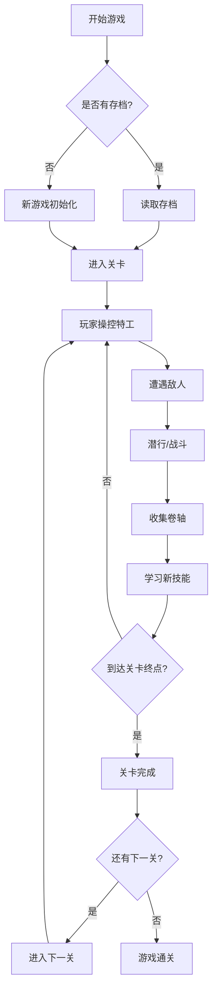

## 1. 产品概述

以中国特工为原型的2D横版动作闯关游戏，玩家操控特工在各种场景中潜行、战斗、收集卷轴学习新技能，最终完成任务通过关卡。

- 核心玩法：潜行暗杀 + 动作战斗 + 技能收集
- 目标用户：喜欢动作游戏、潜行类游戏的玩家
- 产品价值：提供沉浸式的特工体验，包含多样化的关卡设计和技能系统

## 2. 核心功能

### 2.1 用户角色

| 角色 | 注册方式 | 核心权限 |
|------|----------|----------|
| 玩家 | 无需注册，本地存储 | 游戏游玩、进度保存、技能收集 |

### 2.2 功能模块

1. **主菜单页面**：开始游戏、继续游戏、关卡选择、游戏说明
2. **游戏关卡页面**：玩家控制、战斗系统、敌人AI、场景交互
3. **技能系统**：卷轴收集、技能学习、技能释放
4. **状态管理**：生命值、能量值、收集进度、localStorage持久化

### 2.3 页面详情

| 页面名称 | 模块名称 | 功能描述 |
|----------|----------|----------|
| 主菜单 | 开始游戏 | 从第一关开始新游戏 |
| 主菜单 | 继续游戏 | 从上次保存的进度继续 |
| 主菜单 | 关卡选择 | 选择已解锁的关卡开始游戏 |
| 游戏页面 | 玩家控制 | WASD移动、空格跳跃、J攻击、K技能、L潜行 |
| 游戏页面 | 战斗系统 | 近战攻击、技能释放、生命值扣除 |
| 游戏页面 | 敌人AI | 巡逻、警戒、追击、攻击 |
| 游戏页面 | 关卡系统 | 4个主题关卡、关卡完成判定 |
| 游戏页面 | 收集系统 | 卷轴收集、技能学习、存档点 |

## 3. 核心流程

## 4. 用户界面设计

### 4.1 设计风格

- **主色调**：黑色 (#0a0a0a)、深红色 (#8b0000)、金色 (#ffd700)
- **辅助色**：深绿色 (#006400)、深蓝色 (#000080)、冰蓝色 (#87ceeb)
- **按钮风格**：金属质感边框，悬停时有金色发光效果
- **字体**：使用武侠风格字体 "Ma Shan Zheng" 作为标题，"Noto Sans SC" 作为正文
- **布局风格**：全屏游戏画布，HUD信息位于四角
- **图标风格**：简约线条图标，金色边框

### 4.2 页面设计概述

| 页面名称 | 模块名称 | UI元素 |
|----------|----------|--------|
| 主菜单 | 标题区 | 大号金色标题"龙影特工"，背景有粒子特效 |
| 主菜单 | 按钮区 | 垂直排列的金属质感按钮，悬停动画 |
| 游戏页面 | 游戏画布 | 2D横版场景，视差滚动背景 |
| 游戏页面 | HUD | 左上角生命值、右上角能量值、底部技能栏 |
| 游戏页面 | 暂停菜单 | 半透明黑色背景，居中菜单 |

### 4.3 响应式

- 桌面端优先，适配1920x1080分辨率
- 支持窗口缩放，游戏画布等比例缩放
- 键盘操作优化

### 4.4 游戏场景设计

#### 竹林关卡
- 环境：翠绿色竹林，竹叶飘落，阳光透过竹叶
- 特色：玩家可躲在竹林中隐身，可在竹杆间跳跃
- 敌人：手持武士刀的巡逻兵

#### 城堡关卡
- 环境：古色古香的中式城堡，红灯笼，石墙
- 特色：需要躲避巡逻守卫，利用阴影隐藏
- 敌人：重装守卫、弓箭手

#### 沼泽关卡
- 环境：阴暗的沼泽地，毒气泡泡，朽木
- 特色：有毒气体区域，需要快速通过或使用技能防护
- 敌人：沼泽怪物、毒蛙

#### 雪山关卡
- 环境：白雪皑皑的山峰，冰面，暴风雪
- 特色：冰面滑行，雪崩危险区域
- 敌人：雪山守卫、雪狼

