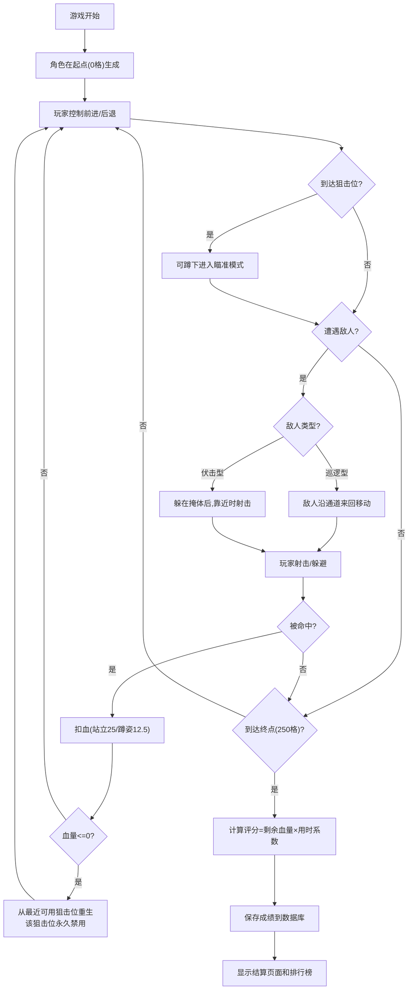

## 1. 产品概述

长廊狙击射击游戏，玩家控制角色在250格长的直线通道中前进，利用5个固定狙击位进行瞄准射击，消灭沿途敌人并抵达终点。游戏融合了战术蹲守与快速推进的玩法，通过评分系统（剩余血量×用时系数）和排行榜增加 replay value。

- 核心玩法：直线推进 + 蹲位狙击 + 敌人AI（巡逻/伏击）
- 目标用户：喜欢战术射击和挑战类游戏的玩家
- 产品价值：提供紧张刺激的狙击体验，通过策略选择（推进速度vs蹲守狙击）增加游戏深度

## 2. 核心功能

### 2.1 用户角色
| 角色 | 注册方式 | 核心权限 |
|------|----------|----------|
| 玩家 | 无需注册，直接游戏 | 进行游戏、查看个人成绩、查看排行榜 |

### 2.2 功能模块
1. **游戏主界面**：长廊场景渲染、角色控制、敌人AI、武器系统
2. **瞄准镜模式**：蹲姿切换、视野放大、弹道系统
3. **评分系统**：实时血量显示、计时、通关评分计算
4. **排行榜**：历史最高分记录、排名展示

### 2.3 页面详情
| 页面名称 | 模块名称 | 功能描述 |
|----------|----------|----------|
| 游戏主页面 | 长廊渲染模块 | 250格直线通道的横向滚动渲染，包含掩体、狙击位、敌人、角色 |
| 游戏主页面 | 角色控制模块 | 前进/后退移动、蹲姿切换瞄准模式、射击、换弹 |
| 游戏主页面 | 敌人AI模块 | 巡逻型敌人来回走动、伏击型敌人躲在掩体后伺机射击 |
| 游戏主页面 | 武器系统模块 | 12发弹夹、3秒换弹、命中判定、伤害计算 |
| 游戏主页面 | 血量与重生模块 | 100点血量、伏击伤害25、蹲姿减伤50%、狙击位重生机制 |
| 瞄准镜界面 | 缩放视野模块 | 蹲姿时放大视野，显示瞄准十字线，清晰显示远处敌人 |
| 结算页面 | 评分模块 | 计算最终得分（剩余血量×用时系数）、显示通关/失败结果 |
| 排行榜页面 | 排名展示模块 | 显示历史最高分TOP10、玩家最佳成绩 |

## 3. 核心流程

玩家进入游戏 → 角色在起点（0格）生成 → 沿通道前进/后退 → 遇到敌人可选择快速通过或蹲守狙击 → 到达狙击位可蹲下进入瞄准模式（视野放大）→ 消灭敌人或躲避前进 → 被击中扣血 → 血量归零则从最近可用狙击位重生（该狙击位禁用）→ 抵达终点（250格）且血量>0 → 计算评分 → 保存成绩 → 查看排行榜

## 4. 界面设计

### 4.1 设计风格
- **主色调**：深橄榄绿 (#3D4A3E) + 战术黑 (#1A1A1A) + 血红色 (#C42021) 警示
- **辅助色**：瞄准镜绿 (#00FF41)、弹夹黄 (#FFD700)
- **按钮风格**：方形硬朗边角、军事战术风格、按压反馈
- **字体**：等宽字体 'Courier New' 搭配粗体无衬线字体，营造军事HUD感
- **布局风格**：全屏沉浸式游戏区域，底部HUD信息栏固定显示
- **视觉效果**：狙击镜圆形遮罩、景深模糊、扫描线效果、枪口闪光

### 4.2 页面设计概览
| 页面名称 | 模块名称 | UI元素 |
|----------|----------|--------|
| 游戏主页面 | 长廊场景 | 横向滚动通道、250格刻度、掩体障碍物、狙击位标记、敌人单位、玩家角色 |
| 游戏主页面 | 底部HUD | 血量条(绿→黄→红渐变)、弹夹计数/总弹药、当前位置格数、计时显示、蹲姿状态指示 |
| 瞄准镜界面 | 缩放视野 | 圆形狙击镜遮罩、十字准星、距离刻度、视野放大2-3倍、边缘暗角 |
| 结算页面 | 评分展示 | 通关/失败标题、剩余血量、用时、最终得分、动画数字滚动效果 |
| 排行榜页面 | 排名列表 | TOP10排名卡片、玩家名称、得分、用时、日期、最佳成绩高亮 |

### 4.3 响应式设计
- **桌面优先**：游戏区域居中显示，固定宽度1200px×600px
- **移动适配**：缩放游戏区域适配屏幕宽度，HUD信息相应缩小
- **触控优化**：虚拟方向键、射击按钮、蹲姿按钮布局在屏幕两侧

### 4.4 视觉特效指引
- **环境氛围**：昏暗长廊、单侧墙壁阴影、地面网格线、远处雾效
- **灯光设置**：狙击位聚光灯、敌人红色轮廓光、命中时屏幕红闪
- **镜头设置**：普通模式横向跟随、瞄准模式聚焦放大、射击时轻微后坐力震动
- **动画效果**：敌人巡逻移动平滑插值、伏击突然弹出、换弹进度条、子弹飞行轨迹、命中火花
- **后处理**：瞄准镜扫描线、噪点颗粒、受伤时边缘模糊、死亡时屏幕渐黑
