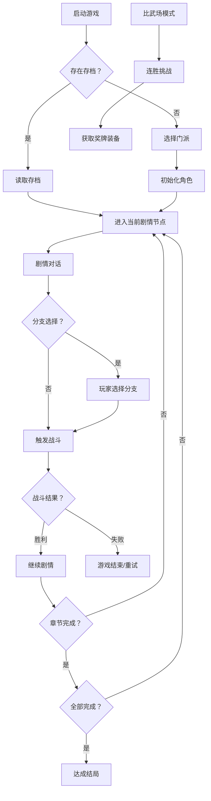

## 1. 产品概述
本产品是一款基于Vue 3的武侠风格回合制RPG网页游戏，致敬经典小霸王武侠游戏，采用现代化技术重构，带来更丰富的战斗系统和剧情体验。
- 核心玩法：玩家选择4大门派之一，学习武功，闯荡江湖，通过回合制战斗和剧情分支选择体验多个结局
- 目标用户：怀旧游戏玩家、武侠文化爱好者、休闲网页游戏用户

## 2. 核心功能

### 2.1 用户角色
| 角色 | 注册方式 | 核心权限 |
|------|----------|----------|
| 玩家 | 无需注册，本地存档 | 游玩全部内容、存档/读档、比武场挑战 |

### 2.2 功能模块
1. **主菜单页面**：开始新游戏、继续游戏、比武场、游戏说明
2. **门派选择页面**：4大门派介绍与选择
3. **剧情章节页面**：剧情对话、分支选择、战斗触发
4. **战斗系统页面**：回合制战斗UI、技能释放、状态显示
5. **比武场页面**：连胜挑战、奖牌奖励、装备获取
6. **角色状态面板**：HP/真气、属性、装备、技能展示

### 2.3 页面详情
| 页面名称 | 模块名称 | 功能描述 |
|----------|----------|----------|
| 主菜单 | 菜单按钮 | 开始新游戏/继续游戏/比武场/说明，按钮hover动效 |
| 门派选择 | 门派卡片 | 展示4大门派属性、技能、特色，点击选择 |
| 剧情章节 | 对话系统 | 武侠风对话文字、选项分支、背景氛围渲染 |
| 战斗系统 | 战斗面板 | HP/真气条、技能按钮、战斗日志、敌方AI行动 |
| 比武场 | 挑战界面 | 连胜计数、奖牌进度、对手匹配、装备奖励展示 |
| 角色面板 | 状态显示 | 实时显示HP、真气、攻击、装备、Buff/Debuff |

## 3. 核心流程

玩家启动游戏 → 读取存档或新游戏 → 选择门派 → 进入第一章剧情 → 对话选择分支 → 触发战斗 → 战斗胜利/失败 → 进入下一场景 → 完成章节 → 进入下一章 → 达成结局。同时可随时进入比武场模式获取装备奖励。

## 4. 用户界面设计

### 4.1 设计风格
- **主色调**：深墨色（#1a1a2e）背景、朱砂红（#c23b22）强调色、金色（#d4a574）装饰色
- **辅助色**：青绿（#4a7c59）治疗色、紫色（#6b4c9a）内功色
- **按钮风格**：复古卷轴风格边框，渐变填充，hover发光效果
- **字体**：标题使用"ZCOOL XiaoWei"等武侠风格字体，正文使用思源宋体
- **布局风格**：卷轴式卡片布局，水墨晕染背景，古朴装饰边框
- **视觉元素**：水墨笔触、山水剪影、祥云纹样、古印章元素

### 4.2 页面设计概述
| 页面名称 | 模块名称 | UI元素 |
|----------|----------|----------|
| 主菜单 | 主界面 | 水墨山水背景、竖排标题、古风按钮、淡入动画 |
| 门派选择 | 卡片列表 | 4张横向排列卷轴卡片、门派图标、属性对比、选中高亮 |
| 剧情对话 | 对话界面 | 底部对话框、头像、打字机效果、选项按钮高亮 |
| 战斗系统 | 战斗界面 | 左右对峙布局、HP/真气进度条、技能栏、战斗日志滚动区 |
| 比武场 | 战绩界面 | 奖牌展示区、连胜计数、对手列表、装备栏 |

### 4.3 响应式设计
- 桌面端优先：1280px以上完整布局
- 平板端：1024px自适应缩放，单列布局
- 移动端：768px以下优化触控区域，简化装饰元素

### 4.4 音效设计
- Web Audio API合成音效：剑鸣声（高频衰减振荡）、拳风声（低频噪声）、针破空声（快速扫频）
- 战斗技能释放时播放对应音效
- 剧情对话无背景音乐保持简洁
