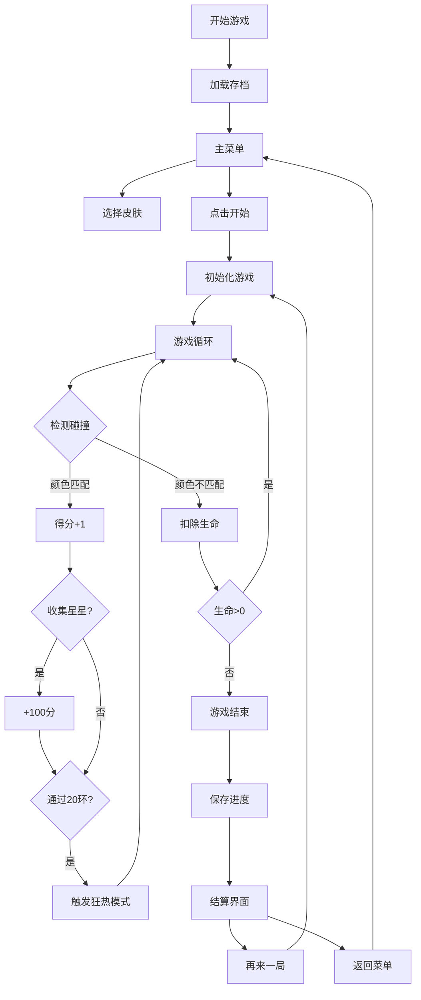

## 1. 产品概述

极速颜色穿越 - 一款高难度的Canvas小游戏，玩家控制小球穿越彩色圆环，通过颜色匹配机制考验反应速度和手眼协调能力。专为喜欢挑战的硬核玩家设计，速度更快、环更密，手残党退散！

- **核心玩法**：控制弹跳小球，利用颜色自动轮换机制穿越匹配颜色的圆环段
- **目标用户**：休闲游戏爱好者、喜欢挑战高难度的玩家
- **产品价值**：提供极具挑战性的游戏体验，通过皮肤解锁和分数系统保持长期可玩性

## 2. 核心功能

### 2.1 功能模块

1. **游戏主界面**：Canvas游戏画布、实时HUD信息（分数、生命、连击数）
2. **开始菜单**：游戏标题、开始按钮、皮肤选择、最高分显示
3. **皮肤系统**：4种小球皮肤（默认、霓虹、彩虹、火焰），通过累计分数解锁
4. **游戏结算**：本局得分、最高分、重新开始、返回菜单
5. **存档系统**：自动保存游戏进度到localStorage

### 2.2 页面详情

| 页面名称 | 模块名称 | 功能描述 |
|-----------|-------------|---------------------|
| 主菜单 | 标题区域 | 游戏名称动画展示、开始按钮 |
| 主菜单 | 皮肤选择 | 展示已解锁/未解锁皮肤，点击切换 |
| 主菜单 | 数据展示 | 最高分、累计总分统计 |
| 游戏界面 | Canvas画布 | 游戏核心渲染区域 |
| 游戏界面 | HUD层 | 实时显示分数、生命、连击、狂热状态 |
| 游戏界面 | 暂停按钮 | 暂停/继续游戏 |
| 结算界面 | 得分展示 | 本局得分、是否破纪录 |
| 结算界面 | 操作按钮 | 再来一局、返回主菜单 |

## 3. 核心流程

## 4. 用户界面设计

### 4.1 设计风格
- **主题色**：深色背景（#0a0a1a）搭配高饱和度霓虹色彩
- **颜色方案**：红(#ff3366)、黄(#ffdd33)、蓝(#3399ff)、绿(#33ff99)四色循环
- **按钮风格**：霓虹发光效果、圆角按钮、点击有缩放动画
- **字体**：Orbitron（科技感字体）用于标题，Rajdhani用于游戏数值
- **视觉特效**：小球拖尾渐变、圆环发光、狂热模式全屏滤镜、背景星空粒子

### 4.2 页面设计概述

| 页面名称 | 模块名称 | UI元素 |
|-----------|-------------|-------------|
| 主菜单 | 标题 | 霓虹渐变文字、呼吸动画、居中展示 |
| 主菜单 | 皮肤卡片 | 4个圆形卡片，选中态发光，未解锁显示锁图标 |
| 主菜单 | 数据面板 | 半透明玻璃态卡片，显示最高分和累计分 |
| 游戏界面 | HUD | 左上角分数、右上角生命、底部连击数 |
| 游戏界面 | 狂热提示 | 顶部横幅、×3标识、倒计时进度条 |
| 结算界面 | 得分动画 | 数字滚动效果、破纪录特效 |
| 结算界面 | 按钮组 | 垂直排列，霓虹边框按钮 |

### 4.3 响应性
- 桌面端：固定480×720游戏画布，居中显示
- 移动端：自适应屏幕宽度，保持9:16比例，触摸区域优化
- 操作方式：支持鼠标点击、空格键、触屏点击

### 4.4 视觉特效
- **背景**：深邃星空背景，随机星星闪烁
- **小球**：半透明渐变拖尾，根据皮肤有不同特效
- **圆环**：四色渐变段，边缘发光效果
- **星星**：金色旋转星星，收集时有爆炸粒子
- **狂热模式**：屏幕边缘红光脉冲，分数数字放大发光
