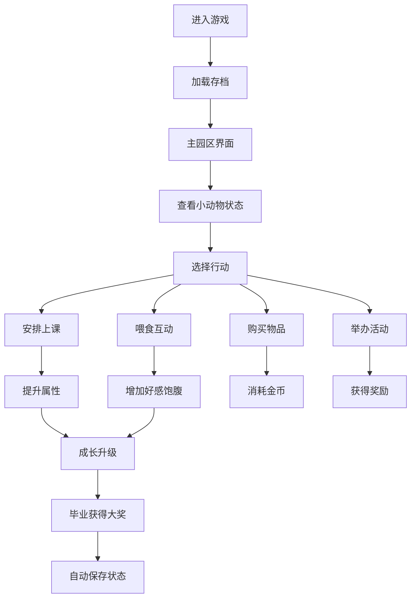

# 动物幼儿园游戏产品需求文档

## 1. 产品概述
一款可爱风格的动物幼儿园模拟经营游戏，玩家扮演园长照顾各种可爱的小动物，通过上课、喂食、互动等方式培养它们成长，获得家长奖励并经营发展幼儿园。
- 核心玩法：养成+经营，管理小动物成长，发展幼儿园设施
- 目标用户：喜欢可爱风格、模拟经营类游戏的玩家

## 2. 核心功能

### 2.1 核心玩法模块
| 模块 | 核心功能 |
|------|----------|
| 上课模块 | 绘画、音乐、运动、认知课程，提升小动物属性 |
| 喂食模块 | 水果、奶制品、肉类、零食，满足小动物喜好 |
| 成长养成模块 | 属性系统、等级成长、毕业机制 |
| 经营系统 | 金币、小费、商店购买、装饰 |
| 天气系统 | 晴天/雨天影响动物状态 |

### 2.2 页面详情
| 页面名称 | 模块名称 | 功能描述 |
|---------|---------|----------|
| 主园区 | 状态面板 | 显示天气、金币、时间、小动物列表 |
| 主园区 | 互动区域 | 展示小动物，点击可查看详情和互动 |
| 上课页面 | 课程选择 | 选择课程类型，安排小动物上课 |
| 喂食页面 | 食物选择 | 选择食物喂给小动物 |
| 商店页面 | 购买系统 | 购买食物、玩具、装饰品 |
| 动物详情 | 成长面板 | 查看属性、等级、状态 |

## 3. 核心流程

## 4. 用户界面设计

### 4.1 设计风格
- 主色调：温暖的橙黄色系 (#FF9F43)，搭配柔和的粉绿色 (#5FCD9C)
- 按钮风格：圆润可爱，带有轻微阴影和hover放大效果
- 字体：圆润可爱的无衬线字体，标题使用活泼样式
- 布局风格：卡片式布局，圆角设计，柔和阴影
- 动物风格：使用可爱的Emoji和卡通化的SVG形象

### 4.2 页面设计概览
| 页面名称 | 模块 | UI元素 |
|---------|------|--------|
| 主园区 | 状态条 | 天气图标、金币、时间、菜单按钮 |
| 主园区 | 动物展示区 | 卡片式布局，每个小动物显示表情和状态 |
| 上课页面 | 课程卡片 | 图标、名称、属性加成、消耗时间 |
| 喂食页面 | 食物列表 | 食物图片、名称、价格、效果预览 |
| 商店页面 | 商品网格 | 分类标签、商品卡片、购买按钮 |

### 4.3 响应式设计
- 桌面端为主，采用网格布局展示多个动物卡片
- 适配平板和手机，自动调整列数和卡片大小
- 触摸区域优化，按钮最小48x48px

### 4.4 动画效果
- 小动物有简单的待机动画（呼吸、摇摆）
- 上课/喂食时有进度条动画
- 获得奖励有弹跳特效
- 天气切换有过渡动画
