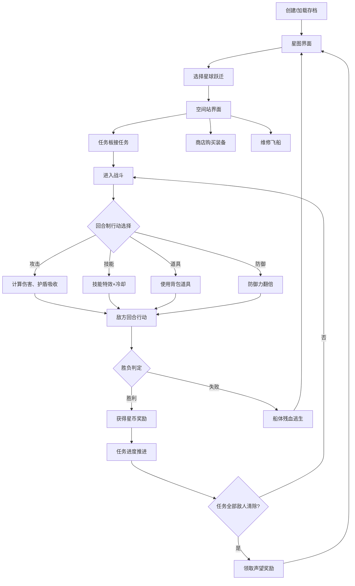

## 1. 产品概述
银河边缘赏金猎人游戏是一款基于Web的回合制太空飞船战斗RPG。玩家扮演漂泊在银河系边缘的赏金猎人，驾驶破旧飞船接任务、战斗海盗、升级装备、积累声望，在多方势力间求生存。
- 核心玩法：星图航行 → 空间站接任务 → 回合制战斗 → 奖励声望和星币 → 商店升级装备
- 目标用户：休闲RPG爱好者，太空科幻题材粉丝

## 2. 核心功能

### 2.1 用户角色
| 角色 | 注册方式 | 核心权限 |
|------|---------|---------|
| 赏金猎人（玩家） | 创建/加载存档 | 航行、接任务、战斗、购买装备、管理声望 |

### 2.2 功能模块
1. **存档系统页面**：新游戏创建、存档列表加载、删除存档
2. **星图导航页面**：暗色背景星场、低多边形星球显示、跃迁航行
3. **空间站页面**：任务板（接/放弃任务）、商店（装备/道具买卖）、维修站、装备管理
4. **战斗界面**：回合制战斗（攻击/技能/道具/防御）、护盾裂纹光效、敌方AI行动、战斗日志、胜利/失败结算

### 2.3 页面详情
| 页面名称 | 模块名称 | 功能描述 |
|---------|---------|---------|
| 存档系统 | 新游戏表单 | 输入玩家名称，创建初始存档、飞船、装备 |
| 存档系统 | 存档列表 | 展示所有存档摘要，点击加载，支持删除 |
| 星图导航 | 星场背景 | Canvas绘制暗色星空、闪烁星点、动态星云 |
| 星图导航 | 星球节点 | SVG低多边形风格，可点击跃迁，显示阵营颜色 |
| 星图导航 | 玩家状态栏 | 顶部显示星币、声望、当前位置、飞船血条护盾条 |
| 空间站 | 任务发布板 | 按难度、阵营、奖励展示可接任务列表 |
| 空间站 | 商店系统 | 装备/道具分类展示，支持购买和出售 |
| 空间站 | 维修站 | 花费星币修复船体和护盾 |
| 空间站 | 装备管理 | 背包列表，可装备/卸下/出售物品 |
| 战斗界面 | 战场双视图 | 玩家飞船与敌舰左右对峙，护盾环+船体条 |
| 战斗界面 | 操作面板 | 攻击/防御/技能/道具四个操作按钮组 |
| 战斗界面 | 战斗日志 | 滚动显示每回合战斗细节 |
| 战斗界面 | 结算弹窗 | 胜利显示奖励，失败提示逃生受损 |

## 3. 核心流程
玩家创建存档 → 从初始空间站出发 → 在星图上选择目的地跃迁 → 抵达空间站：查看任务板接任务 → 任务触发战斗 → 回合制选择行动：攻击/技能/道具/防御 → 击败敌人推进任务进度 → 完成任务领取星币和声望 → 去商店购买更强装备 → 接受更高难度任务 → 循环成长

## 4. 用户界面设计
### 4.1 设计风格
- **主题风格**：深空朋克/复古未来主义，暗色银河背景配青色霓虹点缀
- **主色调**：深空黑 `#0a0e17`、星尘蓝 `#1a2540`、霓虹青 `#4fd1c5`、警戒红 `#e53e3e`、军金 `#d69e2e`
- **点缀色**：护盾能量蓝 `#63b3ed`、船体橙 `#ed8936`、海盗血红 `#c53030`、军方蓝 `#2b6cb0`
- **按钮风格**：斜切角+霓虹描边，悬停辉光扩散，禁用态灰化
- **字体**：标题用 Orbitron 未来科幻字体，正文用 JetBrains Mono 等宽字体
- **布局风格**：全局无边框黑色玻璃面板（backdrop-filter），信息密集但层次清晰
- **视觉特效**：扫描线覆盖、全息投影辉光、护盾裂纹SVG动态、低多边形星球SVG

### 4.2 页面设计概览
| 页面名称 | 模块名称 | UI元素 |
|---------|---------|--------|
| 星图导航 | 星场Canvas | 多层视差星点（近大远小）、星云辉光、鼠标悬停扭曲 |
| 星图导航 | 星球SVG节点 | 6-8边不规则多边形填充+渐变+发光边框，点击波纹动画 |
| 星图导航 | 跃迁轨迹 | 选中时贝塞尔曲线粒子流光 |
| 战斗界面 | 护盾环 | SVG环形进度条，百分比越低裂纹越多（路径变形），青色能量光 |
| 战斗界面 | 船体条 | 橙色渐变血条，受损时抖动+破损边缘 |
| 战斗界面 | 行动按钮 | 大号图标+文字，攻击红色辉光、防御蓝色护盾、技能紫色、道具金色 |
| 空间站 | 任务卡 | 按阵营不同色调边框（军方蓝/海盗红/中立灰），难度星级展示 |
| 空间站 | 装备卡片 | 稀有度彩色边框（普通白/优秀绿/稀有紫），属性图标列表 |

### 4.3 响应式
- 桌面优先（1280px+），3栏布局：左侧导航+中央主区+右侧信息
- 平板（768px）：两栏折叠，信息面板改为底部抽屉
- 移动端（<768px）：单栏堆叠，底部Tab导航切换星图/空间站/战斗

### 4.4 视觉特效要点
- **护盾裂纹**：使用 SVG `<path>` 动态生成不规则锯齿裂纹，裂纹数量随护盾百分比反向增加，激活时白色闪光
- **低多边形星球**：每个星球预生成 7-10 个不规则多边形切片，叠加径向渐变和微弱脉动缩放
- **星场背景**：Canvas 3层视差，1500+星点，30%概率微闪烁，鼠标移动时产生引力扭曲场
