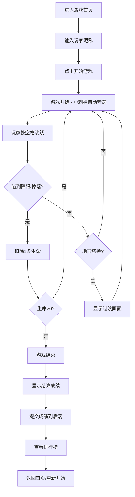

## 1. 产品概述

像素风格刺猬跑酷游戏，复刻经典刺猬索尼克玩法。玩家控制小刺猬自动向右奔跑，通过跳跃躲避障碍、收集金币，挑战高分。

- 核心玩法：自动跑酷 + 跳跃操作 + 道具收集 + 地形切换
- 目标用户：怀旧游戏玩家、休闲游戏爱好者
- 产品价值：重现经典游戏乐趣，提供简单易上手的休闲体验

## 2. 核心功能

### 2.1 用户角色

| 角色 | 注册方式 | 核心权限 |
|------|----------|----------|
| 玩家 | 输入昵称 | 玩游戏、提交成绩、查看排行榜 |

### 2.2 功能模块

1. **游戏主界面**：开始菜单、游戏画布、HUD显示（分数、生命、距离、金币）
2. **游戏核心玩法**：自动跑酷、跳跃控制、碰撞检测、道具系统
3. **地形系统**：3种地形循环（草地、工厂、火山），地形切换过渡
4. **后端服务**：成绩提交、排行榜查询
5. **排行榜界面**：显示历史最高分排名

### 2.3 页面详情

| 页面名称 | 模块名称 | 功能描述 |
|----------|----------|----------|
| 游戏首页 | 开始菜单 | 输入玩家昵称、开始游戏按钮、查看排行榜按钮 |
| 游戏界面 | 游戏画布 | 渲染游戏场景、角色动画、障碍物、道具 |
| 游戏界面 | HUD面板 | 显示当前分数、生命值、跑过距离、收集金币数 |
| 游戏界面 | 结算弹窗 | 游戏结束时显示成绩，提交分数按钮，重新开始 |
| 排行榜页 | 排行榜列表 | 按距离排序显示前10名玩家成绩 |

## 3. 核心流程

## 4. 用户界面设计

### 4.1 设计风格

- **主色调**：天蓝色 (#87CEEB) 背景、翠绿色 (#228B22) 草地、深蓝色 (#000080) 装饰
- **像素风格**：所有元素采用8-bit像素画风，角色使用方块像素绘制
- **字体**：使用像素风格字体 `Press Start 2P` 或等宽像素字体
- **按钮**：3D像素边框按钮，悬停时有像素抖动效果
- **动画**：角色跑步帧动画、跳跃旋转动画、背景视差滚动

### 4.2 页面设计概览

| 页面名称 | 模块名称 | UI元素 |
|----------|----------|--------|
| 游戏首页 | 开始菜单 | 像素标题、昵称输入框、开始按钮、排行榜按钮 |
| 游戏界面 | 游戏画布 | 像素刺猬角色、金币、尖刺、弹簧、星星、地形元素 |
| 游戏界面 | HUD面板 | 左上角生命显示（红心x3）、右上角分数/距离、左下角金币数 |
| 游戏界面 | 过渡画面 | 全屏淡入淡出，显示地形名称（"草地"→"工厂"→"火山"） |
| 排行榜页 | 排行榜列表 | 排名、玩家名、距离、金币、日期，像素风格表格 |

### 4.3 响应式

- 桌面端优先，游戏画布固定尺寸 800x400 像素
- 移动端自适应缩放，触摸屏幕触发跳跃
- 键盘操作：空格键跳跃，长按跳跃更高

### 4.4 视觉效果

- **视差滚动**：3层背景（远山/云、中景、近景）以不同速度滚动
- **角色动画**：跑步4帧动画、跳跃缩球旋转动画
- **粒子效果**：吃金币时闪烁粒子、受伤时红色闪烁
- **过渡效果**：地形切换时全屏渐变为新地形主色调
