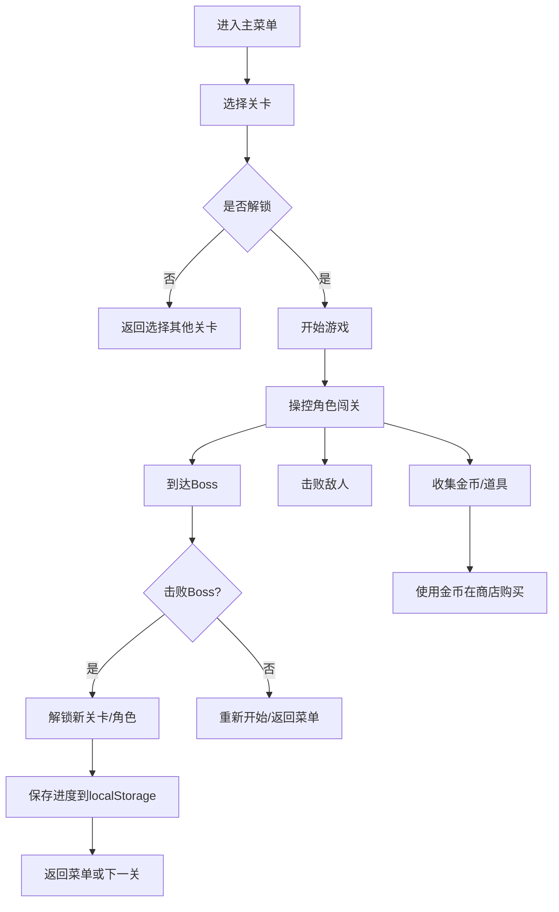

## 1. 产品概述
"像素大闯关"是一款复古像素风格的2D平台闯关游戏，玩家操控像素英雄穿越四个主题关卡，击败敌人和Boss，收集金币道具提升能力。

- 核心玩法：跳跃、攻击、躲避障碍、收集金币、击败Boss
- 目标用户：喜欢复古像素游戏和平台闯关游戏的玩家
- 产品价值：提供怀旧像素游戏体验，丰富的关卡设计和角色成长系统

## 2. 核心功能

### 2.1 用户角色
| 角色 | 注册方式 | 核心权限 |
|------|----------|----------|
| 玩家 | 无需注册，本地存储 | 游戏游玩、进度保存、商店购买 |

### 2.2 功能模块
1. **主菜单页面**：开始游戏、关卡选择、商店、角色选择、设置
2. **游戏关卡页面**：4个主题关卡（森林、火山、冰原、太空）
3. **商店系统**：购买道具、解锁角色
4. **角色系统**：多个可解锁角色，各有不同属性
5. **Boss战斗系统**：每个关卡末尾有Boss战

### 2.3 页面详情
| 页面名称 | 模块名称 | 功能描述 |
|----------|----------|----------|
| 主菜单 | 导航模块 | 开始游戏、关卡选择、商店、角色、设置入口 |
| 关卡选择 | 关卡卡片 | 显示已解锁关卡、星级评价、最高分数 |
| 游戏界面 | 游戏画布 | 渲染游戏场景、角色、敌人、道具、UI |
| 商店页面 | 商品列表 | 显示可购买道具和角色，金币余额 |
| 角色选择 | 角色卡片 | 展示已解锁角色属性，选择出战角色 |
| Boss战斗 | 战斗界面 | Boss血条、特殊攻击模式、通关奖励 |

## 3. 核心流程

## 4. 用户界面设计

### 4.1 设计风格
- **主色调**：复古像素风，8-bit配色
  - 森林关：绿色系 (#228B22, #32CD32, #006400)
  - 火山关：红橙色系 (#FF4500, #FF6347, #8B0000)
  - 冰原关：蓝白色系 (#87CEEB, #B0E0E6, #FFFFFF)
  - 太空关：深紫色系 (#4B0082, #8A2BE2, #000080)
- **像素字体**：使用Press Start 2P等复古像素字体
- **按钮风格**：像素化边框、3D凸起效果、点击凹陷动画
- **布局**：居中游戏画布，顶部状态栏，底部控制按钮

### 4.2 页面设计概述
| 页面名称 | 模块名称 | UI元素 |
|----------|----------|--------|
| 主菜单 | 标题区 | 像素游戏Logo、闪烁动画 |
| 主菜单 | 菜单按钮 | 像素风格按钮、hover发光效果 |
| 游戏界面 | 状态栏 | 血量、金币、分数、当前道具 |
| 游戏界面 | 虚拟摇杆 | 移动端触摸控制 |
| 商店 | 商品卡片 | 像素图标、价格标签、已拥有标记 |
| Boss战 | Boss血条 | 顶部大型血条、Boss名称 |

### 4.3 响应式
- 桌面端：键盘控制（方向键/WASD移动、空格跳跃、J攻击）
- 移动端：虚拟摇杆和按钮，触摸优化
- 自适应：游戏画布按比例缩放适配不同屏幕

## 5. 游戏元素设计

### 5.1 角色
- **初始英雄**：均衡型，速度中等，攻击力中等
- **忍者**：高速型，速度快，攻击力低（需解锁）
- **骑士**：高血型，血量多，速度慢（需解锁）
- **法师**：远程型，可发射魔法弹（需解锁）

### 5.2 道具
- **生命药水**：恢复1点生命值
- **无敌星星**：10秒无敌状态
- **速度靴**：移动速度提升30%
- **力量药水**：攻击力翻倍
- **护盾**：抵挡1次伤害

### 5.3 敌人
- **森林**：野狼、蜜蜂、藤蔓怪
- **火山**：火焰史莱姆、熔岩虫、火龙
- **冰原**：雪球怪、冰冻蝙蝠、冰霜巨人
- **太空**：外星机器人、激光炮塔、黑洞

### 5.4 障碍
- **森林**：藤蔓陷阱、尖刺、深坑
- **火山**：熔岩池、喷气孔、落石
- **冰原**：冰面（打滑）、冰刺、暴风雪
- **太空**：激光束、重力反转区、陨石
