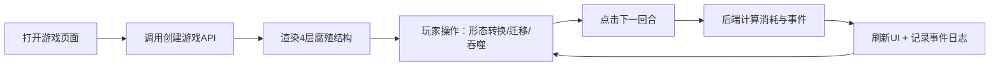

## 1. 产品概述

热带雨林腐殖层生存策略游戏可视化操作界面——玩家通过图形化界面管理分解者种群（真菌/细菌/线虫）在4层腐殖结构中觅食存活。基于已有后端API，提供直接可操作的交互体验。

- 目标用户：策略游戏爱好者、生态模拟教育场景
- 产品价值：将抽象的分解者生态系统具象为可点击操作的策略游戏

## 2. 核心功能

### 2.1 功能模块

1. **游戏主面板**：4层腐殖层可视化、种群分布实时展示、回合控制
2. **种群操作面板**：形态转换（手动触发）、跨层迁移、添加种群、线虫吞噬
3. **状态监控区**：有机质含量、密度上限、资源枯竭警告、暴雨事件提示
4. **配置与帮助区**：游戏参数说明、操作指引

### 2.2 页面详情

| 页面名称 | 模块名称 | 功能描述 |
|-----------|-------------|---------------------|
| 游戏主界面 | 腐殖层可视化 | 从上到下展示落叶层/半腐层/腐殖层/矿质层，每层显示有机质进度条和种群卡片 |
| 游戏主界面 | 顶部控制栏 | 创建新游戏、游戏ID切换、回合推进按钮、当前回合数、暴雨事件闪烁提示 |
| 游戏主界面 | 种群操作区 | 每个种群卡片支持：形态转换、迁移、吞噬（线虫）、数量显示 |
| 游戏主界面 | 右侧状态面板 | 游戏概要数据：总人口、平均有机质、枯竭层数、淋溶剩余回合 |
| 游戏主界面 | 事件日志 | 逐回合记录：消耗、枯竭触发、暴雨、淋溶等事件 |

## 3. 核心流程

玩家打开页面 → 自动创建/恢复游戏 → 查看4层腐殖层与种群 → 点击操作（形态转换/迁移/吞噬）→ 点击"下一回合" → 后端计算消耗/暴雨/枯竭 → 前端刷新并记录日志 → 循环操作

## 4. 界面设计

### 4.1 设计风格

- **主题色**：深森林绿（#1B4332）为主、腐殖棕（#6B4423）为辅、苔藓金（#B7C96A）作点缀
- **视觉隐喻**：每层用渐变模拟土壤深度，落叶层浅暖→矿质层深冷
- **字体**：Lora（复古衬线，标题）+ 系统等宽（数据展示）
- **卡片风格**：圆角8px、半透明背景、柔化阴影模拟腐殖颗粒感
- **动画**：有机质消耗时进度条平滑过渡、暴雨事件红色脉冲、枯竭层抖动警告

### 4.2 页面设计总览

| 区域 | 模块 | UI元素 |
|-----|-----|--------|
| 顶部 | 控制栏 | 大号回合数徽章、绿色"下一回合"按钮、暴雨指示灯、新建游戏按钮 |
| 左侧70% | 腐殖层堆叠 | 4个横向图层卡片，每个含有机质进度条+种群徽章+操作按钮 |
| 右侧30% | 状态面板 | 数据卡片网格、事件日志滚动区 |

### 4.3 响应式

桌面端优先（≥1280px），1024px以下右侧面板折叠到底部，移动端隐藏种群徽章直接显示数字。
