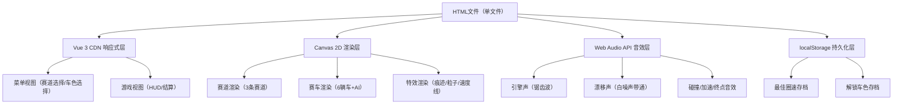

## 1. 架构设计



## 2. 技术说明

- **前端框架**：Vue 3 (CDN引入: https://unpkg.com/vue@3/dist/vue.global.js)
- **渲染引擎**：HTML5 Canvas 2D API（1200x800固定尺寸）
- **音频系统**：Web Audio API（原生，无外部音频文件）
- **数据持久化**：localStorage
- **其他依赖**：无，纯单文件实现
- **字体**：Google Fonts CDN引入 Orbitron + Montserrat

## 3. 模块划分（单文件内结构）

| 模块 | 位置 | 说明 |
|------|------|------|
| 赛道数据 | TRACKS 对象 | 3条赛道的几何参数（椭圆、直角弯、S弯） |
| 赛车物理 | updateCar() 函数 | 加速度/速度/角度/漂移状态更新 |
| AI系统 | updateAI() 函数 | 路径跟踪+预判减速+橡胶带效应 |
| 碰撞检测 | checkCollision() | 赛道边界碰撞判定与反弹 |
| 渲染系统 | draw*() 系列函数 | 赛道/赛车/HUD/特效绘制 |
| 音效系统 | SoundManager 对象 | Web Audio合成音效管理 |
| 存档系统 | Storage 对象 | localStorage读写封装 |
| Vue组件 | Vue App | 菜单/游戏/结算视图切换 |

## 4. 核心数据模型

### 4.1 赛车状态 CarState
```javascript
{
  x: number,           // 世界坐标X
  y: number,           // 世界坐标Y
  angle: number,       // 角度（弧度）
  speed: number,       // 当前速度
  maxSpeed: number,    // 最大速度
  drift: boolean,      // 是否漂移中
  driftFrames: number, // 漂移持续帧数
  boostFrames: number, // 加速剩余帧数
  lap: number,         // 当前圈数
  lastCheckpoint: number, // 上个检查点
  color: string,       // 车身颜色
  isPlayer: boolean,   // 是否玩家
  aiDifficulty: 'easy'|'normal'|'hard'
}
```

### 4.2 存档数据 SaveData
```javascript
{
  bestTimes: {
    beginner: number|null,  // 新手赛道最佳圈速(ms)
    city: number|null,      // 城市赛道最佳圈速(ms)
    mountain: number|null   // 山间赛道最佳圈速(ms)
  },
  unlockedColors: string[],  // 已解锁车色列表
  selectedColor: string      // 当前选中车色
}
```

### 4.3 localStorage键名
- `racing_game_save_v1` - 主存档数据

## 5. 关键算法

### 5.1 漂移转向系数
```
turnFactor = 1 + 5 / max(currentSpeed, 1)
实际转角 = turnSpeed * turnFactor * (left/right)
```

### 5.2 漂移检测与加速
- 条件：brake=true AND (left=true OR right=true) AND speed > 2
- 漂移帧>30触发：boostFrames=120，速度×1.5

### 5.3 AI预判减速
计算前方3个检查点的曲率，曲率越大减速越多：
- easy AI: 额外减速30%
- normal AI: 正常减速
- hard AI: 最优路线+偶尔触发漂移加速

### 5.4 橡胶带效应
根据排名调整AI基础速度：
- 落后：speed × 1.1
- 领先：speed × 0.95
