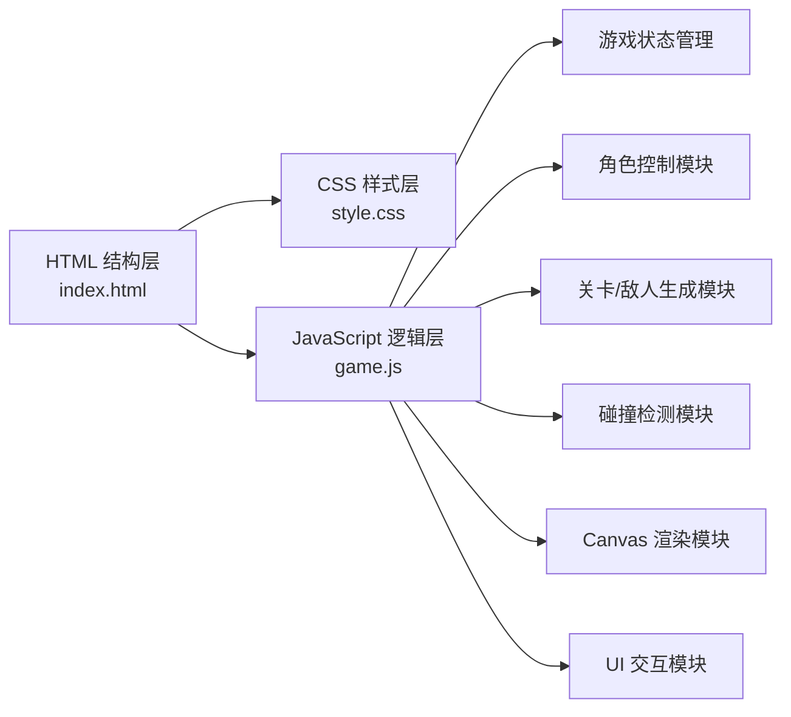

## 1. 架构设计



## 2. 技术说明
- 前端：纯 HTML5 + CSS3 + 原生 JavaScript (ES6+)
- 渲染技术：HTML5 Canvas 2D
- 无外部框架依赖，不使用 React/Vue
- 不使用后端服务，纯前端单页游戏
- 无数据库，游戏进度存储在 localStorage（可选）

## 3. 文件结构
| 文件路径 | 用途 |
|----------|------|
| `/space-runner/index.html` | 游戏主页面，包含 Canvas 和 UI 容器 |
| `/space-runner/style.css` | 全部样式定义：菜单、HUD、结算界面、动画 |
| `/space-runner/game.js` | 游戏核心逻辑（状态、渲染、物理、关卡） |

## 4. 核心模块设计

### 4.1 游戏状态机
```
MENU → PLAYING → PAUSED → PLAYING
PLAYING → WIN  → MENU
PLAYING → LOSE → MENU
```

### 4.2 关卡配置数据
每个关卡包含：
- 主题色（背景渐变、地面颜色）
- 目标距离
- 基础速度、速度递增率
- 障碍物类型数组（专属障碍 + 通用障碍）
- 敌人类型数组（每关独有怪物）
- 特殊天气/环境效果（沙尘暴、雪崩等）

### 4.3 角色属性
```javascript
{
  x, y,           // 位置
  width, height,  // 碰撞盒尺寸
  velocityY,      // 垂直速度（跳跃物理）
  isJumping,      // 是否跳跃中
  isSliding,      // 是否下滑中
  lives,          // 生命值（3）
  invincible,     // 无敌帧计时
  boost,          // 加速能量值
  boostActive     // 加速是否激活
}
```

### 4.4 实体基类
所有障碍物、敌人、收集物共享：
- x, y, width, height
- update() 位置更新
- draw(ctx) 渲染
- type 类型标识

## 5. 关卡详细设计

| 关卡 | 主题 | 专属障碍物 | 专属怪物 | 环境效果 | 目标距离 |
|------|------|-----------|----------|----------|----------|
| 1 | 沙漠星球 | 仙人掌、流沙陷阱、滚石 | 沙虫（地面钻出没） | 沙尘暴粒子 | 2000m |
| 2 | 丛林星球 | 藤蔓（摆动撞击）、肉食植物（咬合）、毒蘑菇 | 外星猴（树枝跳跃） | 雨滴、叶片飘落 | 3000m |
| 3 | 冰雪星球 | 冰刺、雪球（滚动）、冰裂缝 | 雪怪（追逐） | 雪花飘落、屏幕结冰效果 | 4000m |
| 4 | 机械星球 | 激光束（周期性开关）、尖刺、旋转齿轮 | 守卫机器人（发射子弹） | 电光粒子、屏幕扫描线 | 5000m |

## 6. 操作说明
- 键盘：Space / ↑ 跳跃（可二段跳）、↓ 下滑、P 暂停
- 触屏/鼠标：点击屏幕上半部分跳跃，下半部分下滑
