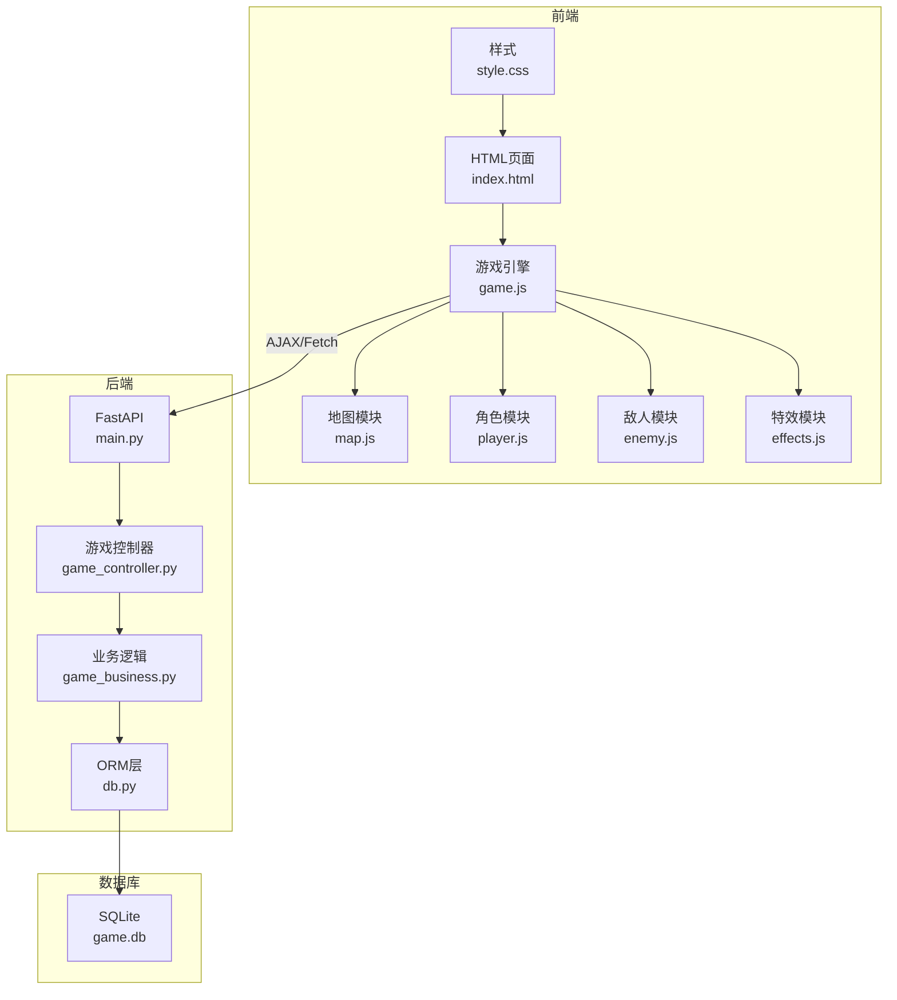
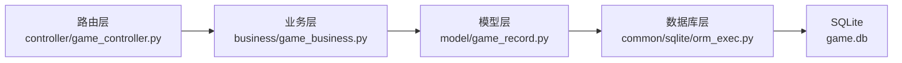
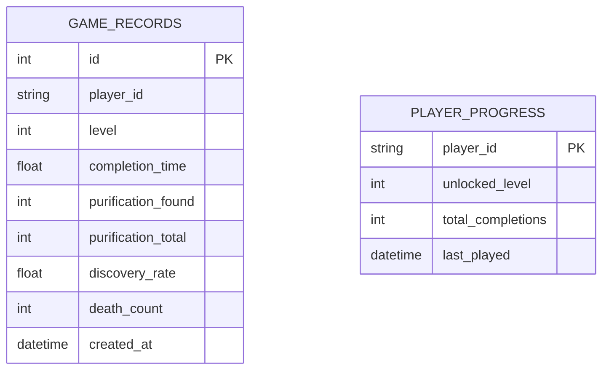

## 1. 架构设计



## 2. 技术说明

- **前端**：原生HTML5 + CSS3 + JavaScript (ES6+)，无框架依赖
- **后端**：FastAPI@0.100+，Python 3.9+
- **数据库**：SQLite 3，使用现有项目ORM框架
- **初始化工具**：无需额外构建工具，直接浏览器运行前端

## 3. 路由定义

| 路由 | 方法 | 用途 |
|------|------|------|
| / | GET | 游戏首页（静态文件） |
| /static/poison-game/* | GET | 游戏静态资源 |
| /api/game/records | GET | 获取玩家所有通关记录 |
| /api/game/records | POST | 提交新的通关记录 |
| /api/game/records/{level} | GET | 获取指定关卡的最佳记录 |
| /api/game/progress | GET | 获取玩家关卡解锁进度 |

## 4. API定义

### 数据类型定义

```typescript
interface GameRecord {
  id: number;
  player_id: string;
  level: number;
  completion_time: number;  // 秒
  purification_found: number;  // 已发现净化站数量
  purification_total: number;  // 本关净化站总数
  discovery_rate: number;  // 净化站发现率 (0-1)
  death_count: number;
  created_at: string;
}

interface GameProgress {
  player_id: string;
  unlocked_level: number;  // 已解锁的最高关卡 (1-12)
  total_completions: number;
}
```

### 请求/响应示例

**POST /api/game/records**
```json
// Request
{
  "player_id": "uuid-string",
  "level": 1,
  "completion_time": 45.5,
  "purification_found": 2,
  "purification_total": 3,
  "death_count": 1
}

// Response (200)
{
  "id": 1,
  "player_id": "uuid-string",
  "level": 1,
  "completion_time": 45.5,
  "purification_found": 2,
  "purification_total": 3,
  "discovery_rate": 0.667,
  "death_count": 1,
  "created_at": "2024-01-15T10:30:00"
}
```

**GET /api/game/progress**
```json
// Response (200)
{
  "player_id": "uuid-string",
  "unlocked_level": 5,
  "total_completions": 4
}
```

## 5. 服务器架构图



## 6. 数据模型

### 6.1 数据模型定义



### 6.2 数据定义语言

```sql
-- 游戏记录表
CREATE TABLE IF NOT EXISTS game_records (
    id INTEGER PRIMARY KEY AUTOINCREMENT,
    player_id TEXT NOT NULL,
    level INTEGER NOT NULL CHECK (level >= 1 AND level <= 12),
    completion_time REAL NOT NULL,
    purification_found INTEGER NOT NULL,
    purification_total INTEGER NOT NULL,
    discovery_rate REAL NOT NULL,
    death_count INTEGER DEFAULT 0,
    created_at DATETIME DEFAULT CURRENT_TIMESTAMP
);

CREATE INDEX idx_game_records_player ON game_records(player_id);
CREATE INDEX idx_game_records_level ON game_records(level);
CREATE INDEX idx_game_records_time ON game_records(completion_time);

-- 玩家进度表
CREATE TABLE IF NOT EXISTS player_progress (
    player_id TEXT PRIMARY KEY,
    unlocked_level INTEGER DEFAULT 1 CHECK (unlocked_level >= 1 AND unlocked_level <= 12),
    total_completions INTEGER DEFAULT 0,
    last_played DATETIME DEFAULT CURRENT_TIMESTAMP
);
```

## 7. 前端文件结构

```
static/poison-game/
├── index.html          # 游戏主页面
├── css/
│   └── style.css       # 游戏样式（毒雾特效、血量条等）
└── js/
    ├── config.js       # 游戏配置（12关地图数据、敌人数值）
    ├── game.js         # 游戏主循环、状态管理
    ├── map.js          # 地图生成、渲染、碰撞检测
    ├── player.js       # 玩家角色、移动、状态
    ├── enemy.js        # 敌人AI、巡逻、攻击
    ├── effects.js      # 毒雾、视野、动画特效
    └── api.js          # 后端API调用
```

## 8. 核心游戏逻辑

### 地图配置（每关30×20格）
- **入口区**（前6列）：毒雾稀薄 1HP/秒，2-3个巡逻敌人
- **中段**（中间18列）：毒雾浓密 5HP/秒，净化站藏于角落
- **出口区**（最后6列）：毒雾最浓 8HP/秒，路径最短

### 角色属性
- 初始血量：120 HP
- 移动速度：4格/秒
- 解毒喷雾：每关2个，使用后5秒免疫毒雾

### 净化站效果
- 接触后恢复40 HP
- 清除毒雾影响10秒
- 计入净化站发现率

### 敌人类型
| 类型 | 攻击方式 | 伤害 | 特殊效果 |
|------|----------|------|----------|
| 毒虫 | 近战 | 15 | 毒雾扣血翻倍3秒 |
| 毒蛙 | 远程 | 20 | 地面残留毒池5秒 |
| 毒蜂 | 群攻 | 5×3-5 | 速度快 |
