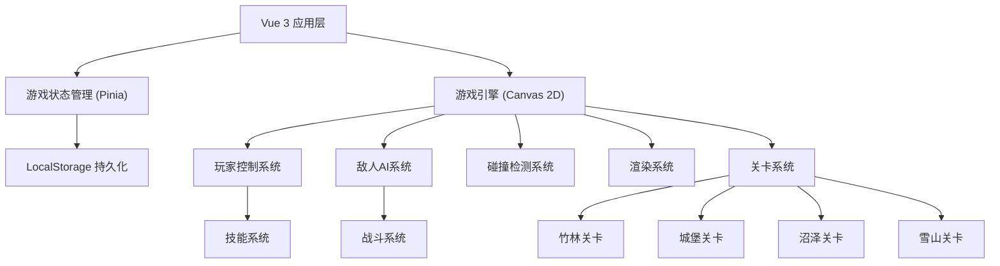

## 1. 架构设计



## 2. 技术描述

- **前端框架**: Vue 3 + Composition API
- **构建工具**: Vite
- **状态管理**: Pinia
- **游戏渲染**: HTML5 Canvas 2D
- **样式方案**: Tailwind CSS 3
- **数据持久化**: LocalStorage
- **字体**: Google Fonts (Ma Shan Zheng, Noto Sans SC)

## 3. 路由定义

| 路由 | 页面 | 功能 |
|------|------|------|
| / | 主菜单页面 | 开始游戏、继续游戏、关卡选择 |
| /game/:levelId | 游戏页面 | 游戏主界面、关卡游玩 |
| /level-select | 关卡选择页面 | 选择已解锁的关卡 |

## 4. 数据模型

### 4.1 游戏存档数据结构

```typescript
interface GameSave {
  currentLevel: number;
  unlockedLevels: number[];
  player: {
    maxHealth: number;
    health: number;
    maxEnergy: number;
    energy: number;
    learnedSkills: string[];
  };
  collectedScrolls: {
    [levelId: number]: string[];
  };
  lastSaveTime: number;
}
```

### 4.2 玩家数据结构

```typescript
interface Player {
  x: number;
  y: number;
  width: number;
  height: number;
  velocityX: number;
  velocityY: number;
  health: number;
  maxHealth: number;
  energy: number;
  maxEnergy: number;
  isJumping: boolean;
  isCrouching: boolean;
  isStealth: boolean;
  isAttacking: boolean;
  facingRight: boolean;
  skills: Skill[];
}
```

### 4.3 敌人数据结构

```typescript
interface Enemy {
  id: string;
  type: 'patrol' | 'archer' | 'monster' | 'wolf';
  x: number;
  y: number;
  width: number;
  height: number;
  health: number;
  maxHealth: number;
  damage: number;
  patrolStart: number;
  patrolEnd: number;
  direction: 1 | -1;
  state: 'patrol' | 'alert' | 'chase' | 'attack';
  alertRange: number;
  attackRange: number;
}
```

### 4.4 技能数据结构

```typescript
interface Skill {
  id: string;
  name: string;
  description: string;
  energyCost: number;
  damage: number;
  cooldown: number;
  currentCooldown: number;
  icon: string;
}
```

### 4.5 卷轴数据结构

```typescript
interface Scroll {
  id: string;
  x: number;
  y: number;
  collected: boolean;
  skillId: string;
  skillName: string;
}
```

### 4.6 关卡数据结构

```typescript
interface Level {
  id: number;
  name: string;
  theme: 'bamboo' | 'castle' | 'swamp' | 'snow';
  width: number;
  height: number;
  platforms: Platform[];
  enemies: Enemy[];
  scrolls: Scroll[];
  hazards: Hazard[];
  playerStart: { x: number; y: number };
  exit: { x: number; y: number; width: number; height: number };
}
```

## 5. 核心系统设计

### 5.1 游戏循环

```
requestAnimationFrame → 更新游戏状态 → 渲染画面
  ↓
玩家输入处理 → 物理更新 → 碰撞检测 → AI更新 → 技能更新
```

### 5.2 控制键位

| 按键 | 功能 |
|------|------|
| A / ← | 向左移动 |
| D / → | 向右移动 |
| W / ↑ / 空格 | 跳跃 |
| S / ↓ | 下蹲 |
| J | 普通攻击 |
| K | 释放技能1 |
| L | 潜行模式 |
| ESC | 暂停游戏 |

### 5.3 LocalStorage 操作

- **保存时机**: 关卡完成时、收集卷轴时、暂停游戏时
- **保存键名**: `tegong_game_save`
- **自动保存**: 每30秒自动保存一次

## 6. 项目目录结构

```
tegong_web/
├── index.html
├── package.json
├── vite.config.js
├── tailwind.config.js
├── postcss.config.js
├── src/
│   ├── main.js
│   ├── App.vue
│   ├── router/
│   │   └── index.js
│   ├── stores/
│   │   └── gameStore.js
│   ├── views/
│   │   ├── MainMenu.vue
│   │   ├── LevelSelect.vue
│   │   └── GameView.vue
│   ├── game/
│   │   ├── Engine.js
│   │   ├── Player.js
│   │   ├── Enemy.js
│   │   ├── Skill.js
│   │   ├── levels/
│   │   │   ├── index.js
│   │   │   ├── bamboo.js
│   │   │   ├── castle.js
│   │   │   ├── swamp.js
│   │   │   └── snow.js
│   │   └── utils/
│   │       ├── collision.js
│   │       └── storage.js
│   ├── components/
│   │   ├── GameHUD.vue
│   │   ├── PauseMenu.vue
│   │   └── SkillBar.vue
│   └── assets/
│       └── styles/
│           └── main.css
```

