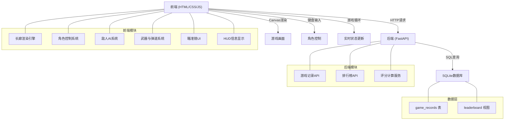
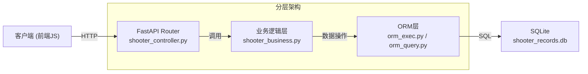
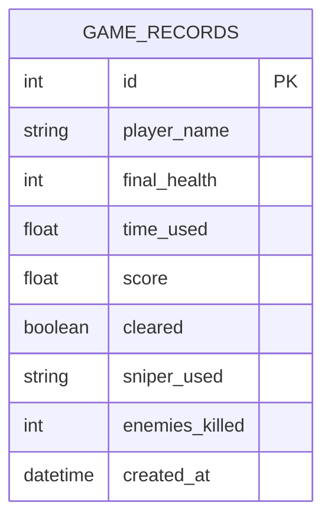

## 1. 架构设计



## 2. 技术选型说明

- **前端**：原生 HTML5 + CSS3 + JavaScript (ES6+)，使用 Canvas API 进行游戏渲染
  - 无需构建工具，直接运行
  - Canvas 2D 提供高性能的实时游戏渲染
  - 原生 JS 事件处理键盘输入和游戏循环
- **后端**：FastAPI (Python)
  - 高性能异步支持
  - 自动生成 API 文档
  - 轻量级部署
- **数据库**：SQLite
  - 零配置，文件型数据库
  - 适合中小型项目
  - 与 FastAPI 无缝集成
- **项目结构**：遵循现有代码库的分层架构（controller/business/model）

## 3. 路由定义

| 路由 | 方法 | 用途 |
|------|------|------|
| `/` | GET | 游戏主页面 |
| `/shooter` | GET | 射击游戏HTML页面 |
| `/api/shooter/records` | POST | 提交游戏成绩 |
| `/api/shooter/records/{record_id}` | GET | 查询单条游戏记录 |
| `/api/shooter/leaderboard` | GET | 获取排行榜TOP10 |
| `/api/shooter/leaderboard/personal` | GET | 获取个人最佳成绩 |

## 4. API 接口定义

### 4.1 提交游戏成绩
**请求体:**
```typescript
interface GameRecordRequest {
  player_name: string;      // 玩家名称
  final_health: number;     // 剩余血量 (0-100)
  time_used: number;        // 用时(秒)
  score: number;            // 最终得分
  cleared: boolean;         // 是否通关
  sniper_used: number[];    // 使用过的狙击位
  enemies_killed: number;   // 消灭敌人数
}
```

**响应:**
```typescript
interface GameRecordResponse {
  id: number;
  player_name: string;
  score: number;
  rank: number;             // 当前排名
  created_at: string;
}
```

### 4.2 获取排行榜
**响应:**
```typescript
interface LeaderboardEntry {
  rank: number;
  player_name: string;
  score: number;
  final_health: number;
  time_used: number;
  created_at: string;
}

interface LeaderboardResponse {
  entries: LeaderboardEntry[];
  total_players: number;
}
```

### 4.3 评分计算
```python
# 评分公式
def calculate_score(final_health: float, time_used: float) -> float:
    # 用时系数: 300秒内为1，每超出10秒系数减0.1，最低0.5
    time_factor = max(0.5, 1.0 - max(0, (time_used - 300)) / 100)
    return round(final_health * time_factor, 2)
```

## 5. 服务端架构图



## 6. 数据模型

### 6.1 ER 图



### 6.2 DDL 语句

```sql
-- 游戏记录表
CREATE TABLE IF NOT EXISTS shooter_game_records (
    id INTEGER PRIMARY KEY AUTOINCREMENT,
    player_name VARCHAR(50) NOT NULL,
    final_health INTEGER NOT NULL CHECK (final_health >= 0 AND final_health <= 100),
    time_used REAL NOT NULL CHECK (time_used > 0),
    score REAL NOT NULL,
    cleared BOOLEAN NOT NULL DEFAULT 0,
    sniper_used TEXT,            -- JSON数组格式
    enemies_killed INTEGER NOT NULL DEFAULT 0,
    created_at TIMESTAMP DEFAULT CURRENT_TIMESTAMP
);

-- 索引: 按分数降序排列，加速排行榜查询
CREATE INDEX IF NOT EXISTS idx_shooter_score ON shooter_game_records (score DESC);
CREATE INDEX IF NOT EXISTS idx_shooter_player ON shooter_game_records (player_name);
```

### 6.3 前端数据结构

```javascript
// 游戏状态
const GameState = {
  playerPosition: 0,           // 当前位置 (0-250)
  health: 100,                 // 血量
  maxHealth: 100,
  isCrouching: false,          // 是否蹲姿
  isAiming: false,             // 是否瞄准模式
  ammoInClip: 12,              // 当前弹夹弹药
  maxAmmoClip: 12,
  isReloading: false,          // 是否换弹中
  reloadProgress: 0,           // 换弹进度 0-1
  gameTime: 0,                 // 游戏用时(秒)
  isGameOver: false,
  isWin: false,
  sniperPositions: [50, 100, 150, 200, 250],  // 狙击位位置
  availableSnipers: [true, true, true, true, true],  // 狙击位是否可用
  enemies: [],                 // 敌人列表
  bullets: [],                 // 子弹列表
  score: 0
};

// 敌人类型
const EnemyType = {
  PATROL: 'patrol',            // 巡逻型
  AMBUSH: 'ambush'             // 伏击型
};
```

### 6.4 关卡配置

```javascript
const LevelConfig = {
  totalLength: 250,            // 总长度(格)
  enemyWaveInterval: 15,       // 敌人波次间隔(格)
  enemiesPerWave: { min: 3, max: 5 },
  sniperPositions: [50, 100, 150, 200, 250],
  damage: {
    ambushStanding: 25,        // 站立被伏击伤害
    ambushCrouching: 12.5,     // 蹲姿被伏击伤害(减伤50%)
  },
  reloadTime: 3000,            // 换弹时间(毫秒)
  playerSpeed: 0.15,           // 移动速度(格/帧)
  aimZoom: 2.5,                // 瞄准镜放大倍数
  bulletSpeed: 1.5,            // 子弹速度(格/帧)
  enemyShootRange: 20,         // 敌人射击范围(格)
  ambushTriggerRange: 8        // 伏击触发距离(格)
};
```
