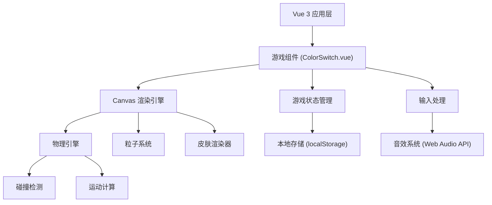

## 1. 架构设计



## 2. 技术描述

- **前端框架**：Vue 3 + TypeScript + Vite
- **样式方案**：TailwindCSS 3
- **渲染技术**：HTML5 Canvas 2D
- **状态管理**：Vue 3 Composition API (reactive/ref)
- **数据持久化**：localStorage
- **音频方案**：Web Audio API 合成音效

### 核心依赖
- `vue@3.4` - 前端框架
- `typescript@5` - 类型安全
- `vite@5` - 构建工具
- `tailwindcss@3` - 样式框架

## 3. 目录结构

```
game-color-switch/
├── src/
│   ├── components/
│   │   └── ColorSwitch.vue      # 主游戏组件
│   ├── game/
│   │   ├── types.ts             # 类型定义
│   │   ├── config.ts            # 游戏配置常量
│   │   ├── engine/
│   │   │   ├── PhysicsEngine.ts # 物理引擎
│   │   │   ├── CollisionDetector.ts # 碰撞检测
│   │   │   └── ParticleSystem.ts # 粒子系统
│   │   ├── entities/
│   │   │   ├── Ball.ts          # 小球类
│   │   │   ├── Ring.ts          # 圆环类
│   │   │   ├── Star.ts          # 星星类
│   │   │   └── SkinManager.ts   # 皮肤管理器
│   │   ├── audio/
│   │   │   └── AudioManager.ts  # 音效管理器
│   │   └── storage/
│   │       └── SaveManager.ts   # 存档管理器
│   ├── App.vue
│   ├── main.ts
│   └── style.css
├── index.html
├── package.json
├── vite.config.ts
└── tsconfig.json
```

## 4. 数据模型

### 4.1 游戏状态类型

```typescript
interface GameState {
  status: 'menu' | 'playing' | 'paused' | 'gameover';
  score: number;
  totalScore: number;
  highScore: number;
  lives: number;
  combo: number;
  frenzyMode: boolean;
  frenzyTimeLeft: number;
  ringsPassed: number;
  gravity: number;
  ballColorIndex: number;
  selectedSkin: string;
  unlockedSkins: string[];
}
```

### 4.2 游戏实体类型

```typescript
interface Ball {
  x: number;
  y: number;
  vy: number;
  radius: number;
  color: string;
  trail: { x: number; y: number; alpha: number }[];
}

interface Ring {
  y: number;
  radius: number;
  thickness: number;
  segments: { color: string; startAngle: number; endAngle: number }[];
  star?: Star;
  passed: boolean;
  isDouble: boolean;
}

interface Star {
  x: number;
  y: number;
  collected: boolean;
  rotation: number;
}

interface Skin {
  id: string;
  name: string;
  unlockScore: number;
  render: (ctx: CanvasRenderingContext2D, ball: Ball) => void;
}
```

## 5. 游戏配置常量

| 参数 | 值 | 说明 |
|------|-----|------|
| GRAVITY | 0.3 | 重力加速度 (px/帧²) |
| JUMP_FORCE | -6 | 跳跃向上速度 (px/帧) |
| COLOR_CHANGE_INTERVAL | 800 | 颜色轮换间隔 (ms) |
| RING_SPEED | 2 | 圆环上移速度 (px/帧) |
| RING_SPACING_MIN | 120 | 圆环最小间距 |
| RING_SPACING_MAX | 200 | 圆环最大间距 |
| DOUBLE_RING_CHANCE | 0.2 | 双环出现概率 |
| DOUBLE_RING_SPACING | 80 | 双环间距 |
| INITIAL_LIVES | 3 | 初始生命数 |
| FRENZY_THRESHOLD | 20 | 触发狂热模式连击数 |
| FRENZY_DURATION | 5000 | 狂热模式持续时间 (ms) |
| DIFFICULTY_INCREASE_INTERVAL | 10 | 每过多少环增加难度 |
| DIFFICULTY_INCREASE_AMOUNT | 0.05 | 每次难度增加量 |
| STAR_SCORE | 100 | 收集星星得分 |
| SKIN_UNLOCK_NEON | 500 | 霓虹球解锁分数 |
| SKIN_UNLOCK_RAINBOW | 2000 | 彩虹球解锁分数 |
| SKIN_UNLOCK_FIRE | 5000 | 火焰球解锁分数 |
| COLORS | ['#ff3366', '#ffdd33', '#3399ff', '#33ff99'] | 四色数组 |
