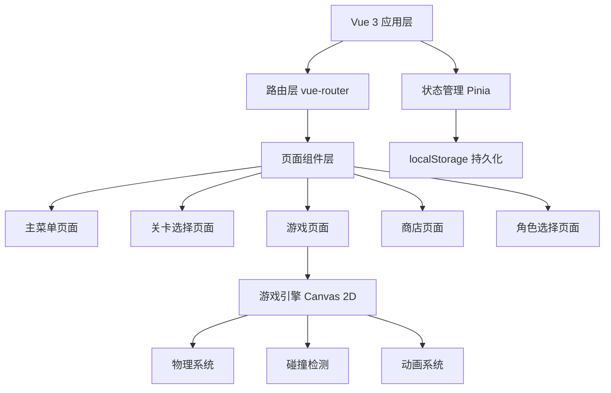
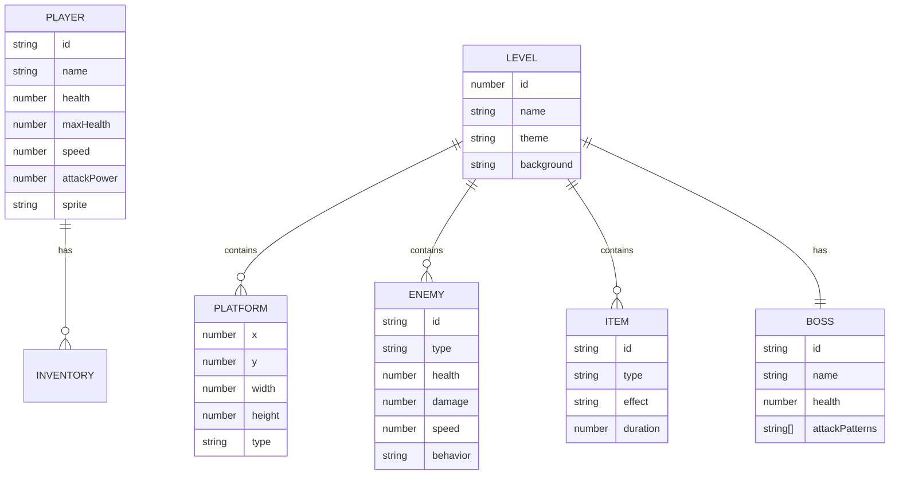

## 1. 架构设计



## 2. 技术描述

- **前端框架**: Vue 3 + TypeScript + Vite
- **路由管理**: Vue Router 4
- **状态管理**: Pinia
- **样式方案**: Tailwind CSS 3 + 自定义像素风格CSS
- **游戏渲染**: HTML5 Canvas 2D API
- **数据持久化**: localStorage
- **图标**: Lucide Icons（像素风格适配）

## 3. 目录结构

```
static/cg_web/
├── src/
│   ├── components/          # 通用UI组件
│   │   ├── PixelButton.vue
│   │   ├── PixelCard.vue
│   │   └── HealthBar.vue
│   ├── pages/               # 页面组件
│   │   ├── MainMenu.vue
│   │   ├── LevelSelect.vue
│   │   ├── Game.vue
│   │   ├── Shop.vue
│   │   └── CharacterSelect.vue
│   ├── game/                # 游戏核心逻辑
│   │   ├── engine.ts        # 游戏引擎
│   │   ├── physics.ts       # 物理系统
│   │   ├── collision.ts     # 碰撞检测
│   │   ├── renderer.ts      # 渲染器
│   │   ├── entities/        # 游戏实体
│   │   │   ├── Player.ts
│   │   │   ├── Enemy.ts
│   │   │   ├── Boss.ts
│   │   │   ├── Item.ts
│   │   │   └── Platform.ts
│   │   └── levels/          # 关卡数据
│   │       ├── forest.ts
│   │       ├── volcano.ts
│   │       ├── ice.ts
│   │       └── space.ts
│   ├── stores/              # Pinia状态管理
│   │   ├── gameStore.ts     # 游戏状态
│   │   ├── playerStore.ts   # 玩家状态
│   │   └── shopStore.ts     # 商店状态
│   ├── composables/         # 组合式函数
│   │   ├── useGameLoop.ts
│   │   ├── useKeyboard.ts
│   │   └── useLocalStorage.ts
│   ├── utils/               # 工具函数
│   │   ├── constants.ts     # 游戏常量
│   │   └── helpers.ts
│   ├── types/               # TypeScript类型定义
│   │   └── game.ts
│   ├── router/              # 路由配置
│   │   └── index.ts
│   ├── App.vue
│   ├── main.ts
│   └── style.css            # 全局样式+像素风格
├── public/                  # 静态资源
│   └── assets/
│       ├── sprites/         # 像素精灵图
│       └── sounds/          # 音效
├── index.html
├── package.json
├── vite.config.ts
├── tsconfig.json
└── tailwind.config.js
```

## 4. 路由定义

| 路由路径 | 页面名称 | 功能说明 |
|----------|----------|----------|
| / | 主菜单 | 游戏入口，导航到各功能 |
| /levels | 关卡选择 | 选择已解锁关卡 |
| /game/:levelId | 游戏页面 | 实际游戏进行界面 |
| /shop | 商店 | 购买道具和角色 |
| /characters | 角色选择 | 选择出战角色 |

## 5. 状态管理 (Pinia Store)

### 5.1 gameStore - 游戏进度状态
```typescript
interface GameState {
  unlockedLevels: number[];      // 已解锁关卡ID
  levelStars: Record<number, number>;  // 关卡星级
  levelScores: Record<number, number>; // 关卡最高分
  totalCoins: number;            // 总金币
  unlockedCharacters: string[];  // 已解锁角色ID
  currentCharacter: string;      // 当前选择角色
  inventory: string[];           // 背包道具
}
```

### 5.2 playerStore - 玩家实时状态
```typescript
interface PlayerState {
  health: number;
  maxHealth: number;
  speed: number;
  attackPower: number;
  invincible: boolean;
  hasShield: boolean;
  speedBoost: boolean;
  powerBoost: boolean;
}
```

### 5.3 shopStore - 商店数据
```typescript
interface ShopItem {
  id: string;
  name: string;
  type: 'item' | 'character';
  price: number;
  description: string;
  owned: boolean;
}
```

## 6. 数据模型

### 6.1 实体类型定义


### 6.2 localStorage 存储结构
```typescript
// 存储键名: 'pixel_game_save'
interface GameSaveData {
  version: string;
  timestamp: number;
  gameState: GameState;
  settings: {
    soundEnabled: boolean;
    musicVolume: number;
    sfxVolume: number;
  };
}
```

## 7. 游戏核心常量

```typescript
// 物理常量
export const GRAVITY = 0.6;
export const JUMP_FORCE = -14;
export const MOVE_SPEED = 5;
export const FRICTION = 0.8;

// 画布尺寸
export const CANVAS_WIDTH = 960;
export const CANVAS_HEIGHT = 540;

// 格子大小
export const TILE_SIZE = 32;

// 角色属性预设
export const CHARACTERS = {
  hero: { name: '像素英雄', health: 5, speed: 5, attack: 1 },
  ninja: { name: '忍者', health: 3, speed: 8, attack: 0.5 },
  knight: { name: '骑士', health: 8, speed: 3, attack: 1.5 },
  mage: { name: '法师', health: 4, speed: 4, attack: 2, ranged: true },
};
```

## 8. 本地存储持久化策略

1. **自动保存**: 每次关卡完成、金币变化、道具购买时自动保存
2. **定时保存**: 游戏进行中每30秒自动保存一次
3. **手动保存**: 提供保存按钮
4. **版本管理**: 存档包含版本号，便于未来升级迁移
5. **数据校验**: 读取时校验数据完整性，损坏时提供重置选项
