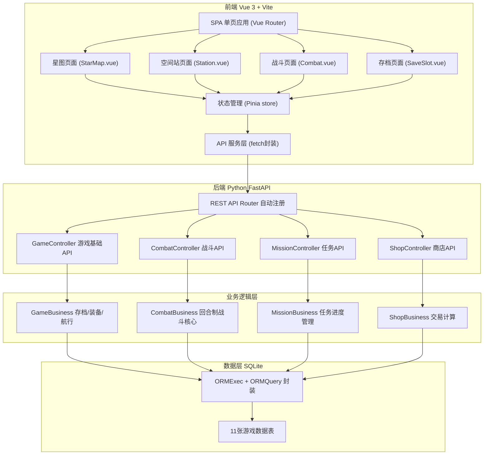
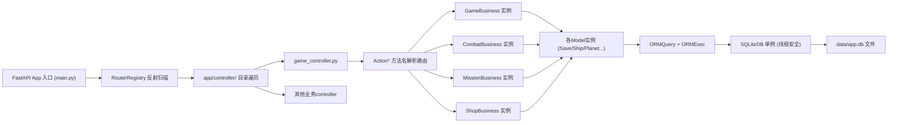
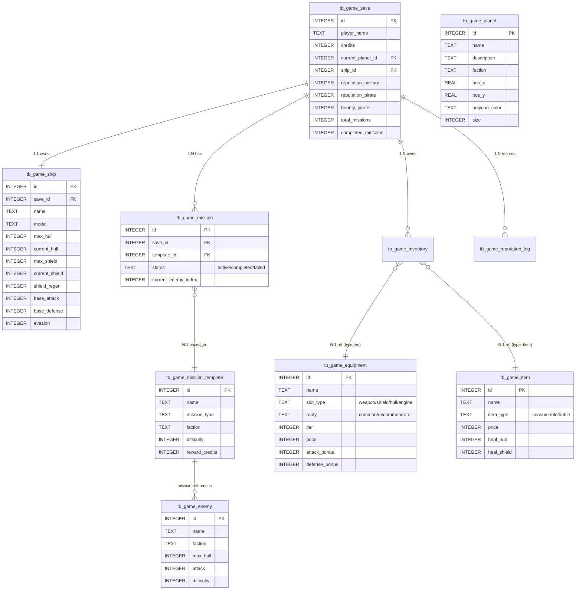

## 1. 架构设计


## 2. 技术栈说明
- **前端**: Vue@3.4 + Pinia@2 + Vue Router@4 + Vite@5（不用React，用户明确要求Vue）
- **样式**: 原生 CSS3 + CSS Variables + BEM 命名，不用 Tailwind（保持特效精细控制）
- **图形渲染**: 
  - 星场背景：HTML5 Canvas 2D（性能优先，1500+粒子）
  - 星球/护盾/飞船：SVG + CSS 动画（精细裂纹特效可控）
- **字体**: Google Fonts 加载 Orbitron (标题) + JetBrains Mono (正文)
- **初始化工具**: Vite 官方模板 `npm create vite@latest -- --template vue`
- **后端**: FastAPI@0.104 + Pydantic@2（已存在项目）
- **数据库**: SQLite3 + 自研 ORM（项目已有架构）
- **构建输出**: 静态构建到 `/static/game/` 目录，由 FastAPI 的 StaticFiles 托管

## 3. 路由定义
| 前端路由 (Vue Router) | 页面组件 | 页面用途 |
|-------|---------|---------|
| `/` | SaveSlot.vue | 存档系统首页（新游戏/加载存档） |
| `/starmap` | StarMap.vue | 星图导航页面 |
| `/station` | Station.vue | 空间站多功能页面（Tab切换任务/商店/维修/装备） |
| `/combat` | Combat.vue | 回合制战斗页面 |

| 后端API路由 (FastAPI) | 用途 |
|-------|---------|
| POST /api/game/newgame | 创建新游戏存档 |
| GET /api/game/state/get | 获取完整游戏状态 |
| GET /api/game/save/list/get | 获取存档列表 |
| DELETE /api/game/save/delete | 删除存档 |
| GET /api/game/planet/list/get | 获取星图星球列表 |
| POST /api/game/travel | 跃迁到目标星球 |
| POST /api/game/repair | 维修飞船 |
| POST /api/game/equip | 装备物品 |
| POST /api/game/unequip | 卸下装备 |
| GET /api/game/skill/list/get | 获取技能列表 |
| GET /api/game/reputation/get | 获取声望日志 |
| POST /api/combat/init | 初始化战斗状态 |
| POST /api/combat/action | 执行战斗行动（含敌方回合） |
| GET /api/shop/inventory/get | 获取商店库存 |
| POST /api/shop/equipment/buy | 购买装备 |
| POST /api/shop/item/buy | 购买道具 |
| POST /api/shop/item/sell | 出售物品 |
| GET /api/mission/available/get | 获取可用任务列表 |
| POST /api/mission/accept | 接受任务 |
| GET /api/mission/enemies/get | 获取任务下一波敌人 |
| POST /api/mission/advance | 推进任务进度 |
| POST /api/mission/complete | 完成任务领奖励 |
| POST /api/mission/abandon | 放弃任务 |
| POST /api/mission/fail | 任务战斗失败 |

## 4. API响应统一格式
所有后端接口返回统一结构：
```typescript
interface ApiResponse<T> {
  code: number;      // 0=成功, 非0=失败
  message: string;   // 消息描述
  data: T | null;    // 数据体
}
```

战斗状态核心结构（前端持有，每回合POST给后端）：
```typescript
interface CombatState {
  turn: number;
  phase: 'player' | 'enemy';
  player: {
    name: string;
    ship_name: string;
    max_shield: number;
    current_shield: number;
    max_hull: number;
    current_hull: number;
    attack: number;
    defense: number;
    evasion: number;
    shield_regen: number;
    buffs: { attack: number; defense: number; evasion: number; turns_remaining: number };
    debuffs: { defense: number; turns_remaining: number; stunned: number };
    skill_cooldowns: Record<number, number>;
  };
  enemies: Array<{
    id: number;
    name: string;
    ship_type: string;
    max_shield: number;
    current_shield: number;
    max_hull: number;
    current_hull: number;
    attack: number;
    defense: number;
    evasion: number;
    shield_regen: number;
    is_dead: boolean;
    buffs: any;
    debuffs: any;
  }>;
  current_enemy_index: number;
  log: string[];
  skills: Skill[];
  items: InventoryItem[];
  mission_id?: number;
  save_id: number;
  is_over: boolean;
  victory: boolean;
  rewards?: { credits: number; exp: number };
}
```

## 5. 服务器架构图


## 6. 数据模型
### 6.1 ER图


### 6.2 初始种子数据
- **星球 7个**：新伊甸（中立）、天狼军港（军方）、暗礁据点（海盗）、织女科研站（企业）、猎户矿场、自由港、废墟站-7
- **装备 12件**：武器/护盾/船体/引擎各3档（普通/优秀/稀有）
- **道具 8种**：修复包x3、护盾包x2、增幅芯片x2、EMP手雷x1
- **敌人 8种**：海盗5型（侦察/拦截/突袭/炮舰/旗舰）+ 无人机+守卫艇+外星舰
- **技能 6个**：集火齐射、精准打击、过载护盾、紧急维修、全系统防御、EMP脉冲
- **任务模板 9个**：护送、清剿、夺回、突袭据点、走私、抢劫、无人机群、外星威胁、Boss狩猎
