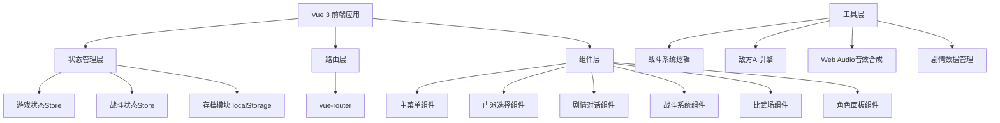
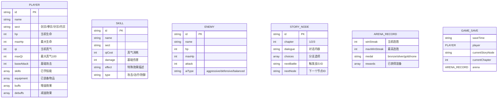

## 1. 架构设计



## 2. 技术说明
- **前端框架**：Vue 3 + TypeScript + Vite
- **路由**：vue-router@4
- **状态管理**：Pinia（轻量级状态管理，支持持久化）
- **样式**：Tailwind CSS 3
- **数据持久化**：localStorage（Pinia持久化插件）
- **音频**：Web Audio API 原生合成
- **初始化工具**：vite-init

## 3. 路由定义
| 路由 | 用途 |
|------|------|
| / | 主菜单页面 |
| /select-sect | 门派选择页面 |
| /story | 剧情章节页面（含对话与分支） |
| /battle | 战斗系统页面 |
| /arena | 比武场模式页面 |
| /ending | 结局展示页面 |

## 4. 数据模型

### 4.1 核心数据模型定义



### 4.2 四大属性配置

| 门派 | 基础攻击 | 技能名称 | 真气消耗 | 技能效果 |
|------|----------|----------|----------|----------|
| 剑宗 | 28 | 剑气纵横 | 15 | 造成55伤害 |
| 拳宗 | 32 | 崩山击 | 18 | 造成65伤害，自身受10反伤 |
| 针宗 | 18 | 千丝万缕 | 12 | 造成35伤害+3回合每回合12毒伤 |
| 内宗 | 15 | 太极护盾 | 20 | 回复40HP并反弹30%伤害 |

### 4.3 战斗系统核心逻辑
- 真气上限100，每回合恢复8点
- 敌方AI根据玩家血量百分比决策：
  - 玩家HP < 30%：激进进攻（80%概率强攻）
  - 玩家HP 30%-70%：平衡策略（50%攻击，50%技能）
  - 玩家HP > 70%：防守反击（30%防御，70%普通攻击）
- Buff/Debuff回合制结算
- 毒伤每回合开始时触发

### 4.4 剧情分支结构
- 共3章，每章9场战斗，合计27场
- 每章3个关键分支选择点
- 分支组合决定最终9个结局之一

### 4.5 比武场奖励
- 连胜5场：铜牌 + 铜品质装备
- 连胜10场：银牌 + 银品质装备
- 连胜20场：金牌 + 金品质装备

## 5. 目录结构

```
src/
├── assets/           # 静态资源（字体、样式变量）
├── components/       # 可复用组件
│   ├── HealthBar.vue
│   ├── QiBar.vue
│   ├── SkillButton.vue
│   ├── DialogueBox.vue
│   ├── CharacterPanel.vue
│   └── BattleLog.vue
├── composables/      # Vue组合式函数
│   ├── useBattle.ts
│   ├── useEnemyAI.ts
│   ├── useAudio.ts
│   └── useSaveLoad.ts
├── data/             # 游戏数据配置
│   ├── sects.ts      # 门派数据
│   ├── skills.ts     # 技能数据
│   ├── enemies.ts    # 敌人数据
│   ├── story.ts      # 剧情数据
│   └── equipment.ts  # 装备数据
├── pages/            # 页面组件
│   ├── MainMenu.vue
│   ├── SelectSect.vue
│   ├── Story.vue
│   ├── Battle.vue
│   ├── Arena.vue
│   └── Ending.vue
├── stores/           # Pinia状态管理
│   ├── game.ts       # 游戏主状态
│   ├── battle.ts     # 战斗状态
│   └── arena.ts      # 比武场状态
├── types/            # TypeScript类型定义
│   └── index.ts
├── utils/            # 工具函数
│   ├── battleLogic.ts
│   └── audioSynth.ts
├── App.vue
├── main.ts
└── router.ts
```
