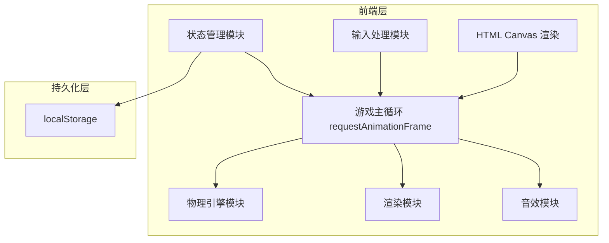
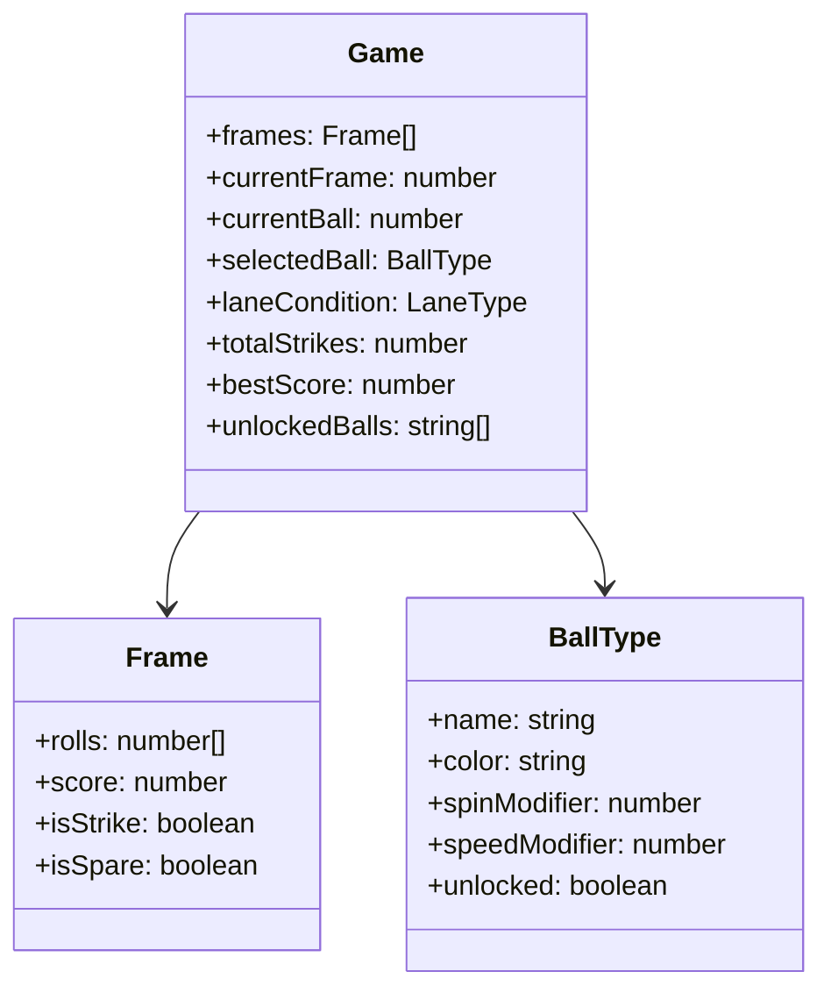

## 1. 架构设计



## 2. 技术说明

- **前端**：纯 HTML5 + CSS3 + JavaScript（ES6+），无框架依赖
- **渲染**：Canvas 2D API
- **音效**：Web Audio API 合成
- **存储**：localStorage JSON 序列化
- **部署**：单文件 HTML，可直接浏览器打开

## 3. 模块设计

### 3.1 游戏状态机

```mermaid
stateDiagram-v2
    "IDLE" --> "POSITIONING": 开始投球
    "POSITIONING" --> "POWER": 点击锁定位置
    "POWER" --> "SPIN": 点击锁定力度
    "SPIN" --> "ROLLING": 点击锁定旋转
    "ROLLING" --> "SCORING": 球停止/出界
    "SCORING" --> "IDLE": 计分完成
    "SCORING" --> "GAME_OVER": 第10帧结束
```

### 3.2 核心类设计

| 类名 | 职责 |
|-----|------|
| Game | 游戏主循环、状态机管理、帧/球计数 |
| Ball | 球的位置、速度、旋转、渲染 |
| Pin | 球瓶的位置、状态（站立/倒下/飞出）、速度 |
| PhysicsEngine | 碰撞检测、连锁击倒判定、球轨迹计算 |
| ScoreBoard | 10 帧计分逻辑、Strike/Spare 奖励计算 |
| InputController | 三步点击输入、力度条/旋转条摆动 |
| SoundManager | Web Audio API 音效合成与播放 |
| SaveManager | localStorage 读写、状态序列化 |
| LaneRenderer | 球道、球沟、标记线渲染 |

### 3.3 数据模型



### 3.4 球属性表

| 球名 | 颜色 | 旋转加成 | 速度加成 | 解锁条件 |
|-----|------|---------|---------|---------|
| 基础球 | 灰色 #888 | ×1.0 | ×1.0 | 默认 |
| 曲线球 | 蓝色 #4A90D9 | ×1.2 | ×1.0 | 默认 |
| 力量球 | 红色 #E74C3C | ×1.0 | ×1.15 | 默认 |
| 精准球 | 绿色 #2ECC71 | ×0.7 | ×1.0 | 默认 |
| 黄金球 | 金色 #FFD700 | ×1.1 | ×1.1 | 累计5次Strike |

### 3.5 球道条件参数

| 条件 | 旋转倍率 | 球速衰减 | 球滑行距离 | 描述 |
|-----|---------|---------|-----------|------|
| 干道 | ×1.5 | 快（0.98/frame） | 短 | 旋转敏感，球速衰减快 |
| 标准道 | ×1.0 | 中（0.995/frame） | 中 | 默认参数 |
| 油道 | ×0.3 | 慢（0.999/frame） | 远 | 旋转被抑制，球滑行远 |

### 3.6 音效设计

| 事件 | 音效类型 | 参数 |
|-----|---------|------|
| 全中（Strike） | 多频叠加上升音 | 500ms，频率从 400Hz 上升至 1200Hz |
| 补中（Spare） | 660Hz 短促两连音 | 每响 80ms，间隔 100ms |
| 失误 | 低沉叹息音 | 200Hz，300ms 渐弱 |
| 击瓶 | 短促碰撞音 | 800Hz，50ms |

## 4. 文件结构

```
bowling/
  index.html    -- 单文件，包含所有 HTML/CSS/JS
```

采用单文件方案，所有代码内联在 index.html 中，方便直接浏览器打开。
