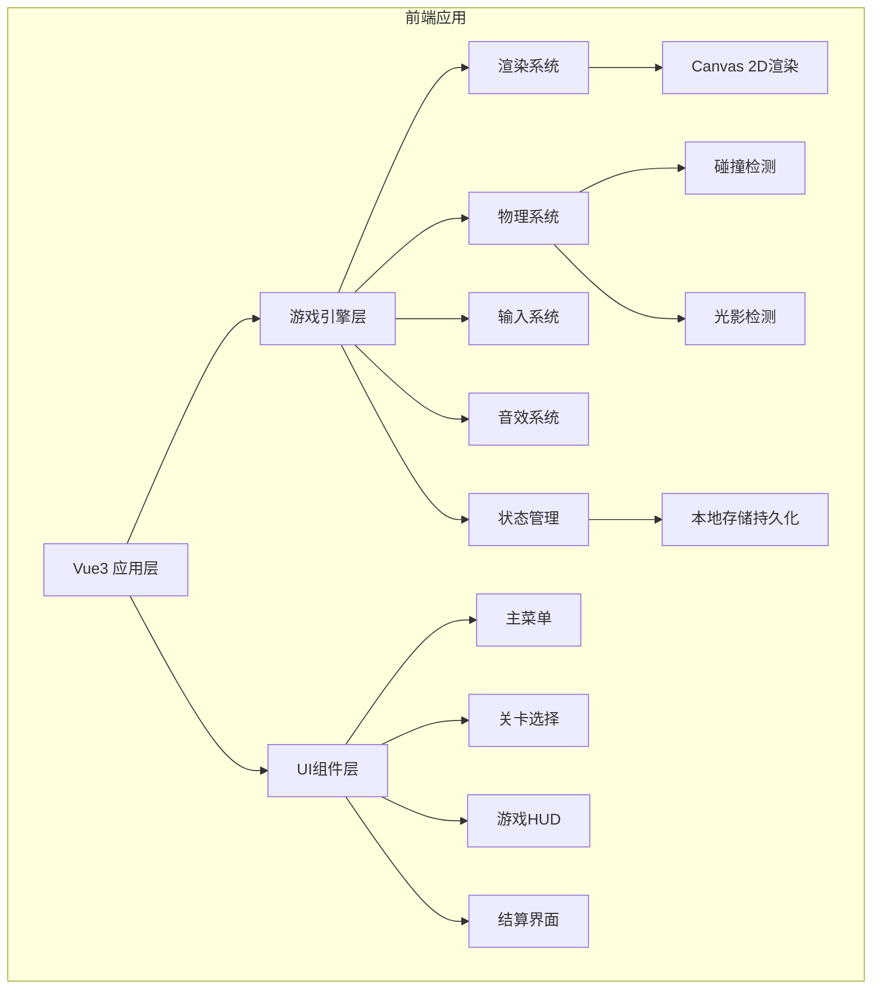
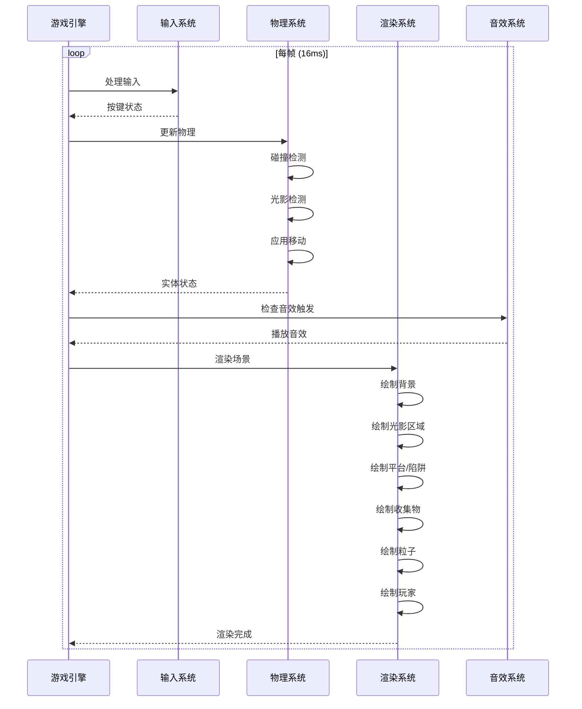

## 1. 架构设计



## 2. 技术描述

### 2.1 技术栈
- **前端框架**：Vue@3.4 + TypeScript + Vite@5.0
- **构建工具**：Vite@5.0
- **样式方案**：CSS3 + CSS变量 + Scoped样式
- **状态管理**：Pinia@2.1
- **游戏渲染**：HTML5 Canvas 2D API
- **音效系统**：Web Audio API
- **本地存储**：localStorage + 加密压缩
- **动画系统**：requestAnimationFrame + Tween动画

### 2.2 项目结构
```
guangying/
├── src/
│   ├── components/           # Vue组件
│   │   ├── MainMenu.vue      # 主菜单
│   │   ├── LevelSelect.vue   # 关卡选择
│   │   ├── GameCanvas.vue    # 游戏画布
│   │   ├── GameHUD.vue       # 游戏HUD
│   │   ├── PauseMenu.vue     # 暂停菜单
│   │   └── ResultScreen.vue  # 结算界面
│   ├── game/                 # 游戏核心引擎
│   │   ├── engine.ts         # 游戏主引擎
│   │   ├── renderer.ts       # 渲染系统
│   │   ├── physics.ts        # 物理系统
│   │   ├── input.ts          # 输入系统
│   │   ├── audio.ts          # 音效系统
│   │   └── particles.ts      # 粒子系统
│   ├── entities/             # 游戏实体
│   │   ├── player.ts         # 玩家角色
│   │   ├── light.ts          # 光/影区域
│   │   ├── platform.ts       # 平台
│   │   ├── trap.ts           # 陷阱
│   │   ├── collectible.ts    # 收集物
│   │   └── torch.ts          # 火把
│   ├── levels/               # 关卡数据
│   │   ├── forest.ts         # 晨光森林
│   │   ├── canyon.ts         # 黄昏峡谷
│   │   └── castle.ts         # 午夜城堡
│   ├── store/                # 状态管理
│   │   └── gameStore.ts      # 游戏状态
│   ├── types/                # 类型定义
│   │   └── index.ts          # 类型声明
│   ├── utils/                # 工具函数
│   │   ├── storage.ts        # 本地存储
│   │   └── math.ts           # 数学工具
│   ├── assets/               # 资源
│   │   ├── images/           # 图片资源
│   │   └── audio/            # 音频资源
│   ├── App.vue               # 根组件
│   └── main.ts               # 入口文件
├── index.html
├── package.json
├── vite.config.ts
└── tsconfig.json
```

## 3. 路由定义

| 路由 | 用途 |
|-----|------|
| / | 主菜单页面 |
| /levels | 关卡选择页面 |
| /game/:levelId | 游戏页面（levelId: 1/2/3） |
| /result/:levelId | 结算页面 |

## 4. 状态管理与数据模型

### 4.1 游戏状态（Pinia Store）
```typescript
interface GameState {
  currentScene: 'menu' | 'levelSelect' | 'playing' | 'paused' | 'result';
  currentLevel: number;
  unlockedLevels: number[];
  levelStars: Record<number, number>;
  totalParticles: number;
  soundEnabled: boolean;
  musicEnabled: boolean;
  highScores: Record<number, number>;
}
```

### 4.2 玩家状态
```typescript
interface PlayerState {
  x: number;
  y: number;
  vx: number;
  vy: number;
  width: number;
  height: number;
  health: number;
  maxHealth: number;
  inLight: boolean;
  isJumping: boolean;
  isGrounded: boolean;
  facingRight: boolean;
  animationFrame: number;
  invincible: boolean;
}
```

### 4.3 关卡数据模型
```typescript
interface Level {
  id: number;
  name: string;
  description: string;
  width: number;
  height: number;
  background: {
    type: 'forest' | 'canyon' | 'castle';
    colors: string[];
  };
  playerStart: { x: number; y: number };
  goal: { x: number; y: number; width: number; height: number };
  platforms: Platform[];
  traps: Trap[];
  lightZones: LightZone[];
  shadowZones: ShadowZone[];
  collectibles: Collectible[];
  torches?: Torch[];
  movingPlatforms?: MovingPlatform[];
  timeLimit?: number;
  totalCollectibles: number;
}
```

### 4.4 本地存储数据结构
```typescript
interface SaveData {
  version: string;
  unlockedLevels: number[];
  levelStars: Record<number, number>;
  totalParticles: number;
  highScores: Record<number, {
    score: number;
    time: number;
    collectibles: number;
    stars: number;
  }>;
  settings: {
    soundEnabled: boolean;
    musicEnabled: boolean;
    soundVolume: number;
    musicVolume: number;
  };
  lastPlayed: number;
}
```

## 5. 核心游戏循环



## 6. 性能优化

### 6.1 渲染优化
- 使用离屏Canvas预渲染静态背景
- 视口裁剪：只渲染可见区域内的实体
- 分层渲染：背景层、游戏层、UI层分离
- 粒子池：复用粒子对象，避免频繁GC

### 6.2 物理优化
- 空间划分：将场景划分为网格，减少碰撞检测数量
- 休眠机制：静止的实体跳过物理更新
- 预测优化：使用简单的AABB碰撞检测

### 6.3 存储优化
- 存档数据使用LZ-string压缩后存储
- 定期清理过期的临时数据
- 图片资源使用WebP格式，按需加载

## 7. 状态持久化方案

### 7.1 自动保存时机
- 关卡通关时
- 收集光粒子时
- 获得星星时
- 解锁新关卡时
- 修改设置时

### 7.2 状态恢复流程
1. 应用启动时从localStorage读取存档
2. 校验存档版本和完整性
3. 恢复游戏状态到Pinia Store
4. 如果上次游戏未正常退出，提示用户是否继续

### 7.3 数据完整性
- 使用CRC32校验和验证数据完整性
- 保存时创建备份，损坏时自动恢复
- 版本迁移：支持旧版本存档升级
