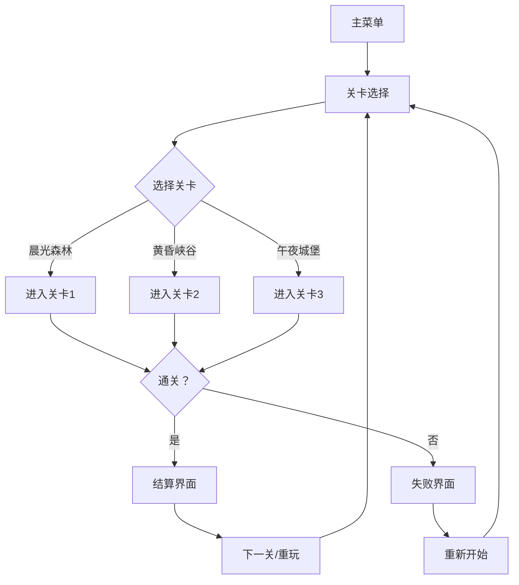

## 1. 产品概述

"光与影"是一款2D平台跳跃游戏，玩家操控可爱的小狐狸角色，在光影之间切换能力，收集光粒子穿越三个主题关卡。游戏核心机制是利用光与影的不同特性——光中加速、影中穿墙——来解决谜题并通关。

- **目标用户**：休闲游戏玩家，喜欢解谜和平台跳跃的用户
- **核心价值**：创新的光影切换机制，精美的视觉效果，治愈的游戏体验

## 2. 核心功能

### 2.1 用户角色
| 角色 | 注册方式 | 核心权限 |
|------|----------|----------|
| 玩家 | 无需注册，本地存档 | 游戏体验、进度保存 |

### 2.2 功能模块
1. **主菜单**：游戏标题、开始游戏、关卡选择、音效设置
2. **关卡选择**：三个主题关卡的选择界面，显示通关进度
3. **游戏主界面**：游戏画布、HUD信息（光粒子数量、生命值、技能状态）、暂停按钮
4. **关卡1-晨光森林**：利用树影躲避陷阱，收集光粒子
5. **关卡2-黄昏峡谷**：快速穿越移动的阴影平台，时机把握
6. **关卡3-午夜城堡**：操控火把制造光影路径，主动创造阴影
7. **游戏结算**：通关统计、星级评价、重新开始/下一关

### 2.3 页面详情
| 页面名称 | 模块名称 | 功能描述 |
|---------|---------|----------|
| 主菜单 | 标题动效 | 光粒子漂浮动画，光影切换特效 |
| 主菜单 | 开始按钮 | 点击进入关卡选择，悬停光影效果 |
| 关卡选择 | 关卡卡片 | 显示关卡名称、通关星级、锁定状态 |
| 游戏主界面 | 游戏画布 | Canvas渲染游戏场景，60fps |
| 游戏主界面 | HUD系统 | 显示光粒子计数、生命值、当前光影状态 |
| 游戏主界面 | 暂停菜单 | 暂停游戏、继续、重新开始、返回主菜单 |
| 关卡1 | 晨光森林 | 静态树影、陷阱机制、光粒子收集 |
| 关卡2 | 黄昏峡谷 | 移动阴影平台、时间限制、加速机制 |
| 关卡3 | 午夜城堡 | 可移动火把、动态光影、路径创造 |
| 结算界面 | 星级评价 | 根据收集率和用时评定1-3星 |

## 3. 核心流程

### 游戏主流程

### 核心玩法机制
1. 玩家使用方向键/AD键移动，空格键跳跃
2. 角色自动检测当前处于光区还是影区
3. 光区：移动速度+50%，跳跃高度+20%，散发金色光芒
4. 影区：可以穿透障碍，移动速度正常，散发紫色光芒
5. 收集光粒子增加分数，到达终点通关
6. 触碰陷阱失去生命值，生命值归零则失败

## 4. 界面设计

### 4.1 设计风格
- **主色调**：
  - 光主题：金色 #FFD700、暖黄 #FFA500、橙红 #FF6347
  - 影主题：深紫 #4B0082、靛蓝 #191970、午夜蓝 #191970
  - 中性色：象牙白 #FFFFF0、深灰 #2F2F2F
- **按钮风格**：圆角矩形，渐变填充，悬停时阴影扩散，点击时有压缩动效
- **字体**：标题使用圆润可爱的字体，正文使用清晰易读的无衬线字体
- **布局风格**：居中卡片式布局，层次分明，呼吸感充足
- **视觉元素**：光粒子特效、渐变光影、柔和的发光边框

### 4.2 页面设计概览
| 页面名称 | 模块名称 | UI元素 |
|---------|---------|--------|
| 主菜单 | 标题区域 | 大号艺术字标题，光粒子环绕动画 |
| 主菜单 | 按钮区域 | 三个主要按钮，垂直排列，带图标 |
| 主菜单 | 背景 | 动态渐变背景，缓慢流动的光影效果 |
| 关卡选择 | 关卡卡片 | 横向排列，每个卡片有关卡预览图和名称 |
| 游戏界面 | 游戏画布 | 占据主要区域，顶部HUD信息栏 |
| 游戏界面 | HUD | 半透明背景，图标化显示，实时更新 |
| 结算界面 | 星级展示 | 三颗星星动画依次亮起，烟花特效 |
| 结算界面 | 统计信息 | 用时、收集率、得分等数据展示 |

### 4.3 响应式设计
- 桌面端优先，支持1280x720及以上分辨率
- 移动端适配：虚拟摇杆控制，按钮放大，布局重排
- 触摸优化：支持滑动操作，按钮热区增大
- Canvas自适应缩放，保持游戏画面比例

### 4.4 游戏场景设计
#### 晨光森林
- 环境：清晨的森林，阳光透过树叶洒下斑驳的光影
- 光照：暖金色调，柔和的光晕效果
- 元素：高大的树木、草丛、蘑菇陷阱、发光的光粒子
- 特色：静态树影区域，玩家需要在光影间切换躲避陷阱

#### 黄昏峡谷
- 环境：日落时分的峡谷，橙红色的天空
- 光照：暖橙色调，长长的阴影，移动的光影平台
- 元素：岩石平台、移动阴影、深渊、风粒子效果
- 特色：平台会移动，需要把握时机在光影间切换

#### 午夜城堡
- 环境：深夜的古堡，月光和火把照亮
- 光照：冷蓝色调，月光效果，火把的动态光影
- 元素：石墙、火把、幽灵、机关门、月光粒子
- 特色：玩家可以操控火把移动，主动创造阴影路径

## 5. 动画与特效

### 5.1 角色动画
-  idle：呼吸动效，尾巴轻微摇摆
-  移动：四足交替奔跑动画，身体上下起伏
-  跳跃：身体伸展，尾巴上扬，耳朵后贴
-  落地：身体压缩，灰尘粒子效果
-  光状态：全身散发金色光芒，周围有光粒子环绕
-  影状态：身体半透明，散发紫色光晕，周围有暗影粒子

### 5.2 技能效果
-  光影切换：圆形冲击波从角色扩散，颜色从金变紫或反之
-  加速冲刺：身后留下彩色拖尾，速度线特效
-  穿墙：身体逐渐变透明，穿过障碍后恢复
-  收集光粒子：粒子飞向角色，数字+1弹出动画

### 5.3 场景动画
-  光粒子：缓慢漂浮，随机运动，被吸引时加速
-  树叶：随风轻微摆动
-  火把：火焰跳动，光影范围动态变化
-  陷阱：周期性闪烁，预备时发光

### 5.4 音效设计
-  背景音乐：每个关卡有独特的BGM，从轻快到神秘
-  角色音效：跳跃、落地、收集、受伤、切换光影
-  环境音效：风声、鸟鸣（森林）、岩石滚动（峡谷）、幽灵低语（城堡）
-  UI音效：按钮点击、菜单切换、通关庆祝
