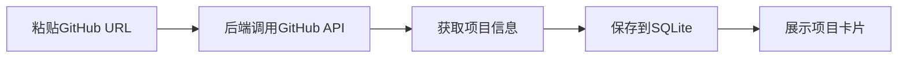

## 1. 产品概述

GitHub Star收藏夹是一个专为开发者打造的项目管理工具，解决GitHub Star过多难以分类和检索的痛点。用户可以为收藏的项目添加自定义标签、私人笔记和优先级标记，实现更高效的项目管理。

- 核心目标：提供比原生GitHub Star更强大的分类、筛选和搜索功能
- 目标用户：经常浏览GitHub并收藏大量项目的开发者

## 2. 核心功能

### 2.1 用户角色
| 角色 | 注册方式 | 核心权限 |
|------|----------|----------|
| 普通用户 | 无需注册，本地使用 | 项目收藏、标签管理、笔记记录、筛选搜索 |

### 2.2 功能模块
1. **首页仪表盘**：按标签分组展示项目、多条件筛选、搜索框
2. **项目卡片**：展示GitHub基本信息、自定义标签、优先级标记
3. **项目管理**：添加项目、编辑标签/优先级/笔记、删除项目、批量删除
4. **随机发现**：随机推荐"想看"优先级的项目

### 2.3 页面详情
| 页面名称 | 模块名称 | 功能描述 |
|---------|----------|----------|
| 首页 | 顶部工具栏 | 搜索框、语言筛选、优先级筛选、随机发现按钮、批量删除按钮、添加项目输入框 |
| 首页 | 标签分组区 | 按标签分组展示项目卡片，支持展开/收起 |
| 首页 | 项目卡片 | 语言色条、项目名称、描述、star数、标签、优先级、操作按钮 |
| 首页 | 编辑弹窗 | 修改标签、优先级、私人笔记 |
| 首页 | 随机推荐弹窗 | 展示随机推荐的"想看"项目 |

## 3. 核心流程

### 3.1 添加项目流程
用户在输入框粘贴GitHub URL → 后端调用GitHub API获取项目信息 → 自动填充项目基本信息 → 保存到本地数据库 → 展示在列表中

### 3.2 筛选搜索流程
用户输入关键词/选择筛选条件 → 前端发送查询请求 → 后端多条件查询 → 返回匹配结果 → 前端更新展示

### 3.3 随机推荐流程
点击"随机发现"按钮 → 后端查询所有"想看"优先级项目 → 随机选择一个 → 弹窗展示项目详情

## 4. 用户界面设计

### 4.1 设计风格
- **主色调**：深色主题（#1e1e2e 背景，#cdd6f4 文字），仿VS Code开发者工具风格
- **强调色**：#89b4fa（蓝）、#a6e3a1（绿）、#f9e2af（黄）、#f38ba8（红）
- **语言色条**：根据GitHub语言颜色展示（Python:#3572A5, JavaScript:#f1e05a, TypeScript:#3178c6, Vue:#41b883等）
- **按钮风格**：扁平化、圆角4px、hover状态有轻微亮度变化
- **字体**：JetBrains Mono（代码风格字体），14px正文，16px标题
- **布局**：卡片式布局，网格排列，紧凑但不拥挤
- **图标**：使用简单的SVG图标，保持极简风格

### 4.2 页面设计概述
| 页面名称 | 模块名称 | UI元素 |
|---------|----------|--------|
| 首页 | 顶部工具栏 | 深色背景、圆角输入框、下拉筛选器、蓝色主按钮 |
| 首页 | 项目卡片 | 左侧彩色竖条（语言标识）、项目名称加粗、描述灰色小字、star数带图标、标签圆角胶囊、优先级颜色标记 |
| 首页 | 标签分组 | 分组标题可点击展开/收起、组内项目网格排列 |
| 首页 | 弹窗 | 深色半透明遮罩、圆角弹窗、表单输入框、确定/取消按钮 |

### 4.3 响应式
- 桌面端：3列网格布局
- 平板端：2列网格布局
- 移动端：1列布局，工具栏垂直排列

### 4.4 交互动效
- 项目卡片hover：轻微上浮、阴影加深
- 标签筛选：平滑过渡动画
- 弹窗出现：缩放+淡入效果
- 随机推荐：卡片翻转动画

---

**优先级定义**：
- 想看：黄色标记 (#f9e2af)
- 在看：蓝色标记 (#89b4fa)
- 已看：绿色标记 (#a6e3a1)
