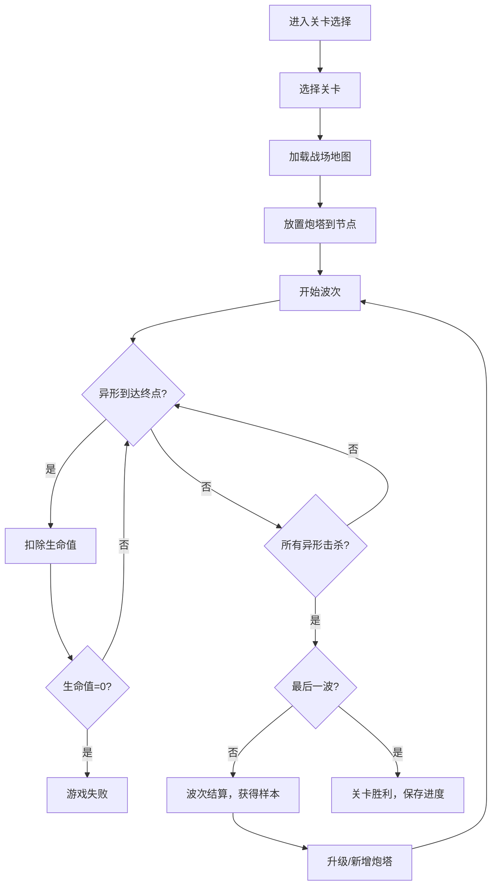

## 1. 产品概述

深空研究站塔防游戏——玩家作为指挥官，在研究站走廊和通道口的指定节点部署自动炮塔，阻止异形虫潮蔓延。俯视角战场由 Canvas 渲染，走廊采用冷光灯管照明风格，异形自带荧光纹路，营造深空恐怖氛围。

- 核心玩法：策略性塔防，炮塔必须部署在指定节点（不可随意放置）
- 目标用户：喜爱塔防策略类游戏的休闲/中度玩家
- 市场价值：以独特的深空恐怖美学 + 四种差异化炮塔 + 四种异形机制提供策略深度

## 2. 核心功能

### 2.1 用户角色
| 角色 | 注册方式 | 核心权限 |
|------|----------|----------|
| 指挥官 | 自动创建/本地存储 | 部署炮塔、升级炮塔、推进关卡 |

### 2.2 功能模块
1. **战场页面**：俯视角 Canvas 战场、走廊地图、部署节点、炮塔放置、异形行进、战斗特效
2. **炮塔面板**：四种炮塔选择、升级操作、生物样本消耗显示
3. **波次控制**：开始波次、波次倒计时、虫潮涌入动画、波次结算
4. **关卡进度**：关卡列表、解锁条件、最高分数/星级

### 2.3 页面详情
| 页面名称 | 模块名称 | 功能描述 |
|----------|----------|----------|
| 战场页面 | Canvas战场 | 渲染俯视角地图、走廊纹理、冷光灯管照明效果、部署节点高亮 |
| 战场页面 | 炮塔系统 | 点击节点弹出炮塔选择面板，放置/升级/出售炮塔 |
| 战场页面 | 异形系统 | 异形沿路径行进，带荧光纹路发光效果，死亡动画 |
| 战场页面 | 波次系统 | 多入口同时涌入、波次间隔倒计时、波次结算奖励 |
| 战场页面 | HUD信息栏 | 生物样本数量、当前波次、生命值、炮塔信息提示 |
| 关卡选择页 | 关卡列表 | 已解锁关卡、星级评价、进入战斗 |
| 升级面板 | 炮塔升级 | 消耗生物样本升级炮塔属性（伤害/射程/攻速/特效） |

## 3. 核心流程

### 3.1 游戏主流程
1. 指挥官进入关卡选择页，选择已解锁关卡
2. 进入战场，地图显示走廊和部署节点
3. 在部署节点放置炮塔（消耗生物样本）
4. 点击"开始波次"，异形从多个入口涌入
5. 炮塔自动攻击范围内的异形
6. 击杀异形获得生物样本
7. 波次结束后可升级/新增炮塔
8. 所有波次通过→关卡完成，生命值归零→失败

### 3.2 流程图

### 3.3 炮塔机制
| 炮塔类型 | 攻击方式 | 特殊效果 | 基础费用 |
|----------|----------|----------|----------|
| 电磁塔 | 单体电击 | 减速50%，持续2秒 | 80样本 |
| 激光塔 | 单体激光 | 高伤害，穿透护甲20% | 120样本 |
| 喷火塔 | 范围锥形 | 范围持续伤害，3秒燃烧 | 100样本 |
| 冷冻塔 | 群体冰冻 | 减速70%，持续3秒，范围效果 | 150样本 |

### 3.4 异形机制
| 异形类型 | 生命值 | 移速 | 护甲 | 特殊能力 | 样本奖励 |
|----------|--------|------|------|----------|----------|
| 普通虫 | 100 | 中 | 0 | 无 | 10 |
| 酸液虫 | 80 | 中 | 0 | 死亡时腐蚀范围内炮塔（降攻速30%，5秒） | 15 |
| 甲壳虫 | 60 | 慢 | 50 | 高护甲减伤（50%伤害减免） | 20 |
| 母虫 | 200 | 慢 | 10 | 每5秒产1只普通虫，死亡爆出2只小虫 | 30 |

## 4. 用户界面设计

### 4.1 设计风格
- **主色调**：深蓝黑 (#0a0e1a) 为底，冷青色 (#00e5ff) 为走廊灯光，荧光绿 (#39ff14) 为异形纹路
- **辅助色**：电磁紫 (#9c27b0)、激光红 (#ff1744)、火焰橙 (#ff6d00)、冰蓝 (#00b0ff)
- **按钮风格**：圆角矩形，微光边框，悬停时发光扩散
- **字体**：Rajdhani（科技感标题），Exo 2（正文/数据）
- **布局风格**：Canvas占主区域，右侧面板显示炮塔选择和升级，顶部HUD信息条
- **特效风格**：冷光灯管扫描线、异形荧光脉冲、炮塔射击粒子、冰冻/燃烧状态特效

### 4.2 页面设计概览
| 页面名称 | 模块名称 | UI元素 |
|----------|----------|--------|
| 战场页面 | Canvas战场 | 深色地板纹理、冷光走廊灯带、节点六边形高亮框、异形荧光纹路动画 |
| 战场页面 | HUD信息栏 | 顶部半透明条，显示波次/生命/样本，Rajdhani字体 |
| 战场页面 | 炮塔选择面板 | 右侧面板，4个炮塔图标+费用，选中时边框发光 |
| 战场页面 | 升级面板 | 点击已有炮塔弹出，显示当前等级/属性/升级费用 |
| 关卡选择页 | 关卡列表 | 网格卡片布局，每卡显示关卡名/星级/锁定状态 |

### 4.3 响应式设计
- 桌面端优先，Canvas自适应窗口宽度，最小支持1280x720
- 右侧面板在窄屏时可收起为底部栏
- 触摸优化：节点和按钮点击区域≥44px

### 4.4 视觉氛围
- 走廊灯光：冷青色水平灯带，带微弱闪烁和扫描线效果
- 异形荧光：身体轮廓带荧光绿脉冲，死亡时纹路碎裂消散
- 环境氛围：背景微弱电嗡声波纹、偶尔闪烁的警告灯
- 炮塔视觉：每类炮塔有独特轮廓和攻击动画（电磁链、激光束、火焰锥、冰晶扩散）
