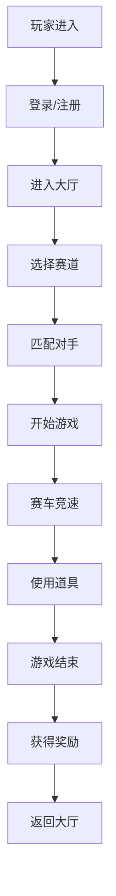

## 1. 产品概述
在线QQ飞车游戏是一款基于Web的多人竞速赛车游戏，玩家可以驾驶赛车在各种赛道上竞速，使用道具攻击对手，升级赛车属性，查看排行榜和解锁成就。目标用户是喜欢竞速游戏的玩家，产品价值在于提供便捷的在线竞速体验。

## 2. 核心功能

### 2.1 用户角色
| 角色 | 注册方式 | 核心权限 |
|------|-----------|-----------|
| 普通玩家 | 手机号注册 | 游戏竞速、道具使用、赛车升级、查看排行榜、解锁成就 |
| 管理员 | 后台账号 | 用户管理、赛道管理、赛车管理、数据统计 |

### 2.2 功能模块

#### 玩家端功能
1. **登录注册**：玩家通过手机号注册登录，支持修改密码
2. **游戏大厅**：选择赛道、匹配对手、开始游戏
3. **赛车竞速**：实时赛车竞速，支持方向键控制、漂移操作
4. **道具系统**：道具拾取和使用（加速、导弹、护盾等道具
5. **赛车升级**：使用金币升级赛车属性（速度、加速度、操控性）
6. **排行榜**：查看全服玩家竞速排行
7. **成就系统**：完成游戏目标解锁成就徽章
8. **个人中心**：查看个人信息、赛车信息、修改密码

#### 管理员端功能
1. **用户管理**：管理玩家账号、封禁/解封用户
2. **赛道管理**：增删改查赛道数据
3. **赛车管理**：管理赛车属性和升级配置
4. **道具管理**：管理道具属性和效果
5. **成就管理**：管理成就配置
6. **数据统计**：游戏数据统计展示

### 2.3 页面详情

| 页面名称 | 模块名称 | 功能描述 |
|-----------|-----------|------------|
| 登录页 | 登录表单 | 手机号密码登录 |
| 注册页 | 注册表单 | 手机号密码注册 |
| 游戏大厅 | 赛道选择 | 展示可用赛道，选择赛道详情 |
| 游戏大厅 | 匹配系统 | 匹配对手进入游戏 |
| 游戏页面 | 赛车游戏 | Canvas实时渲染赛车游戏 |
| 游戏页面 | 操作控制 | 方向键控制、漂移、道具使用 |
| 排行榜页 | 排行榜 | 展示玩家排行数据 |
| 成就页 | 成就列表 | 展示所有成就及解锁状态 |
| 个人中心 | 个人信息 | 展示和修改个人信息 |
| 个人中心 | 赛车升级 | 升级赛车各项属性 |
| 个人中心 | 修改密码 | 修改登录密码 |
| 管理员登录页 | 登录表单 | 管理员登录 |
| 管理员首页 | 数据概览 | 展示游戏统计数据 |
| 用户管理页 | 用户列表 | 管理用户账号 |
| 赛道管理页 | 赛道列表 | 增删改查赛道 |
| 赛车管理页 | 赛车列表 | 管理赛车属性 |
| 道具管理页 | 道具列表 | 管理道具配置 |
| 成就管理页 | 成就列表 | 管理成就配置 |

## 3. 核心流程

### 3.1 玩家游戏流程
玩家打开游戏 → 登录/注册 → 进入游戏大厅 → 选择赛道 → 匹配对手 → 进入游戏 → 赛车竞速（使用道具） → 游戏结束 → 获得奖励 → 返回大厅

### 3.2 管理员操作流程
管理员登录 → 进入管理后台 → 选择管理模块 → 执行管理操作（用户/赛道/赛车/道具/成就） → 保存更改

## 4. 用户界面设计

### 4.1 设计风格
- **主色调**：深蓝色（#1e3a5f）作为主色，代表速度与激情
- **辅助色**：亮橙色（#ff6b35）作为强调色，代表速度感
- **背景色**：深色背景配合霓虹光效，营造电竞氛围
- **按钮风格**：圆角矩形按钮，带有渐变效果，悬浮时有发光效果
- **字体**：使用Orbitron作为标题字体，Roboto作为正文字体
- **布局风格**：卡片式布局，带有玻璃拟态效果
- **图标风格**：使用Lucide图标，配合霓虹发光效果

### 4.2 页面设计概述

| 页面名称 | 模块名称 | UI元素 |
|-----------|-----------|---------|
| 登录页 | 登录表单 | 深色背景、霓虹边框、发光按钮、动态背景 |
| 游戏大厅 | 赛道卡片 | 赛道预览图、赛道名称、难度标识、人数显示 |
| 游戏页面 | 游戏画布 | Canvas游戏画面、速度表、排名显示、道具栏 |
| 排行榜页 | 排行列表 | 排名数字、玩家头像、用时、奖牌图标 |
| 个人中心 | 升级面板 | 属性条、升级按钮、金币显示 |

### 4.3 响应式
桌面端优先，移动端适配，触摸操作优化

### 4.4 游戏场景设计
- **环境**：2D俯视视角赛道，带有霓虹光效的赛道边缘
- **光照**：动态光影效果，赛车尾焰光效
- **动画**：赛车漂移时产生拖尾效果，道具使用特效
- **交互**：键盘WASD/方向键控制，空格键漂移，Shift键使用道具
