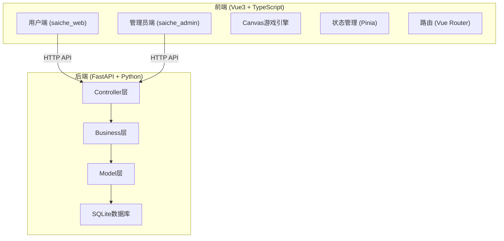
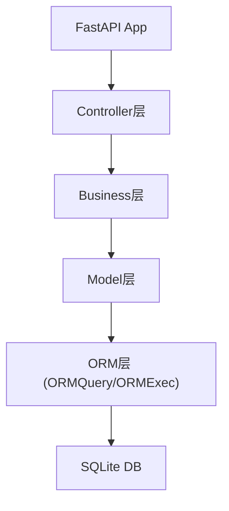
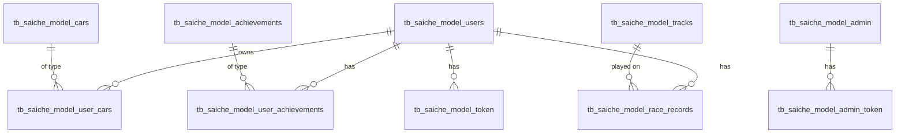

## 1. 架构设计



## 2. 技术描述

- **前端**: Vue3 + TypeScript + Vite + TailwindCSS + Pinia + Vue Router
- **初始化工具**: vite-init
- **后端**: FastAPI + Python 3.8+
- **数据库**: SQLite
- **ORM**: 自定义ORM（ORMQuery + ORMExec）
- **游戏引擎**: Canvas 2D API
- **状态持久化**: LocalStorage + Token认证

## 3. 前端目录结构

```
static/saiche_web/
├── src/
│   ├── components/          # 公共组件
│   ├── composables/         # 组合式函数
│   ├── pages/              # 页面组件
│   │   ├── user/           # 用户端页面
│   │   │   ├── Login.vue
│   │   │   ├── Register.vue
│   │   │   ├── Lobby.vue
│   │   │   ├── Game.vue
│   │   │   ├── Rank.vue
│   │   │   ├── Achievement.vue
│   │   │   └── Profile.vue
│   │   └── admin/          # 管理员端页面
│   │       ├── Login.vue
│   │       ├── Dashboard.vue
│   │       ├── UserManage.vue
│   │       ├── TrackManage.vue
│   │       ├── CarManage.vue
│   │       ├── ItemManage.vue
│   │       └── AchievementManage.vue
│   ├── router/             # 路由配置
│   ├── store/              # Pinia状态管理
│   ├── api/                # API请求封装
│   ├── types/              # TypeScript类型定义
│   ├── utils/              # 工具函数
│   └── game/               # 游戏引擎相关
│       ├── engine/         # 游戏核心引擎
│       ├── objects/        # 游戏对象（赛车、道具等）
│       └── tracks/         # 赛道数据
├── public/
├── index.html
├── package.json
├── vite.config.ts
├── tailwind.config.js
└── tsconfig.json
```

## 4. 后端目录结构

```
app/
├── model/saiche_model/
│   ├── __init__.py
│   ├── user.py            # tb_saiche_model_users
│   ├── admin.py           # tb_saiche_model_admin
│   ├── token.py           # tb_saiche_model_token
│   ├── admin_token.py     # tb_saiche_model_admin_token
│   ├── car.py             # tb_saiche_model_cars
│   ├── user_car.py        # tb_saiche_model_user_cars
│   ├── track.py           # tb_saiche_model_tracks
│   ├── item.py            # tb_saiche_model_items
│   ├── achievement.py     # tb_saiche_model_achievements
│   ├── user_achievement.py # tb_saiche_model_user_achievements
│   ├── race_record.py     # tb_saiche_model_race_records
│   └── rank.py            # tb_saiche_model_ranks
├── business/saiche/
│   ├── __init__.py
│   ├── user_business.py
│   ├── admin_business.py
│   ├── car_business.py
│   ├── track_business.py
│   ├── item_business.py
│   ├── achievement_business.py
│   └── race_business.py
└── controller/saiche/
    ├── __init__.py
    ├── saiche_user_controller.py
    ├── saiche_admin_controller.py
    ├── saiche_car_controller.py
    ├── saiche_track_controller.py
    ├── saiche_item_controller.py
    ├── saiche_achievement_controller.py
    └── saiche_race_controller.py
```

## 5. 路由定义

### 用户端路由
| 路由 | 页面 | 说明 |
|-------|------|------|
| /user/login | Login | 用户登录 |
| /user/register | Register | 用户注册 |
| /user/lobby | Lobby | 游戏大厅 |
| /user/game | Game | 游戏页面 |
| /user/rank | Rank | 排行榜 |
| /user/achievement | Achievement | 成就页面 |
| /user/profile | Profile | 个人中心 |

### 管理员端路由
| 路由 | 页面 | 说明 |
|-------|------|------|
| /admin/login | Login | 管理员登录 |
| /admin/dashboard | Dashboard | 数据概览 |
| /admin/users | UserManage | 用户管理 |
| /admin/tracks | TrackManage | 赛道管理 |
| /admin/cars | CarManage | 赛车管理 |
| /admin/items | ItemManage | 道具管理 |
| /admin/achievements | AchievementManage | 成就管理 |

## 6. API 定义

### 统一响应格式
```typescript
interface ApiResponse<T> {
  code: number;      // 0成功，非0失败
  msg: string;       // 消息
  data: T | null;    // 数据
}
```

### 用户相关API
| 方法 | 路径 | 说明 |
|------|------|------|
| POST | /api/saiche/user/register | 用户注册 |
| POST | /api/saiche/user/login | 用户登录 |
| POST | /api/saiche/user/logout | 用户登出 |
| GET | /api/saiche/user/current/get | 获取当前用户 |
| POST | /api/saiche/user/password/change | 修改密码 |
| GET | /api/saiche/user/detail/get | 获取用户详情 |

### 赛道相关API
| 方法 | 路径 | 说明 |
|------|------|------|
| GET | /api/saiche/track/list/get | 获取赛道列表 |
| GET | /api/saiche/track/detail/get | 获取赛道详情 |
| POST | /api/saiche/track/add | 添加赛道（管理员） |
| POST | /api/saiche/track/update | 更新赛道（管理员） |
| POST | /api/saiche/track/delete | 删除赛道（管理员） |

### 赛车相关API
| 方法 | 路径 | 说明 |
|------|------|------|
| GET | /api/saiche/car/list/get | 获取赛车列表 |
| GET | /api/saiche/car/user/get | 获取用户赛车 |
| POST | /api/saiche/car/upgrade | 升级赛车 |
| POST | /api/saiche/car/add | 添加赛车（管理员） |
| POST | /api/saiche/car/update | 更新赛车（管理员） |

### 游戏相关API
| 方法 | 路径 | 说明 |
|------|------|------|
| POST | /api/saiche/race/start | 开始比赛 |
| POST | /api/saiche/race/finish | 完成比赛 |
| GET | /api/saiche/race/record/get | 获取比赛记录 |
| GET | /api/saiche/rank/list/get | 获取排行榜 |

### 成就相关API
| 方法 | 路径 | 说明 |
|------|------|------|
| GET | /api/saiche/achievement/list/get | 获取成就列表 |
| GET | /api/saiche/achievement/user/get | 获取用户成就 |
| POST | /api/saiche/achievement/unlock | 解锁成就 |

### 管理员API
| 方法 | 路径 | 说明 |
|------|------|------|
| POST | /api/saiche/admin/login | 管理员登录 |
| GET | /api/saiche/admin/stats/get | 获取统计数据 |
| GET | /api/saiche/admin/user/list/get | 用户列表（管理员） |
| POST | /api/saiche/admin/user/ban | 封禁用户（管理员） |

## 7. 服务器架构



### 层级说明
- **Controller层**: 处理HTTP请求，参数校验，路由分发
- **Business层**: 业务逻辑处理，数据校验，业务规则
- **Model层**: 数据模型定义，数据库操作封装
- **ORM层**: 通用数据库操作（查询、插入、更新、删除）

## 8. 数据模型

### 8.1 ER图



### 8.2 数据表定义

#### tb_saiche_model_users（用户表）
| 字段 | 类型 | 说明 |
|------|------|------|
| id | INTEGER | 主键，自增 |
| phone | TEXT | 手机号，唯一 |
| password_hash | TEXT | 密码哈希 |
| salt | TEXT | 密码盐 |
| nickname | TEXT | 昵称 |
| avatar | TEXT | 头像URL |
| coins | INTEGER | 金币 |
| level | INTEGER | 等级 |
| exp | INTEGER | 经验值 |
| status | INTEGER | 状态（0正常，1封禁） |
| created_at | TIMESTAMP | 创建时间 |
| updated_at | TIMESTAMP | 更新时间 |

#### tb_saiche_model_cars（赛车表）
| 字段 | 类型 | 说明 |
|------|------|------|
| id | INTEGER | 主键，自增 |
| name | TEXT | 赛车名称 |
| description | TEXT | 赛车描述 |
| image | TEXT | 赛车图片 |
| base_speed | INTEGER | 基础速度 |
| base_acceleration | INTEGER | 基础加速度 |
| base_handling | INTEGER | 基础操控性 |
| base_nitro | INTEGER | 基础氮气 |
| max_speed | INTEGER | 最大速度（满级） |
| max_acceleration | INTEGER | 最大加速度（满级） |
| max_handling | INTEGER | 最大操控性（满级） |
| max_nitro | INTEGER | 最大氮气（满级） |
| upgrade_cost | INTEGER | 每级升级消耗 |
| price | INTEGER | 购买价格 |
| is_default | INTEGER | 是否默认赛车 |
| created_at | TIMESTAMP | 创建时间 |

#### tb_saiche_model_user_cars（用户赛车表）
| 字段 | 类型 | 说明 |
|------|------|------|
| id | INTEGER | 主键，自增 |
| user_id | INTEGER | 用户ID |
| car_id | INTEGER | 赛车ID |
| speed_level | INTEGER | 速度等级 |
| acceleration_level | INTEGER | 加速度等级 |
| handling_level | INTEGER | 操控性等级 |
| nitro_level | INTEGER | 氮气等级 |
| is_active | INTEGER | 是否当前使用 |
| created_at | TIMESTAMP | 创建时间 |

#### tb_saiche_model_tracks（赛道表）
| 字段 | 类型 | 说明 |
|------|------|------|
| id | INTEGER | 主键，自增 |
| name | TEXT | 赛道名称 |
| description | TEXT | 赛道描述 |
| preview_image | TEXT | 预览图 |
| track_data | TEXT | 赛道数据（JSON） |
| difficulty | INTEGER | 难度（1-5） |
| laps | INTEGER | 圈数 |
| length | INTEGER | 赛道长度（米） |
| reward_coins | INTEGER | 完成奖励金币 |
| reward_exp | INTEGER | 完成奖励经验 |
| is_active | INTEGER | 是否启用 |
| created_at | TIMESTAMP | 创建时间 |

#### tb_saiche_model_items（道具表）
| 字段 | 类型 | 说明 |
|------|------|------|
| id | INTEGER | 主键，自增 |
| name | TEXT | 道具名称 |
| description | TEXT | 道具描述 |
| icon | TEXT | 道具图标 |
| type | TEXT | 道具类型（speed/attack/shield） |
| effect_value | INTEGER | 效果值 |
| duration | INTEGER | 持续时间（秒） |
| cooldown | INTEGER | 冷却时间（秒） |
| created_at | TIMESTAMP | 创建时间 |

#### tb_saiche_model_achievements（成就表）
| 字段 | 类型 | 说明 |
|------|------|------|
| id | INTEGER | 主键，自增 |
| name | TEXT | 成就名称 |
| description | TEXT | 成就描述 |
| icon | TEXT | 成就图标 |
| condition_type | TEXT | 条件类型（race_count/win_count/coins等） |
| condition_value | INTEGER | 条件值 |
| reward_coins | INTEGER | 奖励金币 |
| reward_exp | INTEGER | 奖励经验 |
| created_at | TIMESTAMP | 创建时间 |

#### tb_saiche_model_user_achievements（用户成就表）
| 字段 | 类型 | 说明 |
|------|------|------|
| id | INTEGER | 主键，自增 |
| user_id | INTEGER | 用户ID |
| achievement_id | INTEGER | 成就ID |
| progress | INTEGER | 进度 |
| is_unlocked | INTEGER | 是否已解锁 |
| unlocked_at | TIMESTAMP | 解锁时间 |
| created_at | TIMESTAMP | 创建时间 |

#### tb_saiche_model_race_records（比赛记录表）
| 字段 | 类型 | 说明 |
|------|------|------|
| id | INTEGER | 主键，自增 |
| user_id | INTEGER | 用户ID |
| track_id | INTEGER | 赛道ID |
| car_id | INTEGER | 赛车ID |
| finish_time | REAL | 完成时间（秒） |
| best_lap | REAL | 最佳单圈（秒） |
| rank | INTEGER | 排名 |
| is_winner | INTEGER | 是否获胜 |
| reward_coins | INTEGER | 获得金币 |
| reward_exp | INTEGER | 获得经验 |
| used_items | TEXT | 使用道具（JSON） |
| created_at | TIMESTAMP | 创建时间 |

#### tb_saiche_model_token（用户token表）
| 字段 | 类型 | 说明 |
|------|------|------|
| id | INTEGER | 主键，自增 |
| user_id | INTEGER | 用户ID |
| token | TEXT | token值 |
| expires_at | TIMESTAMP | 过期时间 |
| created_at | TIMESTAMP | 创建时间 |

#### tb_saiche_model_admin（管理员表）
| 字段 | 类型 | 说明 |
|------|------|------|
| id | INTEGER | 主键，自增 |
| username | TEXT | 用户名，唯一 |
| password_hash | TEXT | 密码哈希 |
| salt | TEXT | 密码盐 |
| created_at | TIMESTAMP | 创建时间 |

#### tb_saiche_model_admin_token（管理员token表）
| 字段 | 类型 | 说明 |
|------|------|------|
| id | INTEGER | 主键，自增 |
| admin_id | INTEGER | 管理员ID |
| token | TEXT | token值 |
| expires_at | TIMESTAMP | 过期时间 |
| created_at | TIMESTAMP | 创建时间 |
