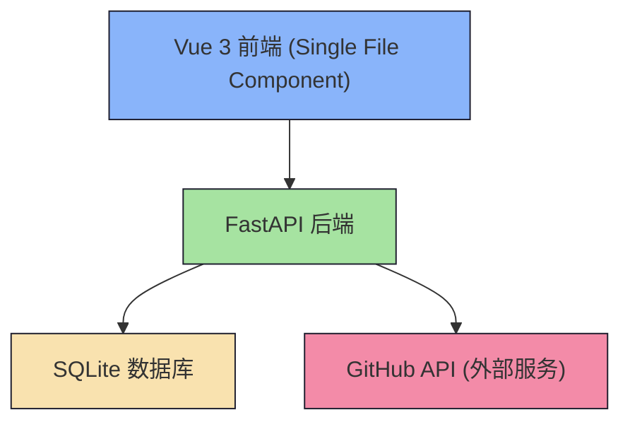
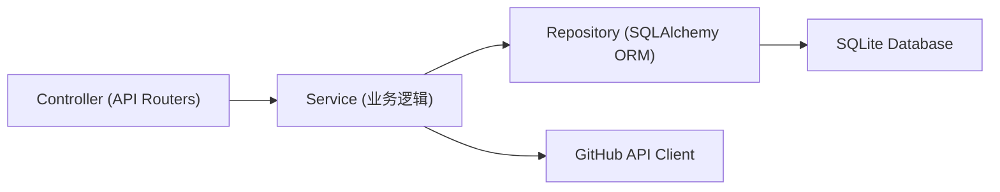
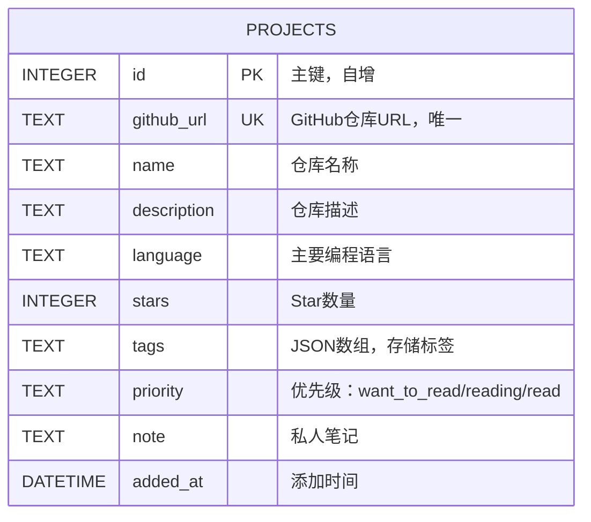

## 1. 架构设计



## 2. 技术描述

- **前端**：Vue 3.4 + Vite 5 + 原生CSS（深色主题）
- **后端**：FastAPI 0.109 + SQLAlchemy 2.0 + Pydantic 2.0
- **数据库**：SQLite 3（本地文件存储）
- **HTTP客户端**：httpx（异步调用GitHub API）
- **CORS**：fastapi.middleware.cors（前后端分离跨域）

## 3. 路由定义

| 路由 | 方法 | 用途 |
|------|------|------|
| /api/projects | GET | 项目列表查询（多条件筛选） |
| /api/projects | POST | 添加新项目（传入GitHub URL） |
| /api/projects/{id} | PUT | 更新项目（标签/优先级/笔记） |
| /api/projects/{id} | DELETE | 删除单个项目 |
| /api/projects/batch-delete | POST | 批量删除项目 |
| /api/projects/random | GET | 随机推荐"想看"项目 |
| / | GET | 静态文件服务（前端页面） |

## 4. API 定义

### 4.1 数据模型

```typescript
interface Project {
  id: number;
  github_url: string;
  name: string;
  description: string | null;
  language: string | null;
  stars: number;
  tags: string[];
  priority: 'want_to_read' | 'reading' | 'read';
  note: string | null;
  added_at: string; // ISO datetime
}
```

### 4.2 请求/响应模式

**添加项目请求**：
```typescript
interface AddProjectRequest {
  github_url: string;
  tags?: string[];
  priority?: 'want_to_read' | 'reading' | 'read';
  note?: string;
}
```

**查询参数**：
```typescript
interface QueryParams {
  search?: string;        // 搜索项目名和笔记
  language?: string;      // 按语言筛选
  priority?: string;      // 按优先级筛选
  tag?: string;           // 按标签筛选
}
```

**批量删除请求**：
```typescript
interface BatchDeleteRequest {
  ids: number[];
}
```

## 5. 服务器架构图



## 6. 数据模型

### 6.1 数据模型定义



### 6.2 DDL 语句

```sql
CREATE TABLE IF NOT EXISTS projects (
    id INTEGER PRIMARY KEY AUTOINCREMENT,
    github_url TEXT UNIQUE NOT NULL,
    name TEXT NOT NULL,
    description TEXT,
    language TEXT,
    stars INTEGER DEFAULT 0,
    tags TEXT DEFAULT '[]',
    priority TEXT DEFAULT 'want_to_read',
    note TEXT,
    added_at DATETIME DEFAULT CURRENT_TIMESTAMP
);

CREATE INDEX IF NOT EXISTS idx_projects_language ON projects(language);
CREATE INDEX IF NOT EXISTS idx_projects_priority ON projects(priority);
```

### 6.3 语言颜色映射

```javascript
const languageColors = {
  'Python': '#3572A5',
  'JavaScript': '#f1e05a',
  'TypeScript': '#3178c6',
  'Vue': '#41b883',
  'React': '#61dafb',
  'Go': '#00ADD8',
  'Rust': '#dea584',
  'Java': '#b07219',
  'C++': '#f34b7d',
  'C': '#555555',
  'Ruby': '#701516',
  'PHP': '#4F5D95',
  'Shell': '#89e051',
  'HTML': '#e34c26',
  'CSS': '#563d7c',
  'Dockerfile': '#384d54',
  'default': '#6c7086'
};
```
