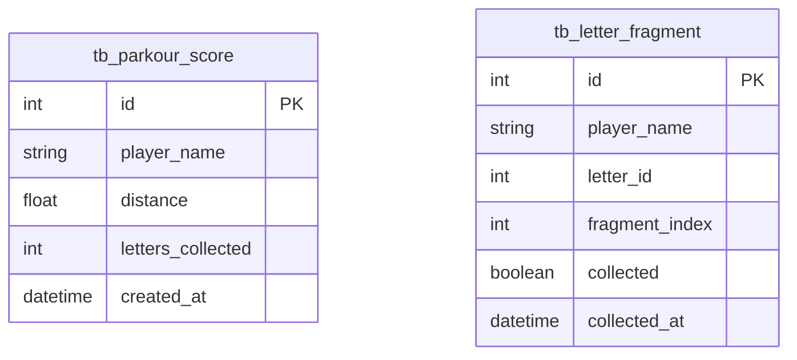

# 屋顶跑酷 - 技术架构文档

## 1. 架构设计

```mermaid
flowchart TB
    subgraph "前端层 (HTML+CSS+JS)"
        "Canvas游戏引擎" --> "物理引擎"
        "Canvas游戏引擎" --> "渲染引擎"
        "Canvas游戏引擎" --> "输入控制器"
        "Canvas游戏引擎" --> "关卡管理器"
        "UI覆盖层" --> "主界面"
        "UI覆盖层" --> "结算界面"
        "UI覆盖层" --> "排行榜"
        "UI覆盖层" --> "信件收集"
    end
    subgraph "后端层 (FastAPI)"
        "API路由" --> "业务逻辑层"
        "业务逻辑层" --> "数据访问层"
    end
    subgraph "数据层"
        "SQLite数据库"
    end
    "UI覆盖层" -->|"fetch API"| "API路由"
    "数据访问层" --> "SQLite数据库"
```

## 2. 技术说明
- **前端**: 纯HTML5 Canvas + CSS3 + Vanilla JS，无框架依赖
- **游戏引擎**: 自研轻量Canvas 2D引擎，含物理/渲染/输入/关卡四个模块
- **后端**: Python FastAPI（已有项目框架）
- **数据库**: SQLite（已有项目基础设施）
- **通信**: RESTful API，JSON格式

## 3. 路由定义
| 路由 | 用途 |
|------|------|
| / | 游戏主界面（HTML页面） |
| /api/scores | 成绩相关API |
| /api/letters | 信件收集相关API |

## 4. API定义

### 4.1 成绩API

```typescript
// POST /api/scores - 提交跑酷成绩
interface SubmitScoreRequest {
  player_name: string;
  distance: number;
  letters_collected: number;
}

interface SubmitScoreResponse {
  code: number;
  message: string;
  data: {
    rank: number;
    is_new_record: boolean;
  }
}

// GET /api/scores/leaderboard - 获取排行榜
interface LeaderboardResponse {
  code: number;
  message: string;
  data: Array<{
    rank: number;
    player_name: string;
    distance: number;
    letters_collected: number;
    created_at: string;
  }>
}

// GET /api/scores/best?player_name=xxx - 获取个人最佳
interface BestScoreResponse {
  code: number;
  message: string;
  data: {
    best_distance: number;
    total_letters: number;
    total_runs: number;
  }
}
```

### 4.2 信件API

```typescript
// GET /api/letters/status?player_name=xxx - 获取信件收集状态
interface LetterStatusResponse {
  code: number;
  message: string;
  data: {
    fragments: Array<{
      letter_id: number;
      fragment_index: number;
      collected: boolean;
    }>
    unlocked_stories: Array<{
      letter_id: number;
      title: string;
      content: string;
    }>
  }
}

// POST /api/letters/collect - 收集信件碎片
interface CollectLetterRequest {
  player_name: string;
  letter_id: number;
  fragment_index: number;
}

interface CollectLetterResponse {
  code: number;
  message: string;
  data: {
    letter_id: number;
    fragment_index: number;
    all_fragments_collected: boolean;
    unlocked_content: string | null;
  }
}
```

## 5. 服务端架构图

```mermaid
flowchart LR
    "Controller层" --> "Business层"
    "Business层" --> "Model层"
    "Model层" --> "SQLite"
```

## 6. 数据模型

### 6.1 数据模型定义



### 6.2 数据定义语言

```sql
CREATE TABLE IF NOT EXISTS tb_parkour_score (
    id INTEGER PRIMARY KEY AUTOINCREMENT,
    player_name VARCHAR(50) NOT NULL,
    distance REAL NOT NULL DEFAULT 0,
    letters_collected INTEGER NOT NULL DEFAULT 0,
    created_at TIMESTAMP DEFAULT CURRENT_TIMESTAMP
);

CREATE INDEX IF NOT EXISTS idx_parkour_score_distance ON tb_parkour_score(distance DESC);
CREATE INDEX IF NOT EXISTS idx_parkour_score_player ON tb_parkour_score(player_name);

CREATE TABLE IF NOT EXISTS tb_letter_fragment (
    id INTEGER PRIMARY KEY AUTOINCREMENT,
    player_name VARCHAR(50) NOT NULL,
    letter_id INTEGER NOT NULL,
    fragment_index INTEGER NOT NULL CHECK(fragment_index BETWEEN 1 AND 3),
    collected INTEGER NOT NULL DEFAULT 0,
    collected_at TIMESTAMP,
    UNIQUE(player_name, letter_id, fragment_index)
);

CREATE INDEX IF NOT EXISTS idx_letter_fragment_player ON tb_letter_fragment(player_name);
```

## 7. 前端游戏引擎架构

### 7.1 核心模块
- **GameEngine**: 主循环(requestAnimationFrame)、状态管理(菜单/游戏/暂停/结算)
- **PhysicsEngine**: 重力、碰撞检测(AABB)、跳跃抛物线
- **Renderer**: Canvas 2D渲染，视差背景、角色动画、障碍绘制、粒子效果
- **InputController**: 键盘事件监听，空格长按计时，S键状态
- **LevelManager**: 障碍生成算法、信件碎片生成、昼夜切换逻辑
- **Camera**: 视口跟随、夜间视野遮罩

### 7.2 游戏参数
| 参数 | 值 | 说明 |
|------|-----|------|
| 基础速度 | 6 px/frame | 随距离缓慢加速 |
| 重力 | 0.6 | 像素/帧² |
| 跳跃力 | -13 | 像素/帧（向上） |
| 长按时间范围 | 100ms-400ms | 映射额外水平推力 |
| 滑铲持续 | 36帧 | 约0.6秒@60fps |
| 天窗碎裂延迟 | 18帧 | 约0.3秒@60fps |
| 昼夜切换距离 | 1500m | 开始渐变 |
| 视野缩小比例 | 60% | 夜间原始视野的60% |
| 障碍间距 | 200-400px | 随速度动态调整 |
| 信件碎片概率 | 15% | 每个障碍区间 |

### 7.3 信件碎片剧情
12封信件，每封3个碎片，集齐解锁剧情文本：
- 信件1-4：城市记忆（城市过去的故事）
- 信件5-8：霓虹之下（角色身世线索）
- 信件9-12：天际线彼端（结局伏笔）
