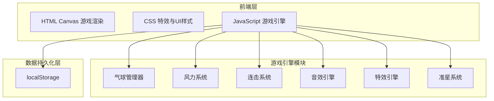

## 1. 架构设计



## 2. 技术说明

- 前端：纯 HTML5 + CSS3 + JavaScript（ES6+），无框架依赖
- 渲染：Canvas 2D API 用于气球、碎片、粒子渲染；HTML/CSS 用于HUD叠加层
- 音效：Web Audio API 合成音效，无需音频文件
- 数据持久化：localStorage 保存游戏进度
- 部署：单个 HTML 文件，直接浏览器打开即可运行

## 3. 文件结构

| 文件 | 用途 |
|------|------|
| index.html | 游戏入口页面，包含所有HTML结构、CSS样式和JavaScript逻辑 |

整个游戏在单个 HTML 文件中实现，内嵌 CSS 和 JavaScript，零依赖可直接运行。

## 4. 核心数据结构

### 4.1 气球对象

```javascript
{
  type: 'red' | 'blue' | 'gold' | 'bomb',
  x: number,          // 水平位置
  y: number,          // 垂直位置
  radius: number,     // 半径
  speed: number,      // 上浮速度
  score: number,      // 击破得分
  color: string,      // 颜色
  id: number          // 唯一标识
}
```

### 4.2 游戏状态

```javascript
{
  score: number,
  highScore: number,
  lives: number,
  combo: number,
  comboTimer: number,
  windForce: number,       // -2 到 2
  windDirection: number,   // 箭头角度
  unlockedCursors: string[],
  currentCursor: string,
  gameOver: boolean
}
```

## 5. 游戏循环设计

使用 requestAnimationFrame 驱动游戏主循环，每帧执行：

1. **生成判定**：3%概率在底部生成随机类型气球
2. **位置更新**：所有气球上浮 + 风力水平漂移
3. **边界检测**：飘出屏幕顶部的气球移除
4. **连击检测**：连击计时器递减，超时重置
5. **风力计时**：15秒倒计时，到期随机改变风向
6. **渲染**：清屏 → 绘制背景 → 绘制气球 → 绘制特效 → 绘制HUD

## 6. 音效合成方案

使用 Web Audio API 的 OscillatorNode + 白噪声（AudioBuffer）组合：

| 音效类型 | 合成方式 | 时长 |
|---------|---------|------|
| 红色爆破 | 440Hz正弦波 + 白噪声 | 100ms |
| 蓝色碎裂 | 880Hz正弦波 + 白噪声 | 80ms |
| 金币音 | 880Hz + 1320Hz和弦 | 200ms |
| 炸弹爆炸 | 100Hz正弦波 + 白噪声 | 400ms |
| 连击上升 | 440Hz + combo×50Hz | 100ms |
| 风声 | 白噪声带通滤波200-600Hz | 300ms |

## 7. localStorage 存储结构

```javascript
{
  "balloonGame_highScore": number,
  "balloonGame_unlockedCursors": string[],  // ["cross","ring","eagle","laser"]
  "balloonGame_currentCursor": string
}
```

## 8. 特效系统设计

| 特效 | 实现方式 |
|------|---------|
| 碎片飞散 | 8片碎片粒子，初速4px/帧，重力0.15px/帧²，颜色同气球 |
| 金色光晕 | 围绕金色气球的脉冲光环，半径正弦波动 |
| 炸弹警示 | 红色边框闪烁，透明度正弦变化 |
| 连击火焰 | 粒子系统环绕连击数字，橙红色火焰粒子向上飘散 |
| 冲击波 | 击破位置圆环扩散，半径增长+透明度衰减 |
| 星星背景 | 小白点随机分布，透明度闪烁 |
