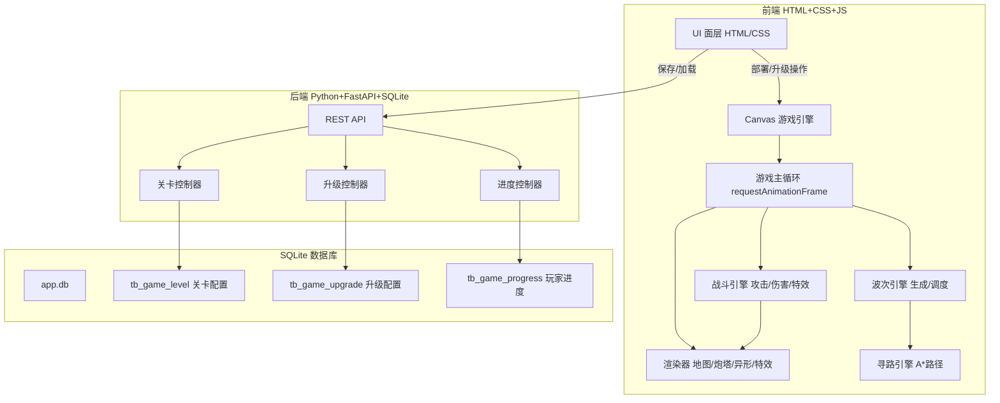
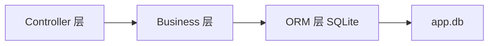
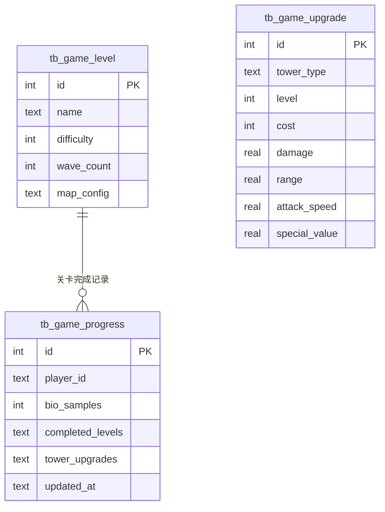

## 1. 架构设计



## 2. 技术说明
- **前端**：原生 HTML5 + CSS3 + JavaScript（ES6+），Canvas 2D 渲染俯视角战场
- **后端**：Python FastAPI + SQLite（复用项目现有架构）
- **游戏引擎**：自研轻量游戏循环，基于 requestAnimationFrame，60fps 目标
- **寻路**：A* 算法预计算路径，异形沿路径行进
- **数据存储**：关卡配置和升级数据存储在 SQLite，前端通过 REST API 交互

## 3. 路由定义
| 路由 | 用途 |
|------|------|
| / | 游戏主页面（战场+UI） |
| /levels | 关卡选择页面 |
| /api/game/level/list | 获取关卡列表 |
| /api/game/level/get | 获取单个关卡详情（地图数据、波次配置） |
| /api/game/upgrade/list | 获取炮塔升级配置 |
| /api/game/progress/get | 获取玩家进度 |
| /api/game/progress/set | 保存玩家进度（关卡完成、样本余额） |

## 4. API 定义

### 4.1 关卡列表
```typescript
// GET /api/game/level/list
Response: {
  code: number
  message: string
  data: {
    levels: Array<{
      id: number
      name: string
      difficulty: number
      wave_count: number
      unlocked: boolean
      best_stars: number
    }>
  }
}
```

### 4.2 关卡详情
```typescript
// GET /api/game/level/get?level_id=1
Response: {
  code: number
  message: string
  data: {
    id: number
    name: string
    map_width: number
    map_height: number
    grid_data: number[][]       // 0=地板, 1=走廊, 2=墙壁
    deploy_nodes: Array<{x: number, y: number}>
    entry_points: Array<{x: number, y: number}>
    exit_point: {x: number, y: number}
    waves: Array<{
      wave_index: number
      enemies: Array<{
        type: "normal" | "acid" | "shell" | "mother"
        count: number
        entry_index: number
        spawn_interval: number
        spawn_delay: number
      }>
    }>
  }
}
```

### 4.3 升级配置
```typescript
// GET /api/game/upgrade/list
Response: {
  code: number
  message: string
  data: {
    upgrades: Array<{
      tower_type: "electromagnetic" | "laser" | "flame" | "freeze"
      level: number
      cost: number
      damage: number
      range: number
      attack_speed: number
      special_value: number
    }>
  }
}
```

### 4.4 玩家进度
```typescript
// GET /api/game/progress/get
Response: {
  code: number
  message: string
  data: {
    bio_samples: number
    completed_levels: number[]
    tower_upgrades: Record<string, number>  // tower_type -> level
  }
}

// POST /api/game/progress/set
Request: {
  bio_samples: number
  completed_levels: number[]
  tower_upgrades: Record<string, number>
}
Response: {
  code: number
  message: string
  data: null
}
```

## 5. 服务端架构图



复用项目现有架构：Controller → Business → Model → SQLite

## 6. 数据模型

### 6.1 ER 图


### 6.2 DDL
```sql
CREATE TABLE IF NOT EXISTS tb_game_level (
    id INTEGER PRIMARY KEY AUTOINCREMENT,
    name TEXT NOT NULL,
    difficulty INTEGER NOT NULL DEFAULT 1,
    wave_count INTEGER NOT NULL DEFAULT 5,
    map_config TEXT NOT NULL
);

CREATE TABLE IF NOT EXISTS tb_game_upgrade (
    id INTEGER PRIMARY KEY AUTOINCREMENT,
    tower_type TEXT NOT NULL,
    level INTEGER NOT NULL DEFAULT 1,
    cost INTEGER NOT NULL DEFAULT 0,
    damage REAL NOT NULL DEFAULT 0,
    range REAL NOT NULL DEFAULT 0,
    attack_speed REAL NOT NULL DEFAULT 0,
    special_value REAL NOT NULL DEFAULT 0,
    UNIQUE(tower_type, level)
);

CREATE TABLE IF NOT EXISTS tb_game_progress (
    id INTEGER PRIMARY KEY AUTOINCREMENT,
    player_id TEXT NOT NULL DEFAULT 'default',
    bio_samples INTEGER NOT NULL DEFAULT 200,
    completed_levels TEXT NOT NULL DEFAULT '[]',
    tower_upgrades TEXT NOT NULL DEFAULT '{}',
    updated_at TEXT NOT NULL DEFAULT (datetime('now')),
    UNIQUE(player_id)
);

-- 初始升级数据
INSERT INTO tb_game_upgrade (tower_type, level, cost, damage, range, attack_speed, special_value) VALUES
('electromagnetic', 1, 0, 15, 120, 1.0, 0.5),
('electromagnetic', 2, 80, 22, 135, 1.1, 0.55),
('electromagnetic', 3, 160, 32, 150, 1.2, 0.6),
('laser', 1, 0, 40, 150, 0.7, 0.2),
('laser', 2, 100, 60, 165, 0.75, 0.25),
('laser', 3, 200, 85, 180, 0.8, 0.3),
('flame', 1, 0, 8, 80, 2.0, 3.0),
('flame', 2, 80, 12, 95, 2.2, 4.0),
('flame', 3, 160, 18, 110, 2.4, 5.0),
('freeze', 1, 0, 5, 130, 0.5, 0.7),
('freeze', 2, 120, 8, 145, 0.55, 0.75),
('freeze', 3, 240, 12, 160, 0.6, 0.8);

-- 初始关卡数据
INSERT INTO tb_game_level (name, difficulty, wave_count, map_config) VALUES
('研发区走廊', 1, 5, '{"width":20,"height":15,"grid":[[1,1,1,1,1,0,0,0,0,0,0,0,0,0,1,1,1,1,1,1],[1,1,1,1,1,0,0,0,0,0,0,0,0,0,1,1,1,1,1,1],[0,0,1,0,0,0,0,0,0,0,0,0,0,0,0,0,1,0,0,0],[0,0,1,0,0,1,1,1,1,1,1,1,1,0,0,0,1,0,0,0],[0,0,1,0,0,1,0,0,0,0,0,0,1,0,0,0,1,0,0,0],[0,0,1,0,0,1,0,0,0,0,0,0,1,0,0,0,1,0,0,0],[0,0,1,1,1,1,0,0,0,0,0,0,1,1,1,1,1,0,0,0],[0,0,0,0,0,1,0,0,0,0,0,0,1,0,0,0,0,0,0,0],[0,0,0,0,0,1,0,0,0,0,0,0,1,0,0,0,0,0,0,0],[0,0,0,0,0,1,1,1,1,1,1,1,1,0,0,0,0,0,0,0],[0,0,0,0,0,0,0,0,0,0,0,0,0,0,0,0,0,0,0,0],[0,0,0,0,0,0,0,0,0,0,0,0,0,0,0,0,0,0,0,0],[0,0,0,0,0,0,0,0,0,0,0,0,0,0,0,0,0,0,0,0],[0,0,0,0,0,0,0,0,0,0,0,0,0,0,0,0,0,0,0,0],[0,0,0,0,0,0,0,0,0,0,0,0,0,0,0,0,0,0,0,0]],"deploy_nodes":[{"x":2,"y":3},{"x":2,"y":5},{"x":6,"y":4},{"x":6,"y":8},{"x":6,"y":10},{"x":13,"y":4},{"x":13,"y":8},{"x":13,"y":10},{"x":17,"y":3},{"x":17,"y":5}],"entry_points":[{"x":2,"y":0},{"x":17,"y":0}],"exit_point":{"x":9,"y":10}}'),
('实验区通道', 2, 7, '{"width":20,"height":15}'),
('核心反应堆', 3, 10, '{"width":20,"height":15}');

-- 初始玩家进度
INSERT INTO tb_game_progress (player_id, bio_samples, completed_levels, tower_upgrades) VALUES
('default', 200, '[]', '{}');
```

## 7. 前端文件结构

```
static/game/
├── index.html          # 游戏主页面
├── css/
│   └── style.css       # 游戏样式
├── js/
│   ├── app.js          # 入口，初始化
│   ├── engine/
│   │   ├── gameLoop.js     # 游戏主循环
│   │   ├── renderer.js     # Canvas渲染器
│   │   └── pathfinder.js   # A*寻路
│   ├── entities/
│   │   ├── tower.js        # 炮塔基类 + 4种炮塔
│   │   └── enemy.js        # 异形基类 + 4种异形
│   ├── systems/
│   │   ├── combat.js       # 战斗系统
│   │   ├── wave.js         # 波次系统
│   │   └── upgrade.js      # 升级系统
│   ├── map/
│   │   └── level.js        # 关卡地图
│   └── ui/
│       ├── hud.js          # HUD信息栏
│       ├── towerPanel.js   # 炮塔选择面板
│       └── levelSelect.js  # 关卡选择
```
