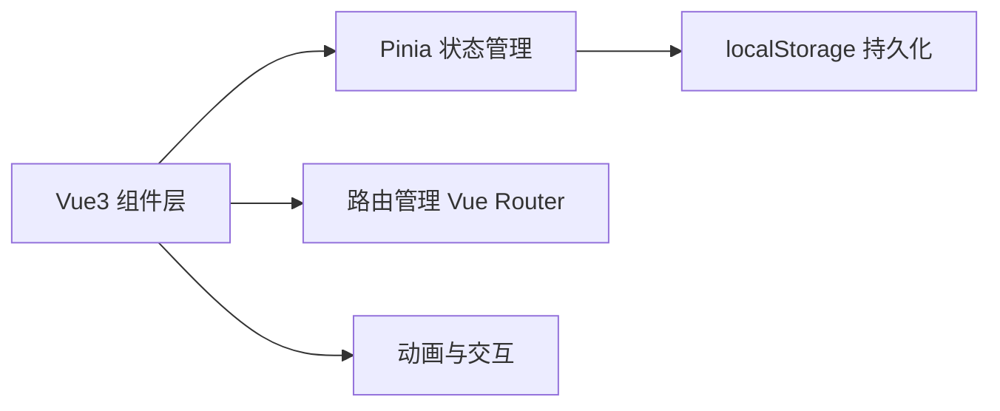
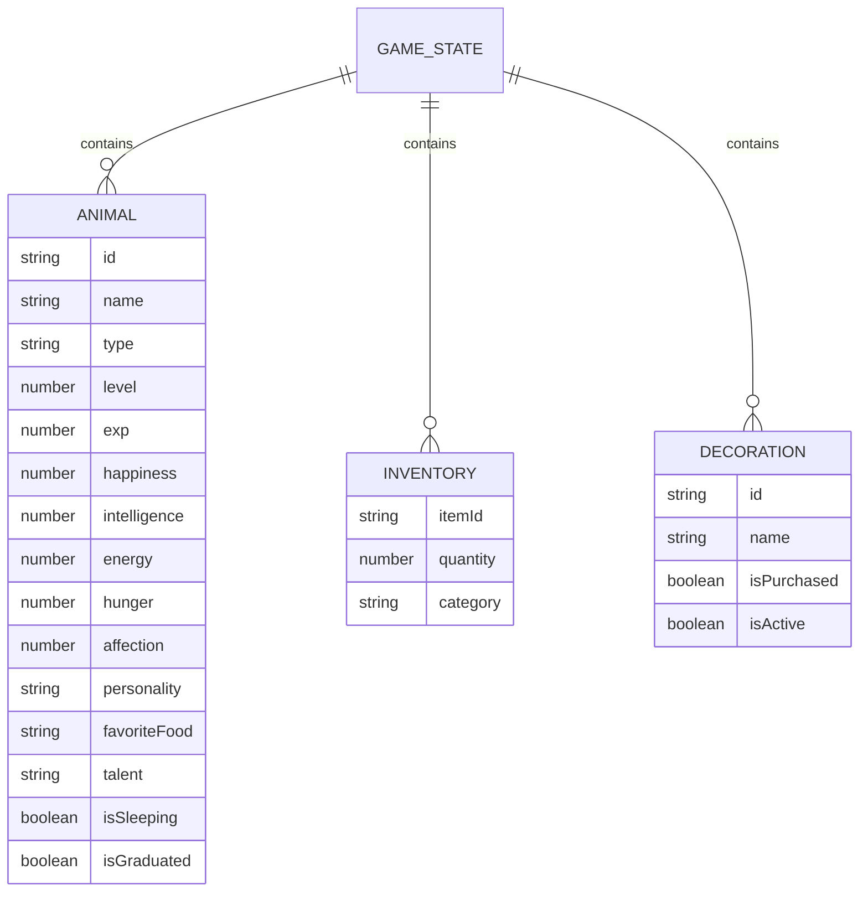

# 动物幼儿园游戏技术架构文档

## 1. 架构设计



## 2. 技术栈说明
- 前端框架：Vue 3 + TypeScript + Vite
- 状态管理：Pinia
- 路由：Vue Router
- 样式：Tailwind CSS 3
- 持久化：localStorage + Pinia 插件
- 图标：Lucide Vue

## 3. 路由定义
| 路由路径 | 页面名称 | 说明 |
|---------|---------|------|
| / | 主园区 | 游戏主页，展示小动物和状态 |
| /class | 上课页面 | 选择课程安排小动物学习 |
| /feed | 喂食页面 | 选择食物喂食小动物 |
| /shop | 商店页面 | 购买食物、玩具、装饰品 |
| /animal/:id | 动物详情 | 查看单个小动物详情 |

## 4. 数据模型

### 4.1 数据关系图


### 4.2 游戏状态类型定义
```typescript
// 动物类型
type AnimalType = 'rabbit' | 'cat' | 'dog' | 'bear' | 'panda' | 'fox';

// 性格类型
type Personality = '活泼' | '安静' | '调皮' | '温柔' | '好奇';

// 天赋类型
type Talent = '绘画' | '音乐' | '运动' | '认知' | '全能';

// 天气类型
type Weather = 'sunny' | 'rainy';

// 课程类型
type CourseType = 'painting' | 'music' | 'sports' | 'cognition';

// 食物分类
type FoodCategory = 'fruit' | 'dairy' | 'meat' | 'snack';

interface Animal {
  id: string;
  name: string;
  type: AnimalType;
  emoji: string;
  level: number;
  exp: number;
  maxExp: number;
  happiness: number;
  intelligence: number;
  energy: number;
  hunger: number;
  affection: number;
  personality: Personality;
  favoriteFood: string;
  talent: Talent;
  isSleeping: boolean;
  isGraduated: boolean;
  lastFed: number;
  lastPlayed: number;
}

interface Food {
  id: string;
  name: string;
  emoji: string;
  category: FoodCategory;
  price: number;
  hungerRestore: number;
  happinessBonus: number;
}

interface Course {
  id: string;
  name: string;
  type: CourseType;
  emoji: string;
  duration: number;
  energyCost: number;
  expGain: number;
  intelligenceGain: number;
  happinessChange: number;
}

interface GameState {
  coins: number;
  day: number;
  timeOfDay: 'morning' | 'afternoon' | 'evening';
  weather: Weather;
  animals: Animal[];
  inventory: Record<string, number>;
  decorations: string[];
  totalGraduated: number;
  lastSave: number;
}
```

## 5. 项目结构
```
static/dongwu/
├── index.html
├── package.json
├── vite.config.ts
├── tsconfig.json
├── tailwind.config.js
├── src/
│   ├── main.ts
│   ├── App.vue
│   ├── router/index.ts
│   ├── stores/
│   │   └── gameStore.ts
│   ├── composables/
│   │   └── useGameLogic.ts
│   ├── components/
│   │   ├── AnimalCard.vue
│   │   ├── AnimalDetail.vue
│   │   ├── CourseCard.vue
│   │   ├── FoodCard.vue
│   │   ├── StatusBar.vue
│   │   ├── WeatherDisplay.vue
│   │   └── ProgressBar.vue
│   ├── pages/
│   │   ├── MainPark.vue
│   │   ├── ClassRoom.vue
│   │   ├── FeedingRoom.vue
│   │   └── Shop.vue
│   ├── data/
│   │   ├── animals.ts
│   │   ├── foods.ts
│   │   ├── courses.ts
│   │   └── decorations.ts
│   ├── types/
│   │   └── index.ts
│   └── utils/
│       └── storage.ts
```

## 6. 状态持久化方案
- 使用 Pinia + localStorage 插件自动持久化
- 定期（每30秒）自动保存游戏状态
- 页面刷新时自动从 localStorage 恢复
- 支持手动保存/重置功能
