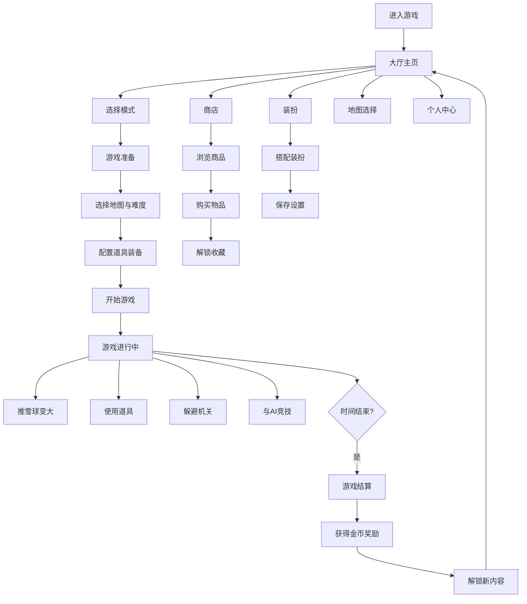

## 1. 产品概述

仓鼠推雪球是一款休闲竞技类网页游戏，玩家操控可爱的小仓鼠在雪地场景中推动雪球不断变大，与AI对手进行竞技对抗，通过趣味道具、地图机关和策略性玩法赢得比赛。游戏融合了养成、收集、竞技等多种玩法元素，为玩家带来轻松有趣的游戏体验。

- 目标用户：休闲游戏爱好者、喜欢可爱风格的玩家
- 产品价值：提供碎片化时间的娱乐体验，通过收集和养成系统增加用户粘性

## 2. 核心功能

### 2.1 用户角色

| 角色 | 注册方式 | 核心权限 |
|------|----------|----------|
| 玩家 | 本地自动创建 | 游戏竞技、道具使用、装扮收集、商店购买 |

### 2.2 功能模块

1. **大厅**：游戏入口、模式选择、活动展示、每日任务
2. **游戏对战**：仓鼠推雪球核心玩法、AI对手、道具系统、地图机关
3. **商店**：仓鼠皮肤、雪球特效、雪地装饰、道具购买
4. **装扮系统**：仓鼠皮肤穿戴、雪球特效设置、装饰搭配
5. **地图选择**：多场景地图（冰雪世界、南极之巅、极光雪原、糖果冰原）
6. **个人中心**：玩家信息、成就、收藏、统计数据
7. **活动系统**：限时活动、特殊嘉宾、彩蛋奖励

### 2.3 页面详情

| 页面名称 | 模块名称 | 功能描述 |
|----------|----------|----------|
| 大厅主页 | 顶部导航 | 金币显示、钻石显示、设置按钮、个人中心入口 |
| 大厅主页 | 中央角色 | 仓鼠展示、当前装扮预览、3D旋转效果 |
| 大厅主页 | 模式选择 | 快速匹配、排位赛、练习模式 |
| 大厅主页 | 活动横幅 | 限时活动轮播、特殊嘉宾预告 |
| 大厅主页 | 底部菜单 | 大厅、商店、装扮、地图、个人中心 |
| 游戏准备页 | 角色装备 | 雪球装备选择、道具栏配置 |
| 游戏准备页 | 场地信息 | 地图预览、天气状态、机关说明 |
| 游戏准备页 | 对手匹配 | 难度选择、AI对手展示、开始按钮 |
| 游戏对战页 | 游戏画布 | Canvas 渲染游戏场景、仓鼠、雪球 |
| 游戏对战页 | HUD界面 | 雪球大小排名、计时器、道具栏、暂停按钮 |
| 游戏对战页 | 结算弹窗 | 胜负结果、金币奖励、经验值、解锁提示 |
| 商店页 | 商品分类 | 仓鼠皮肤、雪球特效、雪地装饰、道具 |
| 商店页 | 商品列表 | 商品卡片、价格、已拥有标识、试穿功能 |
| 装扮页 | 仓鼠装扮 | 皮肤选择、配饰穿戴、保存搭配 |
| 装扮页 | 雪球特效 | 拖尾效果、粒子特效、雪球皮肤 |
| 地图页 | 地图列表 | 地图卡片、解锁状态、场景预览 |
| 地图页 | 地图详情 | 地图介绍、机关说明、难度评级 |
| 个人中心 | 玩家信息 | 头像、昵称、等级、经验条 |
| 个人中心 | 数据统计 | 总场次、胜率、最大雪球、金币总数 |
| 个人中心 | 成就系统 | 成就徽章、完成进度、奖励领取 |
| 个人中心 | 收藏展示 | 已解锁皮肤、特效、装饰展示 |

## 3. 核心流程

### 3.1 游戏主流程

玩家进入大厅 → 选择游戏模式 → 配置装备和道具 → 选择地图和AI难度 → 开始游戏 → 操控仓鼠推雪球 → 使用道具/躲避机关 → 时间结束 → 结算奖励 → 返回大厅

### 3.2 商店购买流程

进入商店 → 浏览商品分类 → 选择商品 → 试穿预览 → 确认购买 → 扣除金币/钻石 → 解锁物品 → 自动装备或收藏

### 3.3 流程图

## 4. 用户界面设计

### 4.1 设计风格

- **主色调**：冰雪蓝色系 (#87CEEB, #B0E0E6, #E0F6FF)，搭配暖橙色 (#FFB347) 作为强调色
- **辅助色**：粉色 (#FFB6C1)、薄荷绿 (#98FB98)、薰衣草紫 (#E6E6FA)
- **按钮风格**：圆角矩形、渐变填充、悬浮放大动效、柔和阴影
- **字体**：圆润可爱的中文字体（站酷快乐体/萌趣字体 fallback 到系统圆体）
- **图标风格**：卡通手绘风格、圆润线条、明亮色彩
- **整体风格**：卡通可爱、冰雪主题、温馨治愈、圆润柔和

### 4.2 页面设计概览

| 页面名称 | 模块名称 | UI元素 |
|----------|----------|--------|
| 大厅主页 | 整体布局 | 冰雪背景渐变、飘落雪花粒子、中央仓鼠舞台、底部Tab导航 |
| 大厅主页 | 角色展示 | 3D透视效果的仓鼠卡片、旋转展示、装扮预览 |
| 大厅主页 | 模式选择 | 卡片式布局、图标+文字、悬浮上浮动画 |
| 游戏对战页 | 游戏画布 | 俯视/斜45度视角、雪地纹理、网格参考线 |
| 游戏对战页 | HUD界面 | 半透明玻璃态面板、圆角设计、实时数据更新 |
| 商店页 | 商品卡片 | 网格布局、商品图标、名称价格、已拥有角标 |
| 装扮页 | 装扮预览 | 左侧角色展示、右侧分类选项卡、实时预览效果 |
| 个人中心 | 信息面板 | 卡片堆叠效果、进度条动画、成就徽章墙 |

### 4.3 响应式设计

- 桌面端优先设计，适配平板和移动端
- 游戏画布自适应容器大小，保持画面比例
- 移动端优化触控操作，增大按钮点击区域
- 底部导航栏在移动端自适应高度

### 4.4 动效设计

- 页面切换：左右滑动过渡、淡入淡出
- 按钮交互：悬浮放大、点击回弹、波纹效果
- 角色动画：仓鼠呼吸动效、行走循环、推雪发力动作
- 雪球效果：滚动旋转、大小渐变、粒子拖尾
- 道具特效：获得闪光、使用爆炸、碰撞抖动
- 背景动效：雪花飘落、极光流动、云朵漂浮
