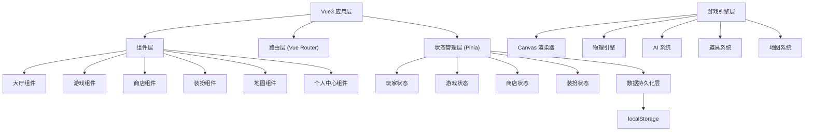

## 1. 架构设计



## 2. 技术描述

- **前端框架**: Vue 3 + Composition API
- **构建工具**: Vite 5
- **状态管理**: Pinia
- **路由**: Vue Router 4
- **样式方案**: Tailwind CSS 3 + SCSS
- **游戏渲染**: HTML5 Canvas 2D
- **图标**: Lucide Icons + 自定义 Emoji 图标
- **动画**: CSS 动画 + requestAnimationFrame 游戏循环
- **数据存储**: localStorage 本地存储
- **包管理**: npm

## 3. 路由定义

| 路由路径 | 页面名称 | 说明 |
|----------|----------|------|
| / | 大厅主页 | 游戏入口，模式选择，活动展示 |
| /game/prepare | 游戏准备页 | 装备配置，地图选择，难度选择 |
| /game/play | 游戏对战页 | 核心游戏画面 |
| /shop | 商店页 | 商品购买 |
| /dress | 装扮页 | 仓鼠装扮，雪球特效 |
| /maps | 地图页 | 地图选择，地图详情 |
| /profile | 个人中心 | 玩家信息，统计，成就 |

## 4. 数据模型

### 4.1 玩家数据模型

```typescript
interface PlayerData {
  id: string;
  nickname: string;
  avatar: string;
  level: number;
  exp: number;
  coins: number;
  diamonds: number;
  
  // 统计数据
  stats: {
    totalGames: number;
    wins: number;
    maxSnowballSize: number;
    totalCoinsEarned: number;
  };
  
  // 已解锁内容
  unlocked: {
    hamsterSkins: string[];
    snowballEffects: string[];
    decorations: string[];
    maps: string[];
    items: { [itemId: string]: number };
  };
  
  // 当前装备
  equipped: {
    hamsterSkin: string;
    snowballEffect: string;
    decorations: string[];
  };
  
  // 成就
  achievements: { [achievementId: string]: boolean };
  
  // 每日任务
  dailyTasks: {
    date: string;
    tasks: DailyTask[];
  };
}
```

### 4.2 游戏状态模型

```typescript
interface GameState {
  status: 'idle' | 'playing' | 'paused' | 'finished';
  mapId: string;
  difficulty: 'easy' | 'normal' | 'hard' | 'expert';
  timeRemaining: number;
  totalTime: number;
  
  // 玩家仓鼠
  player: Hamster;
  
  // AI 对手列表
  opponents: AIOpponent[];
  
  // 地图上的道具
  items: MapItem[];
  
  // 地图机关
  obstacles: Obstacle[];
  
  // 巨型雪球
  giantSnowballs: GiantSnowball[];
  
  // 特殊嘉宾
  specialGuest?: SpecialGuest;
}

interface Hamster {
  id: string;
  name: string;
  x: number;
  y: number;
  direction: number;
  speed: number;
  snowball: Snowball;
  skin: string;
  isPlayer: boolean;
}

interface Snowball {
  size: number;
  maxSize: number;
  growthRate: number;
  x: number;
  y: number;
  rotation: number;
  effect: string;
}

interface AIOpponent extends Hamster {
  difficulty: 'easy' | 'normal' | 'hard' | 'expert';
  aiType: 'aggressive' | 'defensive' | 'balanced' | 'tricky';
  reactionTime: number;
  decisionInterval: number;
}
```

### 4.3 商店数据模型

```typescript
interface ShopItem {
  id: string;
  name: string;
  description: string;
  category: 'hamster' | 'snowball' | 'decoration' | 'item';
  price: number;
  currency: 'coins' | 'diamonds';
  rarity: 'common' | 'rare' | 'epic' | 'legendary';
  icon: string;
  unlocked?: boolean;
}
```

### 4.4 地图数据模型

```typescript
interface MapData {
  id: string;
  name: string;
  description: string;
  background: string;
  groundColor: string;
  width: number;
  height: number;
  obstacles: ObstacleConfig[];
  itemSpawnPoints: { x: number; y: number }[];
  weather: 'snow' | 'clear' | 'blizzard';
  difficulty: 1 | 2 | 3 | 4 | 5;
  unlocked: boolean;
  unlockCondition: string;
}
```

## 5. 核心模块说明

### 5.1 游戏引擎模块

- **游戏循环**: 使用 requestAnimationFrame 实现 60fps 游戏循环
- **渲染系统**: Canvas 2D 绘制地图、仓鼠、雪球、道具等
- **物理系统**: 碰撞检测、雪球滚动、速度计算
- **输入处理**: 键盘 WASD/方向键控制、触屏虚拟摇杆

### 5.2 AI 系统模块

| 难度等级 | 反应速度 | 策略性 | 道具使用 | 失误率 |
|----------|----------|--------|----------|--------|
| 简单 | 慢 | 低 | 很少 | 高 |
| 普通 | 中 | 中 | 偶尔 | 中 |
| 困难 | 快 | 高 | 经常 | 低 |
| 专家 | 极快 | 极高 | 策略性使用 | 极低 |

AI 行为类型：
- **激进型**: 主动追击玩家，抢夺道具
- **防守型**: 避开冲突，专注推雪球
- **平衡型**: 攻守兼备，灵活应对
- **狡诈型**: 擅长使用道具干扰，设陷阱

### 5.3 道具系统

| 道具名称 | 效果 | 稀有度 |
|----------|------|--------|
| 加速冰鞋 | 临时提升移动速度 | 普通 |
| 雪球炸弹 | 投掷后炸碎对方雪球 | 稀有 |
| 护盾 | 短暂无敌状态 | 稀有 |
| 减速粘液 | 让对手减速 | 普通 |
| 磁铁 | 吸引附近道具 | 史诗 |
| 双倍雪球 | 雪球增长速度翻倍 | 史诗 |
| 传送门 | 随机传送到地图某处 | 稀有 |
| 缩小光线 | 让对手雪球暂时变小 | 史诗 |

### 5.4 地图机关

- **冰面滑行**: 摩擦力减小，难以控制方向
- **雪堆障碍**: 撞到会减速并损失雪球
- **冰裂缝**: 掉落会损失大量雪球大小
- **巨型雪球**: 定期滚动，碾压路径上的一切
- **加速坡道**: 经过会获得速度提升
- **弹跳平台**: 弹起仓鼠和雪球

## 6. 项目目录结构

```
src/
├── assets/              # 静态资源
│   ├── styles/          # 全局样式
│   └── images/          # 图片资源
├── components/          # 通用组件
│   ├── common/          # 基础组件（按钮、卡片等）
│   └── game/            # 游戏相关组件
├── views/               # 页面视图
│   ├── Hall.vue         # 大厅页
│   ├── GamePrepare.vue  # 游戏准备页
│   ├── GamePlay.vue     # 游戏对战页
│   ├── Shop.vue         # 商店页
│   ├── Dress.vue        # 装扮页
│   ├── Maps.vue         # 地图页
│   └── Profile.vue      # 个人中心页
├── stores/              # Pinia 状态管理
│   ├── player.ts        # 玩家状态
│   ├── game.ts          # 游戏状态
│   ├── shop.ts          # 商店状态
│   └── ui.ts            # UI 状态
├── game/                # 游戏引擎
│   ├── engine.ts        # 游戏主循环
│   ├── renderer.ts      # Canvas 渲染
│   ├── physics.ts       # 物理系统
│   ├── ai/              # AI 系统
│   │   ├── base.ts      # AI 基类
│   │   ├── easy.ts      # 简单AI
│   │   ├── normal.ts    # 普通AI
│   │   ├── hard.ts      # 困难AI
│   │   └── expert.ts    # 专家AI
│   ├── items.ts         # 道具系统
│   ├── maps.ts          # 地图系统
│   └── entities/        # 游戏实体
│       ├── hamster.ts   # 仓鼠类
│       ├── snowball.ts  # 雪球类
│       └── obstacle.ts  # 障碍物类
├── data/                # 游戏数据配置
│   ├── hamsters.ts      # 仓鼠皮肤数据
│   ├── items.ts         # 道具数据
│   ├── maps.ts          # 地图数据
│   └── achievements.ts  # 成就数据
├── utils/               # 工具函数
│   ├── storage.ts       # 本地存储
│   ├── helpers.ts       # 通用辅助函数
│   └── constants.ts     # 常量定义
├── router/              # 路由配置
├── App.vue
└── main.ts
```

## 7. 本地存储方案

使用 localStorage 存储所有游戏数据，关键数据包括：
- 玩家基本信息（昵称、等级、金币、钻石）
- 已解锁的皮肤、特效、地图
- 当前装扮配置
- 游戏统计数据
- 成就完成状态
- 每日任务进度

存储键名：`hamster_snowball_game_data`

数据版本号管理，支持游戏更新时的数据迁移。
