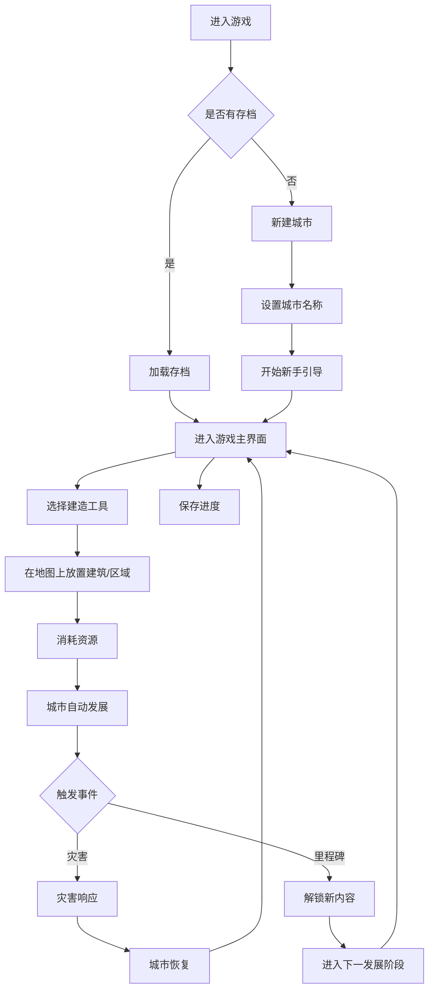

## 1. 产品概述

一款基于Vue3的城市建设模拟游戏，玩家作为市长从零开始规划、建设和管理一座城市，体验从小村庄发展为国际大都市的全过程。

- **核心目标**：提供沉浸式的城市建设体验，让玩家感受规划、建设、管理城市的乐趣与挑战
- **目标用户**：喜欢模拟经营、策略类游戏的玩家，各年龄段都能轻松上手

## 2. 核心功能

### 2.1 用户角色
| 角色 | 注册方式 | 核心权限 |
|------|----------|----------|
| 玩家 | 无需注册，本地存储 | 城市规划、建设管理、政策制定、灾害应对、好友互动 |

### 2.2 功能模块
1. **游戏主界面**：城市地图、工具栏、状态栏、资源面板
2. **城市规划系统**：道路铺设、区域划分（住宅/商业/工业）、建筑放置
3. **基础设施系统**：供水、供电、交通、医疗、教育设施建设
4. **经济管理系统**：税收调节、预算管理、财政收支平衡
5. **市民需求系统**：幸福感监测、需求满足、人口管理
6. **灾害应对系统**：火灾、地震、洪水等灾害预警与处理
7. **发展阶段系统**：村庄→小镇→城市→大都市四个发展阶段
8. **地标建筑系统**：解锁并建造标志性建筑，提升城市形象
9. **政策系统**：制定各类政策，影响城市发展方向
10. **社交功能**：邀请好友、分享城市、查看好友城市

### 2.3 页面详情
| 页面名称 | 模块名称 | 功能描述 |
|----------|----------|----------|
| 游戏主界面 | 城市地图区 | 网格化地图，支持缩放、拖拽，显示所有建筑和区域 |
| 游戏主界面 | 工具栏 | 提供建造工具：道路、住宅、商业、工业、基础设施等 |
| 游戏主界面 | 资源状态栏 | 显示金币、人口、水电供应、幸福度等关键指标 |
| 游戏主界面 | 时间控制 | 游戏速度调节（暂停/1x/2x/3x） |
| 城市信息面板 | 发展阶段 | 显示当前城市等级、升级条件、解锁内容 |
| 城市信息面板 | 财政报告 | 收入/支出明细、税收调整 |
| 城市信息面板 | 市民状态 | 人口统计、幸福度指数、各项需求满足度 |
| 地标建筑页面 | 地标列表 | 展示所有可建造地标，解锁条件、建造成本、效果 |
| 政策页面 | 政策列表 | 展示各类政策，支持启用/禁用，显示政策效果 |
| 社交页面 | 好友列表 | 显示好友城市、可访问好友城市、邀请新好友 |
| 分享页面 | 城市分享 | 生成城市快照、分享链接、导出城市数据 |

## 3. 核心流程

## 4. 用户界面设计

### 4.1 设计风格
- **主色调**：天空蓝 (#4A90D9) 作为主色，代表希望与发展；草地绿 (#68C46F) 作为辅助色，代表生机
- **强调色**：金色 (#FFD700) 用于重要数据和成就，橙色 (#FF9500) 用于警告和提示
- **按钮风格**：圆角矩形按钮，带有轻微阴影和悬停动画
- **字体**：主要使用 'Noto Sans SC'，标题加粗，正文常规
- **布局风格**：模块化面板设计，支持拖拽调整面板位置
- **图标风格**：使用 Font Awesome 图标，配合 emoji 增强视觉趣味性

### 4.2 页面设计概述
| 页面名称 | 模块名称 | UI 元素 |
|----------|----------|---------|
| 游戏主界面 | 城市地图 | 网格状瓦片地图，不同建筑使用emoji和颜色区分，支持缩放、拖拽 |
| 游戏主界面 | 顶部状态栏 | 半透明背景，水平排列资源图标和数值，悬停显示详细信息 |
| 游戏主界面 | 左侧工具栏 | 垂直图标工具栏，选中工具高亮显示，支持工具提示 |
| 游戏主界面 | 右侧信息面板 | 可折叠面板，分标签页显示详细信息 |
| 游戏主界面 | 底部控制栏 | 时间控制按钮、保存/加载按钮、设置按钮 |
| 地标页面 | 卡片网格 | 每个地标一张卡片，包含图片、名称、描述、解锁状态、建造按钮 |
| 政策页面 | 开关列表 | 政策名称、描述、效果说明、启用/禁用开关 |
| 社交页面 | 好友列表 | 头像、城市名称、城市等级、访问按钮、邀请按钮 |

### 4.3 响应式设计
- **桌面端优先**：1280px 以上宽度为最佳体验，支持多面板布局
- **平板适配**：768px-1279px，面板改为上下布局，工具栏可折叠
- **移动端适配**：320px-767px，简化界面，使用底部导航栏，优化触控操作

### 4.4 游戏场景视觉
- **环境氛围**：明亮清新的卡通风格，白天/夜晚循环效果，天气变化动画
- **地图瓦片**：使用 emoji 作为建筑图标，配合颜色区分不同区域类型
- **动画效果**：建筑放置动画、人口流动粒子效果、灾害警告闪烁效果
- **视差滚动**：背景云层缓慢移动，增强深度感

