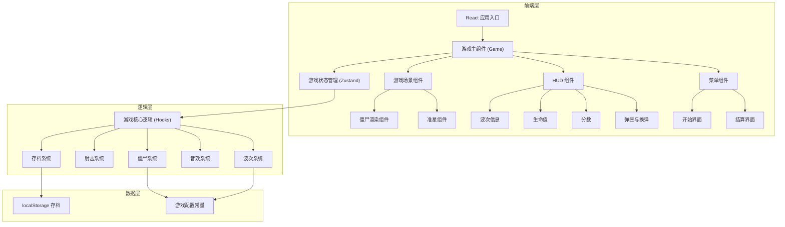

## 1. 架构设计



## 2. 技术描述

- **前端框架**：React@18 + TypeScript
- **构建工具**：Vite@5
- **样式方案**：TailwindCSS@3 + CSS Modules
- **状态管理**：Zustand
- **音效方案**：Web Audio API（程序化生成音效，无需外部资源）
- **数据存储**：localStorage
- **项目初始化**：vite-init react-ts 模板

## 3. 路由定义

| 路由 | 用途 |
|------|------|
| / | 游戏主页面（包含开始界面、游戏界面、结算界面） |

本游戏为单页面应用，通过状态切换显示不同界面，不使用多路由。

## 4. 核心数据模型

### 4.1 游戏状态类型

```typescript
// 僵尸类型枚举
enum ZombieType {
  WALKER = 'walker',      // 缓慢行者
  RUNNER = 'runner',      // 疾跑者
  TANK = 'tank',          // 坦克僵尸
}

// 僵尸实体
interface Zombie {
  id: string;
  type: ZombieType;
  x: number;              // 水平位置 (0-100%)
  distance: number;       // 距离玩家的距离 (0-100, 100为最远)
  health: number;         // 当前生命值
  maxHealth: number;      // 最大生命值
  speed: number;          // 移动速度
  size: number;           // 体型大小系数
  score: number;          // 击杀分数
  isDead: boolean;        // 是否死亡
}

// 游戏状态
interface GameState {
  status: 'menu' | 'playing' | 'paused' | 'victory' | 'gameover';
  currentWave: number;    // 当前波次 (1-10)
  lives: number;          // 剩余生命
  score: number;          // 当前分数
  magazine: number;       // 当前弹匣子弹数
  maxMagazine: number;    // 弹匣容量
  isReloading: boolean;   // 是否正在换弹
  reloadProgress: number; // 换弹进度 (0-1)
  totalShots: number;     // 总射击次数
  headshots: number;      // 爆头次数
  zombies: Zombie[];      // 当前场上的僵尸
  waveZombieQueue: ZombieType[]; // 本波待生成的僵尸队列
  waveSpawnTimer: number; // 下一个僵尸生成计时器
  showWaveNotice: boolean; // 是否显示波次提示
  waveNoticeText: string;  // 波次提示文字
}
```

### 4.2 存档数据

```typescript
interface SaveData {
  highestWave: number;    // 已通关的最高波次
  totalScore: number;     // 历史最高分数
  totalShots: number;     // 历史总射击数
  totalHeadshots: number; // 历史总爆头数
  headshotAccuracy: number; // 爆头命中率
  lastPlayedWave: number; // 上次游玩的波次
  lastPlayedScore: number; // 上次游玩的分数
  lastPlayedLives: number; // 上次游玩剩余生命
  savedAt: number;        // 存档时间戳
}
```

### 4.3 波次配置

```typescript
interface WaveConfig {
  wave: number;
  walkers: number;    // 行者数量
  runners: number;    // 疾跑者数量
  tanks: number;      // 坦克数量
  spawnInterval: number; // 生成间隔 (ms)
}

const WAVE_CONFIGS: WaveConfig[] = [
  { wave: 1, walkers: 5, runners: 0, tanks: 0, spawnInterval: 2000 },
  { wave: 2, walkers: 7, runners: 0, tanks: 0, spawnInterval: 1800 },
  { wave: 3, walkers: 5, runners: 3, tanks: 0, spawnInterval: 1600 },
  { wave: 4, walkers: 6, runners: 4, tanks: 0, spawnInterval: 1500 },
  { wave: 5, walkers: 8, runners: 5, tanks: 0, spawnInterval: 1400 },
  { wave: 6, walkers: 6, runners: 4, tanks: 1, spawnInterval: 1500 },
  { wave: 7, walkers: 7, runners: 5, tanks: 2, spawnInterval: 1400 },
  { wave: 8, walkers: 8, runners: 6, tanks: 2, spawnInterval: 1300 },
  { wave: 9, walkers: 10, runners: 8, tanks: 3, spawnInterval: 1200 },
  { wave: 10, walkers: 8, runners: 10, tanks: 3, spawnInterval: 1000 },
];
```

### 4.4 僵尸配置

```typescript
interface ZombieConfig {
  type: ZombieType;
  health: number;     // 所需命中次数
  speed: number;      // 移动速度系数
  size: number;       // 体型系数
  score: number;      // 分数
  headMultiplier: number; // 爆头伤害倍率
}

const ZOMBIE_CONFIGS: Record<ZombieType, ZombieConfig> = {
  [ZombieType.WALKER]: {
    type: ZombieType.WALKER,
    health: 3,
    speed: 1,
    size: 1,
    score: 10,
    headMultiplier: 3, // 爆头1发击倒 = 3倍伤害
  },
  [ZombieType.RUNNER]: {
    type: ZombieType.RUNNER,
    health: 1,
    speed: 3,
    size: 0.85,
    score: 25,
    headMultiplier: 2, // 秒杀
  },
  [ZombieType.TANK]: {
    type: ZombieType.TANK,
    health: 8,
    speed: 0.4,
    size: 1.6,
    score: 100,
    headMultiplier: 2, // 爆头4发击倒 = 2倍伤害
  },
};
```

## 5. 核心模块设计

### 5.1 游戏主循环
- 使用 `requestAnimationFrame` 驱动游戏循环
- 每帧更新僵尸位置、检测碰撞、处理状态

### 5.2 射击系统
- 点击屏幕触发射击
- 检测点击位置是否在僵尸碰撞箱内
- 判断命中位置（头部/身体）
- 扣除弹匣子弹，处理空仓状态

### 5.3 换弹系统
- 点击换弹按钮触发
- 2秒换弹时间，期间无法射击
- 换弹完成后弹匣补满

### 5.4 波次系统
- 按波次配置生成僵尸队列
- 按间隔逐个生成僵尸
- 所有僵尸消灭且队列为空时进入下一波

### 5.5 音效系统
- 使用 Web Audio API 程序化生成音效
- 枪声：短促的方波/白噪声
- 爆头：高频爆裂音
- 换弹：两段机械音
- 呻吟：低频振荡音
- 警报：蜂鸣脉冲音

### 5.6 存档系统
- 游戏状态变化时自动保存到 localStorage
- 页面加载时读取存档
- 保存已通关波数与爆头命中率
```
