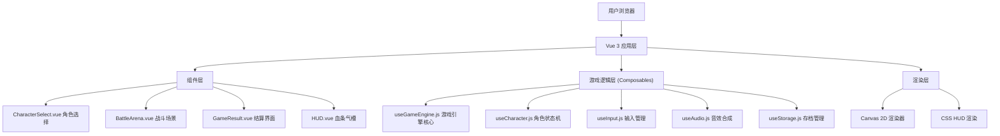

## 1. 架构设计


## 2. 技术描述
- **前端框架**: Vue@3.4+ (Composition API)
- **构建工具**: Vite@5.x
- **样式方案**: 原生CSS3 + CSS变量，不引入UI库
- **状态管理**: Vue Composition API + reactive/ref，不引入Pinia/Vuex
- **游戏渲染**: HTML5 Canvas 2D API 绘制角色和场景
- **音效引擎**: Web Audio API 合成音效（拳击、格挡、必杀爆发音
- **数据持久化**: localStorage 自动存档/读档
- **字体方案**: Google Fonts (Press Start 2P, VT323)
- **初始化方式**: `npm create vite@latest fighting-game -- --template vue`

## 3. 目录结构
```
fighting-game/
├── src/
│   ├── components/
│   │   ├── CharacterSelect.vue   # 角色选择页面
│   │   ├── BattleArena.vue     # 战斗主场景
│   │   ├── GameResult.vue      # 结算页面
│   │   └── HUD.vue           # 顶部HUD组件
│   ├── composables/
│   │   ├── useGameEngine.js    # 游戏引擎核心逻辑
│   │   ├── useCharacter.js     # 角色状态与动作管理
│   │   ├── useInput.js         # 键盘输入管理
│   │   ├── useAudio.js          # 音效合成管理
│   │   └── useStorage.js       # localStorage存档管理
│   ├── data/
│   │   └── characters.js        # 角色配置数据
│   ├── utils/
│   │   └── renderer.js         # Canvas渲染工具函数
│   ├── App.vue
│   ├── main.js
│   └── style.css
├── index.html
├── package.json
└── vite.config.js
```

## 4. 路由定义
| 路由 | 用途 |
|------|------|
| / (无路由，单页应用状态切换 | 根据gameState状态切换视图：select → battle → result |

采用单页应用，不引入Vue Router，通过响应式gameState变量在三个界面间切换。

## 5. 数据模型

### 5.1 角色数据模型
```javascript
// characters.js
const CHARACTERS = {
  longquan: {
    id: 'longquan',
    name: '龙拳',
    color: '#ff4444',          // 火柴人颜色
    hp: 100,
    attack: 12,
    defense: 8,
    speed: 5,
    special: {
      name: '升龙拳',
      type: 'single',           // single/multi/stun/charge
      damage: 45,
      hits: 1,
      chargeTime: 0,           // 蓄力时间(ms)
      stunTime: 0,             // 击倒时间(ms)
      description: '消耗满气槽造成45伤害'
    }
  },
  jifeng: {
    id: 'jifeng',
    name: '疾风',
    color: '#44ff44',
    hp: 85,
    attack: 10,
    defense: 6,
    speed: 8,
    special: {
      name: '影分身',
      type: 'multi',
      damage: 15,
      hits: 3,
      chargeTime: 0,
      stunTime: 0,
      description: '消耗满气槽造成3×15伤害'
    }
  },
  tiebi: {
    id: 'tiebi',
    name: '铁壁',
    color: '#4488ff',
    hp: 130,
    attack: 8,
    defense: 14,
    speed: 3,
    special: {
      name: '铁山靠',
      type: 'stun',
      damage: 35,
      hits: 1,
      chargeTime: 0,
      stunTime: 2000,
      description: '消耗满气槽造成35伤害+击倒2秒'
    }
  },
  huanying: {
    id: 'huanying',
    name: '幻影',
    color: '#aa44ff',
    hp: 90,
    attack: 11,
    defense: 7,
    speed: 7,
    special: {
      name: '瞬狱杀',
      type: 'charge',
      damage: 50,
      hits: 1,
      chargeTime: 500,
      stunTime: 0,
      description: '消耗满气槽造成50伤害，蓄力0.5秒'
    }
  }
}
```

### 5.2 玩家状态模型
```javascript
// useCharacter.js
const playerState = {
  characterId: 'longquan',
  hp: 100,
  maxHp: 100,
  energy: 0,             // 0-100
  x: 100,                // X坐标
  y: 0,                  // Y坐标(地面为0)
  facing: 1,             // 1=右, -1=左
  state: 'idle',         // idle/walk/attack/hurt/knockdown/special/charge
  stateTimer: 0,          // 状态剩余帧计数
  attackFrame: 0,         // 攻击判定帧计数
  hurtTimer: 0,
  knockdownTimer: 0,
  chargeTimer: 0,
  hitCount: 0,
  specialHits: 0,
  idleTime: 0,
  isIdle: false
}
```

### 5.3 游戏状态模型
```javascript
// useGameEngine.js
const gameState = {
  phase: 'select',          // select/battle/result
  round: 1,                // 1-3
  p1Score: 0,
  p2Score: 0,
  timer: 60,             // 秒
  p1: playerState,
  p2: playerState,
  lastInputTime: Date.now(),
  screenShake: 0,
  flashEffect: null
}
```

## 6. 核心算法与常量
- **攻击判定**: 距离检测：Math.abs(p1.x - p2.x) < 60px 且 attackFrame 在 1-8 帧内
- **伤害计算**: 基础伤害 = 攻击方attack - 防守方defense × 0.5, 防御时 × 0.4
- **气槽积累**: 攻击命中 +8%, 受击 +12%
- **防御状态**: 按住后退方向键（P1:A / P2:← 触发防御
- **帧同步**: requestAnimationFrame 60FPS, 固定步长更新
- **待机检测**: Date.now() - lastInputTime > 300000 (5分钟)
- **存档键名**: 'fighting_game_save_v1

## 7. 音效合成参数
| 音效类型 | 波形 | 频率 | 时长 | 音量 |
|---------|------|------|------|------|
| 拳击声 | square | 150Hz→80Hz | 0.12s | 0.3 |
| 格挡金属声 | triangle | 800Hz→1200Hz | 0.08s | 0.2 |
| 必杀爆发音 | sawtooth | 200Hz→1000Hz→200Hz | 0.4s | 0.5 |
