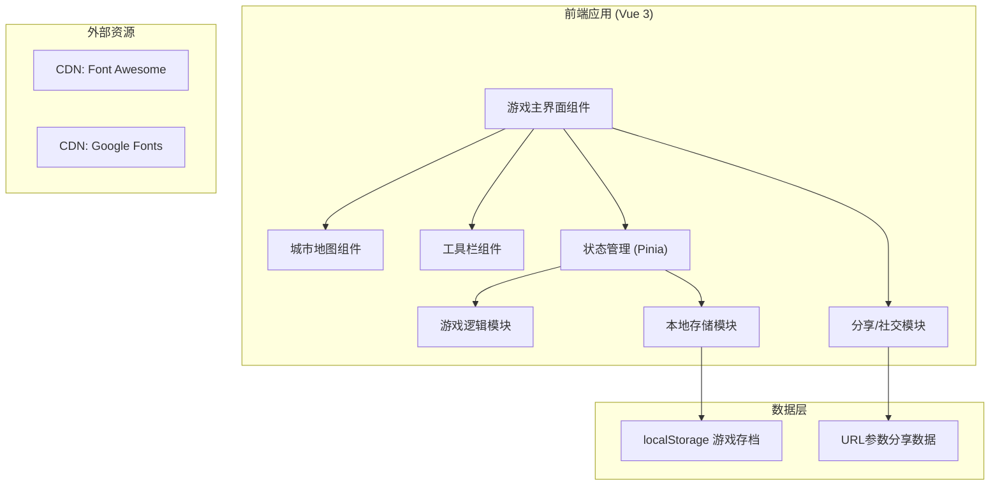
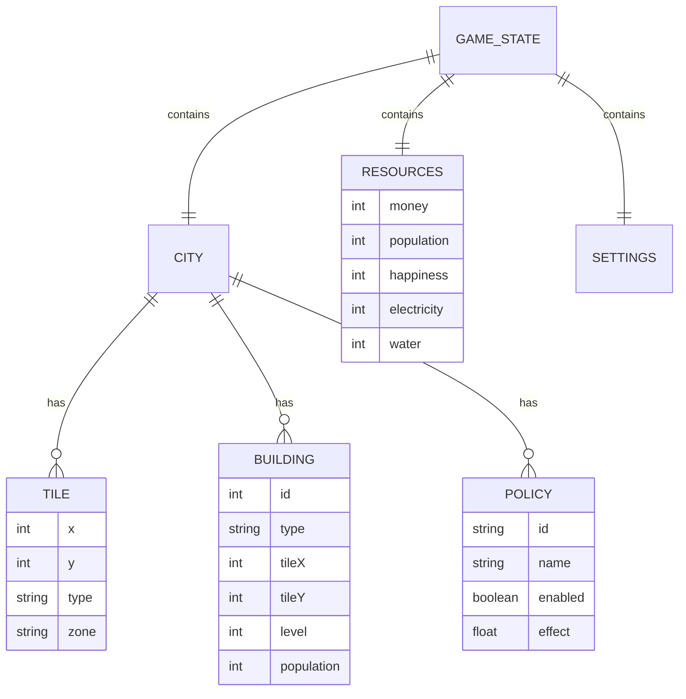

## 1. 架构设计



## 2. 技术栈说明

- **前端框架**: Vue 3 (Composition API)
- **构建工具**: Vite
- **状态管理**: Pinia
- **样式方案**: TailwindCSS 3
- **图标库**: Font Awesome 6
- **数据持久化**: LocalStorage + URL 编码
- **部署方式**: 静态资源部署

## 3. 目录结构

```
static/sz_web/
├── src/
│   ├── components/
│   │   ├── GameMap.vue          # 城市地图组件
│   │   ├── ToolBar.vue          # 左侧工具栏
│   │   ├── StatusBar.vue        # 顶部状态栏
│   │   ├── InfoPanel.vue        # 右侧信息面板
│   │   ├── ControlBar.vue       # 底部控制栏
│   │   ├── LandmarkModal.vue    # 地标建筑弹窗
│   │   ├── PolicyModal.vue      # 政策弹窗
│   │   └── SocialModal.vue      # 社交/分享弹窗
│   ├── stores/
│   │   ├── gameStore.js         # 游戏主状态
│   │   ├── cityStore.js         # 城市数据状态
│   │   └── uiStore.js           # UI状态管理
│   ├── utils/
│   │   ├── gameLogic.js         # 游戏核心逻辑
│   │   ├── storage.js           # 本地存储工具
│   │   ├── share.js             # 分享功能
│   │   └── constants.js         # 游戏常量配置
│   ├── App.vue
│   └── main.js
├── index.html
├── package.json
├── vite.config.js
└── tailwind.config.js
```

## 4. 路由定义

| 路由 | 用途 |
|------|------|
| / | 游戏主界面（单页应用，无多路由） |

## 5. 数据模型

### 5.1 数据模型定义



### 5.2 核心状态定义

```javascript
// 游戏主状态
{
  // 城市基本信息
  cityName: '我的城市',
  developmentStage: 'village', // village, town, city, metropolis
  
  // 资源状态
  resources: {
    money: 10000,
    population: 0,
    maxPopulation: 100,
    happiness: 70,
    electricity: 0,
    maxElectricity: 0,
    water: 0,
    maxWater: 0,
  },
  
  // 地图数据 (20x20 网格)
  map: Array(20).fill().map(() => Array(20).fill({
    type: 'grass', // grass, road, water, building
    zone: null, // residential, commercial, industrial
    building: null
  })),
  
  // 已建造地标
  landmarks: [],
  
  // 已启用政策
  activePolicies: [],
  
  // 游戏时间
  gameTime: {
    day: 1,
    speed: 1,
    paused: false
  }
}
```

## 6. 核心功能实现说明

### 6.1 状态持久化
- 使用 localStorage 自动保存游戏状态（每30秒自动保存）
- 页面刷新时自动从 localStorage 恢复状态
- 支持手动保存/加载存档

### 6.2 分享功能
- 将游戏状态压缩编码到 URL 参数中
- 生成分享链接，好友可通过链接查看城市
- 支持导出/导入 JSON 格式的存档文件

### 6.3 游戏循环
- 使用 requestAnimationFrame 实现游戏主循环
- 每秒更新一次游戏状态（人口增长、资源消耗、税收计算）
- 支持调节游戏速度（暂停/1x/2x/3x）

### 6.4 地图渲染
- 使用 CSS Grid 实现 20x20 网格地图
- 支持拖拽平移和滚轮缩放
- 使用 emoji 作为建筑图标，减少图片资源依赖

