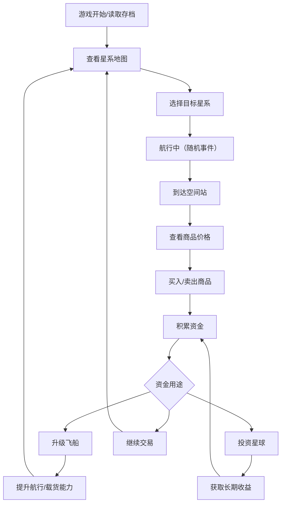
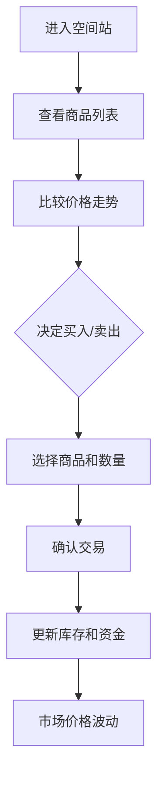

## 1. 产品概述

星际贸易商是一款基于浏览器的太空贸易模拟游戏，玩家驾驶飞船穿梭于银河系各个星系之间，通过低买高卖积累财富，升级飞船，投资星球，与AI贸易商竞争市场份额。

- **核心玩法**：星系探索、商品交易、飞船升级、星球投资、随机事件、AI竞争
- **目标用户**：喜欢策略模拟、经营类游戏的玩家
- **产品价值**：提供沉浸式的太空贸易体验，结合策略决策和随机事件的趣味性

---

## 2. 核心功能

### 2.1 用户角色

| 角色 | 注册方式 | 核心权限 |
|------|----------|----------|
| 玩家 | 无需注册，自动存档 | 完整游戏权限，包括交易、升级、投资、探索 |

### 2.2 功能模块

1. **主界面**：星系地图、飞船状态、资金显示、导航控制
2. **交易系统**：空间站商品列表、买入/卖出操作、价格波动显示
3. **飞船升级**：货舱扩容、引擎升级、护盾强化、武器系统
4. **星球投资**：开发项目列表、投资收益、项目进度
5. **随机事件**：海盗袭击、遗迹发现、贸易禁令、市场波动
6. **AI竞争**：其他贸易商状态、市场份额、价格影响
7. **主题切换**：科幻风格、末日风格两套主题
8. **存档系统**：自动保存、页面刷新保持状态

### 2.3 页面详情

| 页面名称 | 模块名称 | 功能描述 |
|-----------|-------------|---------------------|
| 主游戏界面 | 星系地图 | 显示星系节点、航线、当前位置，点击可跳转 |
| 主游戏界面 | 飞船状态栏 | 显示生命值、护盾、货舱容量、燃料、速度 |
| 主游戏界面 | 资金面板 | 显示当前信用点、每日收益、总资产 |
| 交易界面 | 商品列表 | 显示空间站可交易商品、价格、库存、涨跌幅 |
| 交易界面 | 交易操作 | 数量选择、买入/卖出按钮、交易确认 |
| 升级界面 | 飞船属性 | 显示当前属性、升级选项、升级费用 |
| 投资界面 | 星球项目 | 可投资项目列表、预计收益、投资进度 |
| 事件弹窗 | 随机事件 | 事件描述、选项按钮、结果展示 |
| 排行榜 | 竞争状态 | AI贸易商排名、市场份额、玩家排名 |
| 设置面板 | 主题切换 | 主题选择、音量控制、存档管理 |

---

## 3. 核心流程

### 3.1 游戏主流程

玩家进入游戏后，从初始空间站出发，查看各星系商品价格，选择目标星系航行。航行途中可能触发随机事件。到达目标星系后，在空间站进行商品交易，赚取差价。积累资金后升级飞船或投资星球项目。与AI贸易商竞争市场份额，最终成为银河首富。

### 3.2 交易流程

---

## 4. 用户界面设计

### 4.1 设计风格

#### 主题一：深空科幻风格
- **主色调**：深蓝 `#0a1628`、星空黑 `#050a12`、霓虹蓝 `#00d4ff`、能量紫 `#7c3aed`
- **辅色调**：警示红 `#ef4444`、成功绿 `#10b981`、金色 `#f59e0b`
- **按钮风格**：圆角矩形，霓虹边框发光效果，hover时有能量流动动画
- **字体**：Orbitron（标题）+ Rajdhani（正文），科技感十足
- **布局风格**：半透明玻璃拟态面板，全息投影效果，网格背景
- **视觉元素**：星空粒子背景、扫描线效果、数据可视化图表、霓虹指示灯

#### 主题二：末日废土风格
- **主色调**：锈棕 `#3d2817`、炭黑 `#1a1410`、铁锈红 `#b45309`、沙黄 `#d97706`
- **辅色调**：警示橙 `#ea580c`、酸性绿 `#84cc16`、破旧银 `#9ca3af`
- **按钮风格**：不规则边角，做旧纹理，金属质感，按下去有凹陷效果
- **字体**：Bebas Neue（标题）+ Courier Prime（正文），复古打字机风格
- **布局风格**：磨损边框面板，胶片颗粒质感，错位拼接布局
- **视觉元素**：噪点纹理、划痕效果、故障艺术、老旧显示器扫描线、警示条纹

### 4.2 页面设计概述

| 页面名称 | 模块名称 | UI 元素 |
|-----------|-------------|----------|
| 主游戏界面 | 星系地图 | 星空背景、发光星点、航线动画、飞船图标、位置脉冲效果 |
| 主游戏界面 | 状态栏 | 进度条动画、数值变化特效、图标闪烁提示 |
| 交易界面 | 商品列表 | 表格布局、价格涨跌颜色区分、K线迷你图、库存条形图 |
| 升级界面 | 属性面板 | 雷达图属性展示、升级进度环、前后数值对比 |
| 投资界面 | 项目卡片 | 卡片式布局、收益曲线、进度条、倒计时动画 |
| 事件弹窗 | 事件展示 | 全屏半透明遮罩、动画入场、选项按钮悬停特效 |
| 排行榜 | 排名列表 | 头像、排名奖牌动画、进度条对比 |

### 4.3 响应式设计

- **桌面优先**：1280px 以上宽度，三栏布局（左侧状态栏 + 中间主区域 + 右侧信息面板）
- **平板适配**：768px - 1280px，两栏布局，信息面板改为底部抽屉
- **手机适配**：768px 以下，单栏布局，可滑动切换不同功能模块
- **触摸优化**：按钮最小尺寸 44x44px，滑动手势支持，双击缩放

### 4.4 动画与交互

- **页面加载**：星空粒子渐入，面板从四周滑入，数据依次呈现
- **航行动画**：飞船沿航线移动，星点拖尾效果，超空间跳跃特效
- **交易反馈**：金币飞入动画，数值跳动增加，成功提示弹窗
- **事件触发**：屏幕震动，警报闪烁，事件卡片翻转入场
- **悬停效果**：按钮发光/凹陷，卡片上浮，信息提示气泡
- **状态变化**：进度条平滑过渡，数值滚动动画，颜色渐变

---

## 5. 游戏平衡性设计

### 5.1 经济系统
- 商品价格波动范围：±30%
- 稀有商品出现概率：5% - 15%
- 交易手续费：0.5% - 2%
- 航行燃料消耗：根据距离和飞船效率计算

### 5.2 升级系统
- 货舱容量：初始 100 单位，最高 1000 单位
- 航行速度：初始 1x，最高 5x
- 护盾强度：初始 100，最高 500
- 升级费用呈指数增长

### 5.3 投资系统
- 项目周期：7 - 30 游戏天
- 预期收益率：5% - 30%
- 风险等级：低/中/高三档，高风险高收益

### 5.4 随机事件概率
- 海盗袭击：10%
- 发现遗迹：5%
- 贸易禁令：8%
- 市场波动：15%
- 好运事件：7%
- 无事件：55%
