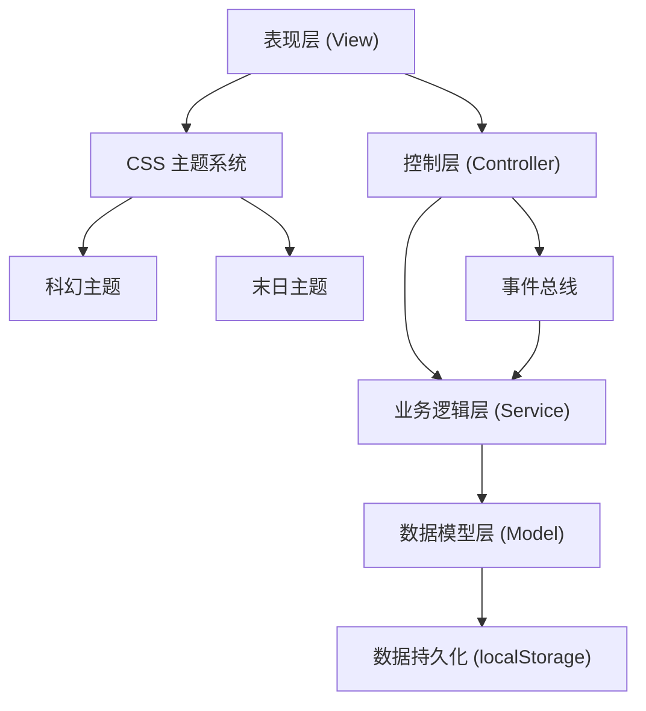

## 1. 架构设计

本项目采用纯前端技术栈实现，无后端依赖，使用 localStorage 进行数据持久化。架构分层清晰，便于维护和扩展。



---

## 2. 技术描述

### 2.1 技术栈选择
- **前端**：原生 HTML5 + CSS3 + JavaScript (ES6+)
- **初始化工具**：手动创建，无需构建工具
- **后端**：无后端，纯前端实现
- **数据库**：浏览器 localStorage 作为持久化存储
- **外部依赖**：仅引入 Google Fonts 字体库，无其他第三方库

### 2.2 架构说明

#### 分层架构
1. **表现层 (View)**：负责 UI 渲染和用户交互
   - 页面结构：HTML 语义化标签
   - 样式渲染：CSS 变量驱动的主题系统
   - 事件监听：DOM 事件绑定和处理

2. **控制层 (Controller)**：协调视图和业务逻辑
   - 路由管理：单页面应用的视图切换
   - 事件分发：用户操作转译为业务调用
   - 状态同步：视图与数据模型的双向同步

3. **业务逻辑层 (Service)**：核心游戏逻辑实现
   - 交易服务：商品买卖、价格计算
   - 航行服务：星系移动、燃料消耗
   - 升级服务：飞船属性提升、费用计算
   - 投资服务：项目管理、收益计算
   - 事件服务：随机事件触发和处理
   - AI 服务：贸易商行为模拟

4. **数据模型层 (Model)**：数据结构定义和操作
   - 游戏状态：玩家、飞船、星系、商品等数据
   - 数据验证：输入合法性检查
   - 数据转换：格式化和计算

5. **持久化层**：localStorage 操作
   - 自动保存：游戏状态定期持久化
   - 存档管理：存档读取、删除、重置
   - 状态恢复：页面刷新后自动读取存档

### 2.3 目录结构
```
static/my_web/
├── index.html              # 主页面入口
├── css/
│   ├── main.css            # 基础样式
│   ├── themes/
│   │   ├── sci-fi.css      # 科幻主题变量
│   │   └── wasteland.css   # 末日主题变量
│   └── components/         # 组件样式
│       ├── map.css
│       ├── trade.css
│       ├── upgrade.css
│       ├── investment.css
│       └── event.css
├── js/
│   ├── main.js             # 入口文件
│   ├── config/
│   │   ├── constants.js    # 游戏常量配置
│   │   ├── goods.js        # 商品数据
│   │   ├── systems.js      # 星系数据
│   │   └── events.js       # 事件数据
│   ├── models/
│   │   ├── GameState.js    # 游戏状态模型
│   │   ├── Player.js       # 玩家模型
│   │   ├── Ship.js         # 飞船模型
│   │   ├── StarSystem.js   # 星系模型
│   │   └── AI Trader.js    # AI贸易商模型
│   ├── services/
│   │   ├── StorageService.js   # 存储服务
│   │   ├── TradeService.js     # 交易服务
│   │   ├── NavigationService.js # 航行服务
│   │   ├── UpgradeService.js   # 升级服务
│   │   ├── InvestmentService.js # 投资服务
│   │   ├── EventService.js     # 事件服务
│   │   └── AIService.js        # AI服务
│   ├── controllers/
│   │   ├── GameController.js   # 游戏主控制器
│   │   ├── UIController.js     # UI控制器
│   │   └── ThemeController.js  # 主题控制器
│   └── utils/
│       ├── helpers.js      # 工具函数
│       └── eventBus.js     # 事件总线
└── assets/
    └── fonts/              # 本地字体备用
```

---

## 3. 核心模块定义

### 3.1 数据结构定义

```javascript
// 玩家状态
interface Player {
  name: string;
  credits: number;          // 信用点
  totalAssets: number;      // 总资产
  marketShare: number;      // 市场份额
  dailyIncome: number;      // 每日收益
}

// 飞船状态
interface Ship {
  name: string;
  hull: number;             // 船体生命值
  maxHull: number;
  shield: number;           // 护盾
  maxShield: number;
  cargo: number;            // 当前载货
  maxCargo: number;         // 最大载货
  speed: number;            // 航行速度倍率
  fuel: number;             // 燃料
  maxFuel: number;
  cargoItems: CargoItem[];  // 货物列表
  upgrades: Upgrades;       // 升级等级
}

interface CargoItem {
  goodId: string;
  quantity: number;
  buyPrice: number;         // 买入均价
}

interface Upgrades {
  cargo: number;            // 货舱等级 1-10
  engine: number;           // 引擎等级 1-10
  shield: number;           // 护盾等级 1-10
  weapon: number;           // 武器等级 1-10
}

// 星系
interface StarSystem {
  id: string;
  name: string;
  x: number;                // 地图坐标
  y: number;
  type: string;             // 星系类型
  description: string;
  goods: StationGood[];     // 空间站商品
  investments: Investment[]; // 可投资项目
  tradeBan: boolean;        // 是否贸易禁令
  banEndTime: number;       // 禁令结束时间
}

interface StationGood {
  goodId: string;
  price: number;            // 当前价格
  basePrice: number;        // 基础价格
  quantity: number;         // 库存
  priceHistory: number[];   // 历史价格
  trend: 'up' | 'down' | 'stable';
}

// 投资项目
interface Investment {
  id: string;
  name: string;
  description: string;
  cost: number;             // 投资金额
  duration: number;         // 周期（游戏天）
  returnRate: number;       // 收益率
  risk: 'low' | 'medium' | 'high';
  progress: number;         // 已投资金额
  startTime: number | null; // 开始时间
  ownerId: string | null;   // 投资者ID
}

// AI贸易商
interface AITrader {
  id: string;
  name: string;
  credits: number;
  ship: Ship;
  currentSystem: string;
  personality: 'aggressive' | 'conservative' | 'balanced';
  marketShare: number;
}

// 游戏状态
interface GameState {
  version: string;
  player: Player;
  ship: Ship;
  systems: StarSystem[];
  aiTraders: AITrader[];
  currentSystemId: string;
  gameTime: number;         // 游戏时间（天）
  lastSaveTime: number;
  theme: 'sci-fi' | 'wasteland';
  discoveredSystems: string[];
  eventLog: GameEvent[];
}

// 随机事件
interface GameEvent {
  id: string;
  type: string;
  title: string;
  description: string;
  choices: EventChoice[];
  timestamp: number;
}

interface EventChoice {
  text: string;
  outcome: EventOutcome;
}

interface EventOutcome {
  credits?: number;
  hull?: number;
  shield?: number;
  goods?: { goodId: string; quantity: number };
  message: string;
}
```

### 3.2 核心常量配置

| 配置项 | 值 | 说明 |
|--------|----|------|
| INITIAL_CREDITS | 10000 | 初始资金 |
| INITIAL_CARGO | 100 | 初始货舱容量 |
| INITIAL_FUEL | 100 | 初始燃料 |
| FUEL_PER_DISTANCE | 0.5 | 每单位距离燃料消耗 |
| TRADE_FEE_RATE | 0.01 | 交易手续费率 |
| PRICE_FLUCTUATION | 0.3 | 价格波动幅度 |
| AUTO_SAVE_INTERVAL | 30000 | 自动保存间隔(ms) |
| GAME_TICK_INTERVAL | 1000 | 游戏时钟间隔(ms) |
| DAYS_PER_TICK | 0.1 | 每次tick推进的游戏天数 |
| MAX_CARGO_LEVEL | 10 | 货舱最高等级 |
| MAX_ENGINE_LEVEL | 10 | 引擎最高等级 |

### 3.3 升级费用公式
- 货舱升级：`1000 * 1.8^(level-1)`
- 引擎升级：`1500 * 1.8^(level-1)`
- 护盾升级：`1200 * 1.8^(level-1)`
- 武器升级：`2000 * 1.8^(level-1)`

### 3.4 属性加成公式
- 货舱容量：`100 + (level - 1) * 100`
- 航行速度：`1 + (level - 1) * 0.5`
- 护盾上限：`100 + (level - 1) * 50`
- 武器伤害：`10 + (level - 1) * 15`

---

## 4. 事件总线定义

```javascript
// 事件类型
const EVENTS = {
  // 游戏事件
  GAME_START: 'game:start',
  GAME_PAUSE: 'game:pause',
  GAME_SAVE: 'game:save',
  GAME_LOAD: 'game:load',
  GAME_TICK: 'game:tick',
  
  // 航行事件
  NAVIGATE_START: 'navigate:start',
  NAVIGATE_COMPLETE: 'navigate:complete',
  NAVIGATE_CANCEL: 'navigate:cancel',
  
  // 交易事件
  TRADE_BUY: 'trade:buy',
  TRADE_SELL: 'trade:sell',
  PRICE_UPDATE: 'price:update',
  
  // 升级事件
  UPGRADE_PURCHASE: 'upgrade:purchase',
  
  // 投资事件
  INVESTMENT_START: 'investment:start',
  INVESTMENT_COMPLETE: 'investment:complete',
  
  // 随机事件
  RANDOM_EVENT_TRIGGER: 'event:trigger',
  RANDOM_EVENT_RESOLVE: 'event:resolve',
  
  // UI事件
  UI_THEME_CHANGE: 'ui:theme:change',
  UI_VIEW_CHANGE: 'ui:view:change',
  
  // AI事件
  AI_TRADE: 'ai:trade',
  AI_NAVIGATE: 'ai:navigate',
};
```

---

## 5. 存储键定义

| 键名 | 说明 |
|------|------|
| `galaxy_trader_save` | 游戏存档主数据 |
| `galaxy_trader_settings` | 游戏设置（主题等） |
| `galaxy_trader_version` | 存档版本号 |

---

## 6. 主题系统设计

通过 CSS 变量实现主题切换，两套主题共享相同的变量名，只需切换 class 即可。

```css
/* 基础变量定义 */
:root {
  --bg-primary: #0a1628;
  --bg-secondary: #050a12;
  --text-primary: #ffffff;
  --text-secondary: #a0aec0;
  --accent-primary: #00d4ff;
  --accent-secondary: #7c3aed;
  /* ... 更多变量 */
}

/* 末日主题覆盖 */
body.theme-wasteland {
  --bg-primary: #3d2817;
  --bg-secondary: #1a1410;
  --accent-primary: #b45309;
  --accent-secondary: #d97706;
  /* ... 更多覆盖 */
}
```
