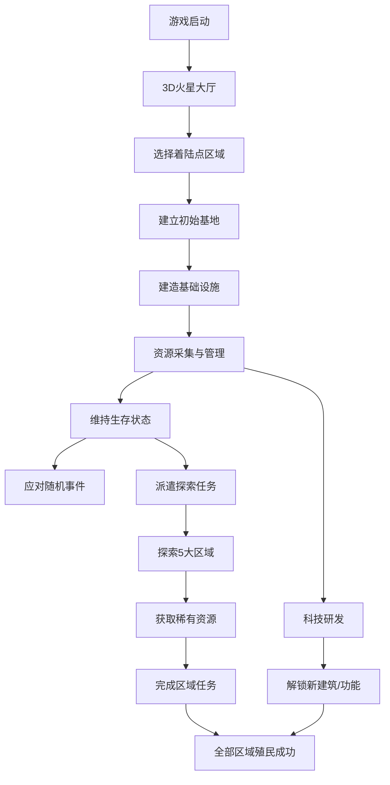

## 1. 产品概述

火星殖民基地是一款沉浸式3D策略生存游戏，玩家作为首批火星殖民者，在红色星球上建立人类第一个永久基地。游戏融合了基地建设、资源管理、生存挑战和科技研发等核心玩法，通过高度还原的火星环境和真实的时间系统，为玩家带来极具代入感的太空殖民体验。

- **主要目标**：从零开始建设可持续发展的火星基地，应对极端环境，探索未知区域，最终实现人类在火星的永久居住
- **目标用户**：太空探索爱好者、策略游戏玩家、3D互动体验爱好者
- **市场价值**：填补国内高品质火星题材网页游戏的空白，结合教育性与娱乐性，传播航天知识

## 2. 核心功能

### 2.1 用户角色
| 角色 | 注册方式 | 核心权限 |
|------|---------|---------|
| 殖民者指挥官 | 本地存档/游客模式 | 全权管理基地建设、资源调配、探索任务、科技研发 |

### 2.2 功能模块
1. **3D火星大厅**：全息高纹理火星模型，可自由旋转、缩放、点击查看各区域
2. **基地建设系统**：居住舱、太阳能电站、氧气循环系统、矿场、水资源提取站等建筑
3. **资源管理系统**：矿产、水资源、能源、氧气、食物等资源的采集、消耗和存储
4. **生存挑战系统**：沙尘暴、极端温度、辐射、设备故障等环境威胁
5. **探索任务系统**：驾驶火星车探索5个特色区域，完成任务获取稀有资源
6. **科技研发系统**：解锁新科技，提升基地效率和生存能力
7. **时间与事件系统**：真实火星时间模拟，随机事件触发机制

### 2.3 页面详情
| 页面名称 | 模块名称 | 功能描述 |
|---------|---------|----------|
| 启动页面 | 游戏入口 | 科幻风格启动动画、新游戏/继续游戏按钮、设置选项 |
| 3D火星大厅 | 全息火星模型 | 高纹理3D火星展示、区域选择、时间显示、全局资源概览 |
| 基地建设界面 | 建筑管理 | 建筑列表、放置预览、建造进度、建筑升级/拆除 |
| 资源仪表盘 | 资源监控 | 实时资源数据、生产/消耗速率、资源预警 |
| 探索地图界面 | 区域探索 | 5个区域地图、火星车状态、任务列表、探索进度 |
| 科技树界面 | 科技研发 | 科技节点、研发进度、前置条件、效果预览 |
| 事件通知面板 | 事件系统 | 随机事件弹窗、事件详情、应对选项、事件日志 |
| 生存状态面板 | 环境监控 | 温度、辐射、沙尘暴等级、基地整体健康度 |

## 3. 核心流程

玩家启动游戏后，首先看到全息火星模型，选择着陆点开始建立初始基地。通过建造基础设施获取资源，维持生存。随着资源积累，解锁新科技，扩展基地规模。同时需要应对随机发生的环境事件，派遣火星车探索各个区域获取稀有资源。最终目标是在所有5个区域建立前哨站，完成火星殖民。

## 4. 用户界面设计

### 4.1 设计风格
- **主色调**：深邃火星红(#C1440E)、太空黑(#0A0A0F)、科技蓝(#00D4FF)、警示橙(#FF6B00)
- **辅助色**：金属银(#C0C0C0)、植被绿(#00C853)、能量黄(#FFD600)
- **整体风格**：科幻全息风，半透明玻璃拟态UI，霓虹光效边框，数据可视化图表
- **按钮风格**：圆角矩形，渐变填充，悬停发光效果，点击微缩反馈
- **字体**：标题使用Orbitron科技字体，正文使用Roboto Mono等宽字体
- **布局风格**：非对称布局，浮动面板，3D透视效果，背景深空粒子动画
- **图标风格**：线性科技图标，霓虹描边，状态变化时的发光动画

### 4.2 页面设计概述
| 页面名称 | 模块名称 | UI元素 |
|---------|---------|--------|
| 3D火星大厅 | 全息火星模型 | 高纹理火星球体、星空背景、漂浮粒子、区域热区高亮、旋转控制、缩放动画 |
| 基地建设界面 | 建筑管理 | 半透明建筑卡片、建造进度条、资源消耗提示、放置预览网格、建筑3D模型 |
| 资源仪表盘 | 资源监控 | 环形进度图、实时数据流、趋势折线图、资源不足闪烁预警 |
| 探索地图界面 | 区域探索 | 卫星地图风格、探索路径动画、火星车位置标记、区域解锁进度 |
| 科技树界面 | 科技研发 | 节点连线、科技图标、研发进度环、前置依赖高亮 |
| 事件通知面板 | 事件系统 | 滑入动画、事件图标、倒计时、选项按钮组、事件日志滚动列表 |
| 生存状态面板 | 环境监控 | 仪表盘样式、风险等级色条、实时数据跳动、环境特效叠加 |

### 4.3 响应式设计
- **桌面优先**：1920×1080为基准设计，支持2K/4K分辨率自适应
- **平板适配**：≥768px，面板自动堆叠，触控优化
- **移动端**：≥375px，简化布局，核心功能优先，虚拟摇杆控制3D视角
- **交互优化**：桌面端鼠标悬停预览，移动端长按查看详情

### 4.4 3D场景指导
- **环境与氛围**：深邃宇宙背景，真实星空，火星大气散射效果，红色尘埃粒子漂浮
- **光照设置**：主光源模拟太阳光，环境光反射火星红色地表，建筑面板自发光
- **相机设置**：初始视角为火星斜上方45°，支持轨道旋转、滚轮缩放、点击聚焦，阻尼平滑运动
- **构图与焦点**：火星球体占据画面中心60%区域，UI面板分布四周不遮挡主体，关键区域使用光晕引导视线
- **交互与动画**：火星缓慢自转，区域悬停时高亮放大，点击时有脉冲波纹，建筑建造时有生长动画
- **后期处理**：轻微泛光效果，暗角 vignette，胶片颗粒质感，颜色分级营造火星氛围
- **性能控制**：3D模型面数控制在5万面以内，使用纹理压缩，目标帧率60fps

## 5. 关卡与区域设计

### 5.1 着陆点 (Landing Site)
- **环境特点**：地形相对平坦，温度适中(-60°C~-20°C)，辐射较低
- **主要任务**：建立初始基地，熟悉操作，建造居住舱和太阳能电站
- **资源分布**：基础铁矿、少量水资源
- **解锁条件**：游戏初始即可进入
- **特殊事件**：设备故障、小型沙尘暴

### 5.2 峡谷探险 (Valles Marineris)
- **环境特点**：巨大峡谷地形，深度达11公里，温度波动大，存在地下水源迹象
- **主要任务**：探索峡谷寻找水源，建立水资源提取站
- **资源分布**：丰富的地下水资源、稀有金属矿
- **解锁条件**：基地等级达到2级，拥有1辆火星车
- **特殊事件**：岩壁坍塌、发现地下水脉

### 5.3 极地冰盖 (Polar Ice Caps)
- **环境特点**：极寒地区(-125°C~-40°C)，大面积水冰和干冰，极昼极夜现象
- **主要任务**：开采冰层获取大量水资源，建立极地前哨站
- **资源分布**：巨量水资源、干冰(可提取二氧化碳)
- **解锁条件**：完成峡谷探险，研发抗寒科技
- **特殊事件**：极夜期能源危机、冰层断裂

### 5.4 火山区域 (Tharsis Montes)
- **环境特点**：高温环境(-30°C~20°C)，火山活动频繁，地热资源丰富
- **主要任务**：获取稀有矿物，利用地热发电
- **资源分布**：稀有矿物、硫磺、地热能源
- **解锁条件**：基地等级达到4级，研发高温防护科技
- **特殊事件**：火山活动、地热喷口、设备过热

### 5.5 远古遗迹 (Ancient Ruins)
- **环境特点**：神秘区域，存在疑似远古文明遗迹，辐射异常
- **主要任务**：探索遗迹，破解谜题，获取外星科技
- **资源分布**：未知科技碎片、能量晶体
- **解锁条件**：完成火山区域探索，研发遗迹探测科技
- **特殊事件**：发现神秘符号、系统异常、科技觉醒
