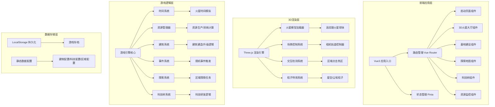

## 1. 架构设计



## 2. 技术描述

- **前端框架**：Vue 3.4 + Composition API + `<script setup>` 语法糖
- **构建工具**：Vite 5.0
- **状态管理**：Pinia 2.1
- **路由管理**：Vue Router 4.3
- **3D引擎**：Three.js 0.160
- **3D辅助**：@tweenjs/tween.js (动画补间)、three/addons (OrbitControls等)
- **样式方案**：TailwindCSS 3.4 + SCSS
- **UI组件**：自定义科幻风格组件库，使用Element Plus按需引入
- **数据可视化**：Chart.js 4.4 (资源趋势图)
- **图标方案**：Lucide Icons (线性科技图标)
- **字体**：Google Fonts (Orbitron, Roboto Mono)

## 3. 目录结构

```
static/huoxing/
├── index.html                    # 入口HTML
├── package.json                  # 依赖配置
├── vite.config.js                # Vite配置
├── tailwind.config.js            # Tailwind配置
├── public/
│   └── textures/                 # 3D纹理资源
│       ├── mars_diffuse.jpg      # 火星地表纹理
│       ├── mars_normal.jpg       # 火星法线贴图
│       ├── mars_specular.jpg     # 火星高光贴图
│       └── stars.png             # 星空纹理
└── src/
    ├── main.js                   # 应用入口
    ├── App.vue                   # 根组件
    ├── router/
    │   └── index.js              # 路由配置
    ├── stores/
    │   ├── gameStore.js          # 游戏全局状态
    │   ├── resourceStore.js      # 资源状态
    │   ├── buildingStore.js      # 建筑状态
    │   ├── techStore.js          # 科技状态
    │   └── eventStore.js         # 事件状态
    ├── components/
    │   ├── layout/               # 布局组件
    │   │   ├── GameHeader.vue    # 顶部状态栏
    │   │   └── GameSidebar.vue   # 侧边导航
    │   ├── three/                # 3D相关组件
    │   │   ├── MarsGlobe.vue     # 火星球体组件
    │   │   ├── StarField.vue     # 星空背景
    │   │   └── DustParticles.vue # 尘埃粒子
    │   ├── ui/                   # UI基础组件
    │   │   ├── SciFiPanel.vue    # 科幻面板
    │   │   ├── ResourceBar.vue   # 资源条
    │   │   ├── BuildingCard.vue  # 建筑卡片
    │   │   ├── TechNode.vue      # 科技节点
    │   │   └── EventModal.vue    # 事件弹窗
    │   └── game/                 # 游戏功能组件
    │       ├── BaseBuilder.vue   # 基地建设
    │       ├── ResourcePanel.vue # 资源监控
    │       ├── ExploreMap.vue    # 探索地图
    │       ├── TechTree.vue      # 科技树
    │       └── EventLog.vue      # 事件日志
    ├── views/                    # 页面视图
    │   ├── LaunchView.vue        # 启动页
    │   ├── MarsHallView.vue      # 3D火星大厅
    │   ├── BaseView.vue          # 基地建设页
    │   ├── ExploreView.vue       # 探索页
    │   └── TechView.vue          # 科技页
    ├── engine/                   # 游戏引擎
    │   ├── GameEngine.js         # 游戏主循环
    │   ├── TimeSystem.js         # 时间系统
    │   ├── ResourceSystem.js     # 资源系统
    │   ├── BuildingSystem.js     # 建筑系统
    │   ├── EventSystem.js        # 事件系统
    │   ├── ExploreSystem.js      # 探索系统
    │   └── TechSystem.js         # 科技系统
    ├── config/                   # 配置数据
    │   ├── buildings.js          # 建筑配置
    │   ├── technologies.js       # 科技配置
    │   ├── regions.js            # 区域配置
    │   ├── events.js             # 事件配置
    │   └── resources.js          # 资源配置
    ├── utils/                    # 工具函数
    │   ├── threeHelpers.js       # Three.js辅助函数
    │   ├── formatters.js         # 格式化工具
    │   └── storage.js            # 存储工具
    └── assets/                   # 静态资源
        ├── styles/               # 样式文件
        │   ├── main.scss         # 主样式
        │   └── animations.scss   # 动画定义
        └── fonts/                # 字体文件
```

## 4. 路由定义

| 路由路径 | 页面名称 | 功能描述 |
|---------|---------|---------|
| / | 启动页面 | 游戏入口，新游戏/继续游戏，设置选项 |
| /hall | 3D火星大厅 | 全息火星模型展示，区域选择，全局概览 |
| /base | 基地建设 | 建筑管理，资源监控，基地状态 |
| /explore | 探索地图 | 5大区域探索，火星车管理，任务系统 |
| /tech | 科技研发 | 科技树展示，研发进度，效果预览 |

## 5. 核心数据模型

### 5.1 资源数据模型

```javascript
// 资源类型定义
const RESOURCES = {
  iron: { name: '铁矿', icon: '⚙️', color: '#C0C0C0' },
  water: { name: '水资源', icon: '💧', color: '#00D4FF' },
  energy: { name: '能源', icon: '⚡', color: '#FFD600' },
  oxygen: { name: '氧气', icon: '🌬️', color: '#00C853' },
  food: { name: '食物', icon: '🍞', color: '#8BC34A' },
  rareMineral: { name: '稀有矿物', icon: '💎', color: '#E040FB' },
  techFragment: { name: '科技碎片', icon: '🔮', color: '#FF6B00' }
}

// 资源状态
interface ResourceState {
  current: number      // 当前数量
  max: number          // 最大存储
  production: number   // 每秒产出
  consumption: number  // 每秒消耗
  ratio: number        // 当前/最大 百分比
}
```

### 5.2 建筑数据模型

```javascript
interface Building {
  id: string
  name: string
  description: string
  icon: string
  category: 'habitat' | 'power' | 'life' | 'production' | 'research'
  cost: { [resourceType: string]: number }
  production: { [resourceType: string]: number }
  consumption: { [resourceType: string]: number }
  buildTime: number      // 建造时间(秒)
  level: number
  maxLevel: number
  unlocked: boolean
  built: boolean
  progress: number       // 建造进度 0-100
  position?: { x: number, y: number }
  regionId: string       // 所属区域
}
```

### 5.3 科技数据模型

```javascript
interface Technology {
  id: string
  name: string
  description: string
  icon: string
  tier: number           // 科技层级 1-5
  cost: {
    techFragment: number
    energy: number
  }
  researchTime: number   // 研发时间(秒)
  prerequisites: string[] // 前置科技ID
  effects: {
    type: 'production_bonus' | 'storage_bonus' | 'unlock_building' | 'unlock_region' | 'environment_resist'
    target: string
    value: number
  }[]
  researched: boolean
  progress: number
  researching: boolean
}
```

### 5.4 区域数据模型

```javascript
interface Region {
  id: 'landing' | 'canyon' | 'polar' | 'volcano' | 'ruins'
  name: string
  description: string
  unlocked: boolean
  explored: number       // 探索进度 0-100
  environment: {
    temperature: { min: number, max: number, current: number }
    radiation: number    // 辐射等级 1-10
    dustLevel: number    // 沙尘等级 1-10
  }
  resources: { [resourceType: string]: { abundance: number, maxExtract: number } }
  buildings: Building[]
  roverPosition?: { x: number, y: number }
  tasks: RegionTask[]
}

interface RegionTask {
  id: string
  name: string
  description: string
  type: 'explore' | 'collect' | 'build' | 'research'
  target: number
  progress: number
  reward: { [resourceType: string]: number }
  completed: boolean
}
```

### 5.5 事件数据模型

```javascript
interface GameEvent {
  id: string
  name: string
  description: string
  icon: string
  type: 'disaster' | 'opportunity' | 'malfunction' | 'discovery'
  severity: 'low' | 'medium' | 'high' | 'critical'
  regionId?: string
  duration: number       // 持续时间(秒)
  effects: {
    type: 'resource_change' | 'production_modifier' | 'building_damage' | 'unlock_content'
    target: string
    value: number
  }[]
  choices: EventChoice[]
  triggered: boolean
  active: boolean
  timeRemaining: number
}

interface EventChoice {
  id: string
  text: string
  cost?: { [resourceType: string]: number }
  successRate: number    // 成功率 0-100
  successEffect: { description: string, effects: any[] }
  failureEffect: { description: string, effects: any[] }
}
```

## 6. 游戏主循环

```javascript
class GameEngine {
  constructor() {
    this.lastTime = 0
    this.isRunning = false
    this.speed = 1  // 游戏速度 1x, 2x, 5x
  }
  
  start() {
    this.isRunning = true
    this.lastTime = performance.now()
    this.loop()
  }
  
  loop = () => {
    if (!this.isRunning) return
    
    const currentTime = performance.now()
    const deltaTime = (currentTime - this.lastTime) / 1000 * this.speed
    this.lastTime = currentTime
    
    this.update(deltaTime)
    requestAnimationFrame(this.loop)
  }
  
  update(deltaTime) {
    // 1. 更新时间系统 (火星时间)
    timeSystem.update(deltaTime)
    
    // 2. 更新资源生产/消耗
    resourceSystem.update(deltaTime)
    
    // 3. 更新建筑建造进度
    buildingSystem.update(deltaTime)
    
    // 4. 更新科技研发进度
    techSystem.update(deltaTime)
    
    // 5. 更新探索任务进度
    exploreSystem.update(deltaTime)
    
    // 6. 检查随机事件触发
    eventSystem.update(deltaTime)
    
    // 7. 更新环境状态
    environmentSystem.update(deltaTime)
    
    // 8. 检查游戏胜利/失败条件
    this.checkGameState()
    
    // 9. 自动保存
    if (timeSystem.getTotalSeconds() % 30 < deltaTime) {
      storage.saveGame()
    }
  }
}
```

## 7. 火星时间系统

```javascript
class TimeSystem {
  constructor() {
    // 火星日 = 24小时39分35.244秒 = 88642.663秒
    this.MARS_DAY_SECONDS = 88642.663
    this.totalSeconds = 0  // 游戏内经过的总秒数
    this.marsDay = 1       // 火星日(索尔)
    this.marsHour = 6      // 火星小时
  }
  
  update(deltaTime) {
    this.totalSeconds += deltaTime
    
    // 计算火星日和小时
    const dayProgress = (this.totalSeconds % this.MARS_DAY_SECONDS) / this.MARS_DAY_SECONDS
    this.marsDay = Math.floor(this.totalSeconds / this.MARS_DAY_SECONDS) + 1
    this.marsHour = dayProgress * 24.6597  // 火星小时
    
    // 更新光照
    this.updateDayNightCycle(dayProgress)
  }
  
  updateDayNightCycle(dayProgress) {
    // 0 = 午夜, 0.25 = 日出, 0.5 = 正午, 0.75 = 日落
    const sunAngle = dayProgress * Math.PI * 2 - Math.PI / 2
    
    // 根据时间调整环境光照和天空颜色
    // 用于3D场景的光照更新
    return {
      sunIntensity: Math.max(0, Math.sin(sunAngle)),
      skyColor: this.getSkyColor(dayProgress),
      isNight: dayProgress < 0.25 || dayProgress > 0.75
    }
  }
  
  getTimeString() {
    const hour = Math.floor(this.marsHour)
    const minute = Math.floor((this.marsHour - hour) * 60)
    return `索尔 ${this.marsDay} · ${hour.toString().padStart(2, '0')}:${minute.toString().padStart(2, '0')}`
  }
}
```

## 8. 关键技术实现要点

### 8.1 Three.js 3D火星渲染
- 使用SphereGeometry创建火星球体，分段数64×64保证平滑
- 加载Diffuse、Normal、Specular三张高分辨率纹理(2048×2048)
- 添加Atmosphere大气层效果，使用自定义Shader实现边缘发光
- OrbitControls控制器，禁用平移，限制缩放距离
- Raycaster实现区域点击检测

### 8.2 性能优化
- 3D场景使用WebGLRenderer的antialias和powerPreference: 'high-performance'
- 使用InstancedMesh渲染大量粒子(星空、尘埃)
- 游戏状态更新使用requestAnimationFrame，UI更新使用Vue响应式
- 资源生产计算使用增量时间，避免帧率影响
- LocalStorage持久化采用节流保存，每30秒一次

### 8.3 状态管理
- 使用Pinia分模块管理游戏状态，支持时间旅行调试
- 3D场景状态与UI状态分离，避免不必要的重渲染
- 使用computed属性派生数据(如资源净产出、可建造条件)
